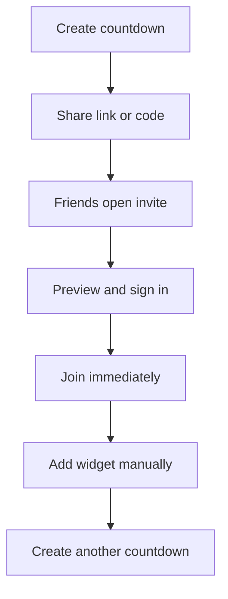
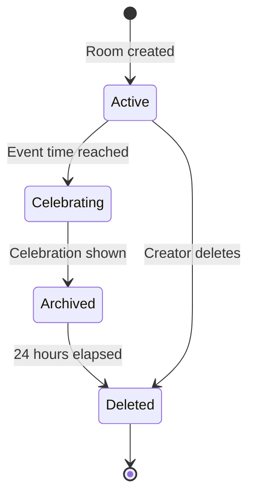

# Hyped! MVP User Flows

**Status:** Draft for review  
**Last updated:** 2026-09-05  
**Related documents:** [`01-problem-statement.md`](./01-problem-statement.md), [`02-requirements.md`](./02-requirements.md)

## 1. Purpose

This document describes how people move through Hyped! during the MVP. It covers the successful paths, permission-sensitive actions, loading and failure states, and the lifecycle of a shared countdown room.

The main product loop is:



## 2. Actors

| Actor | Description |
|---|---|
| Invite recipient | Has a valid invite link or room code but has not joined yet. |
| Member | Can view, share, leave, configure personal reminders, and add a widget. |
| Co-host | Has member access and can edit the event, theme, and remove regular members. |
| Creator | Owns the room and can manage roles, invitations, ownership, and deletion. |

## 3. Shared rules

- Users authenticate with Google or Apple.
- Google profile details are imported when available. Apple may not supply a profile photo or may supply a name only during first authorization.
- Users can edit their Hyped! display name and profile photo.
- Rooms are private and cannot be discovered through search.
- A room supports 25 people in total, including the creator.
- A user can create up to 10 active rooms and join up to 25 additional active rooms.
- Countdown rooms represent one-time events only in the MVP.
- The event is stored as one exact instant in UTC together with its original IANA time zone.
- Each member sees the event in their local time, with the original event time zone available for clarity.
- Mutating actions require connectivity. Offline mode is read-only.

## 4. App launch and authentication

### UF-AUTH-01: First launch without an invite

1. User opens Hyped!.
2. App shows an interactive sample countdown.
3. User changes the sample event theme and sees the countdown react with subtle motion.
4. User continues to the Google/Apple sign-in choices.
5. User chooses a provider and completes authentication.
6. App creates or restores the internal account.
7. App imports the available display name and profile photo.
8. If no photo is available, the app creates an initials-based avatar.
9. User reaches the room-list empty state with suggested event templates and a Join action.

**Alternative states**

- User cancels sign-in: remain on sign-in and show no error alarm.
- Provider fails or network is unavailable: show a recoverable error and Retry.
- Existing session is valid: skip sign-in and open the room list.

### UF-AUTH-02: Edit profile

1. Signed-in user opens Profile.
2. User edits their display name, profile photo, or both.
3. App validates the fields and image.
4. User saves.
5. The updated Hyped! identity appears in shared rooms without modifying the provider account.

## 5. Create and share a countdown

### UF-CREATE-01: Create a room

1. User taps **Create countdown**.
2. App displays the creation form.
3. User enters the required fields:
   - Title
   - Date
   - Time
   - Time zone
4. User may add:
   - Location
   - Description
   - Preset colour or gradient
   - GIF selected through supported GIF search
   - Uploaded static cover image
5. App shows the event in the selected time zone and its normalized instant for confirmation.
6. User taps **Create**.
7. Server validates that the event is in the future and the user owns fewer than 10 active rooms.
8. Room is created with the user as creator.
9. App opens the room and offers **Share invite** and **Add widget** guidance.

**Validation and failure states**

- Past or invalid event time: keep entered values and explain how to fix the date or time.
- Missing required field: highlight that field.
- More than 10 active created rooms: explain the limit and link to the room list.
- Unsupported or rejected image: retain the last valid theme and allow another choice.
- Offline or server failure: do not create a local-only room; allow a safe retry.

### UF-SHARE-01: Share an invitation

1. A member opens the room's Share action.
2. App presents the HTTPS invite link and human-enterable room code.
3. User shares the link through the native share sheet or copies the code.
4. App records a privacy-safe share event without storing the invite secret in analytics.

Invite links and codes remain valid until the creator regenerates them or the room ends.

## 6. Join through an invite link

### UF-JOIN-01: App installed and user signed in

```mermaid
sequenceDiagram
    actor Recipient
    participant Link as App/Universal Link
    participant App as Hyped App
    participant API as Hyped API
    Recipient->>Link: Open invite URL
    Link->>App: Route invite token
    App->>API: Validate token
    API-->>App: Safe room preview
    App-->>Recipient: Show preview
    Recipient->>App: Tap Join countdown
    App->>API: Join immediately
    API-->>App: Membership and room
    App-->>Recipient: Open countdown
```

The preview contains the event title, cover image or theme, live countdown, and inviter identity. It does not expose the full member list or private controls.

After a valid preview, a signed-in recipient taps **Join countdown** and joins immediately without creator approval. Retried requests must not create duplicate memberships.

### UF-JOIN-02: App installed but user signed out

1. On the user's first app launch, the interactive sample countdown appears with a clear **Skip to invite** action.
2. After completing or skipping the demo, the invite opens the safe room preview.
3. App asks the recipient to sign in with Google or Apple.
4. App retains the invite intent during the sign-in session.
5. After successful sign-in, the server revalidates the invitation and capacity.
6. User confirms **Join countdown**, joins immediately, and the room opens.

If sign-in is cancelled or fails, the preview remains available and no membership is created.

### UF-JOIN-03: App not installed

1. Recipient opens the invite URL.
2. Link routes directly to the relevant Apple App Store or Google Play listing.
3. The MVP does not guarantee automatic invite restoration after installation.
4. After installation, the recipient reopens the original link or enters the room code.

### UF-JOIN-04: Join using a room code

1. Signed-in user taps **Join room**.
2. User enters the room code and submits it.
3. Server validates the code.
4. App shows the safe preview.
5. User taps **Join countdown**.
6. The user joins immediately without creator approval and the room opens.

### Join edge cases

| Condition | Expected outcome |
|---|---|
| Invalid or regenerated invite | Do not join; show “This invite is no longer valid.” |
| Room is full | Do not join; show that the 25-person limit has been reached. |
| User has joined 25 active rooms | Do not join; explain the personal limit and link to the room list. |
| Room was deleted or passed its deletion time | Do not reveal room data; show that the countdown is unavailable. |
| User is already a member | Open the room without creating another membership. |
| User was removed earlier | Allow rejoining while the current link or code remains valid. |
| Network fails during join | Show Retry; a retry must not create duplicate membership. |

## 7. View and use a countdown

### UF-VIEW-01: Open an active room

1. Member selects a room from the room list or widget.
2. App loads the latest authorized room revision.
3. App renders the countdown from the stored instant without requesting the server for every tick.
4. Member sees the event details, theme, role, and available actions.
5. While foregrounded, the countdown updates at least once per second.

### UF-OFFLINE-01: View while offline

1. App loads the last authorized cached room state.
2. Countdown continues using the stored instant and device clock.
3. App displays an offline or last-updated indicator.
4. Create, join, edit, leave, role, invite, and delete actions are disabled with an explanation.
5. On reconnection, app fetches the latest revision and authorization state.

If the user was removed while offline, cached content disappears when the app next learns that access was revoked.

## 8. Add and manage a widget

### UF-WIDGET-01: Add a widget

1. Member uses the Android or iOS home-screen widget flow.
2. User selects a Hyped! widget size supported by the platform.
3. Widget configuration asks which joined room to display.
4. User selects one room and confirms.
5. Widget shows the event title and the most appropriate countdown value.
6. Tapping the widget opens that room in Hyped!.

Widgets are never added automatically. Refresh frequency follows OS limits, so a widget does not promise a continuously ticking seconds display. Animated GIFs use a static preview frame or compatible theme fallback on the widget.

### Widget unavailable states

- Signed out: ask the user to open Hyped! and sign in.
- Left or removed from room: hide private details and show that the room is unavailable.
- Room deleted or expired: show an unavailable state and offer widget removal/reconfiguration.
- Temporarily offline: show the last safe state and update when scheduling and connectivity permit.

## 9. Edit a countdown

### UF-EDIT-01: Creator or co-host edits details

1. Authorized editor opens **Edit countdown**.
2. App loads the latest room revision.
3. Editor changes event details or theme.
4. App validates the changes and requires a future event time.
5. Editor saves while online.
6. Server writes a new revision and synchronizes it to members.
7. Members receive a notification when the title, date, time, time zone, or location changed.
8. Colour, gradient, GIF, cover image, and description changes update silently.

If another editor saved a newer revision, the stale editor must reload before intentionally retrying. A failed change must not replace the last valid room state.

## 10. Notifications and personal reminders

### UF-NOTIFY-01: Default reminders

With notification permission, a newly joined member receives reminders:

- 24 hours before the event
- 1 hour before the event
- At the event time

### UF-NOTIFY-02: Personal settings

1. Member opens notification settings for the room.
2. Member enables, disables, or changes their own reminders.
3. App saves the preference for that member only.
4. Other members' reminder settings remain unchanged.

If OS notification permission is denied, the app explains how to enable it but does not block room participation.

## 11. Manage members and roles

### UF-ROLE-01: Promote or demote a co-host

1. Creator opens the member list.
2. Creator selects a member.
3. Creator promotes the member to co-host after confirmation.
4. The new role takes effect immediately.

Only the creator can promote or demote co-hosts. A co-host cannot modify the creator or another co-host's role.

### UF-ROLE-02: Remove a regular member

1. Creator or co-host opens the member list.
2. They select a regular member and tap **Remove**.
3. App asks for confirmation.
4. Server removes access and updates connected clients and widgets.
5. The removed user may rejoin immediately with a still-valid invite link or code.

To prevent rejoining, the creator must regenerate the invitation after removal.

### UF-INVITE-01: Regenerate invitation

1. Creator opens room invitation settings.
2. Creator selects **Generate new invite**.
3. App warns that the old link and code will stop working.
4. Creator confirms.
5. Server creates a new link and code and invalidates both old values immediately.

Only the creator can regenerate invitations.

## 12. Leave, transfer, delete, and account removal

### UF-LEAVE-01: Member or co-host leaves

1. User selects **Leave room** while online.
2. App asks for confirmation and warns that the widget will stop showing the room.
3. Server removes membership.
4. App clears cached private data and updates associated widgets.

### UF-OWNER-01: Creator transfers ownership

1. Creator chooses an existing member or co-host.
2. App explains that the recipient will gain creator permissions.
3. Creator confirms the transfer.
4. Server atomically assigns the new creator and changes the previous creator to a regular member.
5. The previous creator may now leave the room.

A room always has exactly one creator.

### UF-DELETE-01: Creator deletes an active room

1. Creator selects **Delete countdown**.
2. App explains that members will lose access and asks for destructive confirmation.
3. Creator confirms while online.
4. Server deletes the room, invalidates invitations, and revokes access.
5. All members are notified.
6. App and widgets move to the unavailable state.

Co-hosts cannot delete a room.

### UF-ACCOUNT-01: Delete an account

1. User opens account settings and requests deletion.
2. If the user owns rooms, the app requires ownership transfer for each room.
3. App requires the user to leave all joined rooms.
4. User re-authenticates and confirms permanent deletion.
5. System removes the account and personal/profile data according to the retention policy.

Deletion cannot proceed while the user still owns or belongs to a room.

## 13. Event completion and automatic deletion



### UF-LIFE-01: Countdown reaches zero

1. Countdown reaches the stored event instant.
2. App displays a celebration animation or completion message and never shows negative time.
3. Room moves to **Archived**.
4. Members may view the archived celebration for 24 hours but cannot edit the event.
5. Default “event time” reminders are delivered to members who enabled them.
6. After 24 hours, the system permanently deletes the room and associated room media, membership, and invitations.
7. Room disappears from lists and associated widgets show an unavailable state.

Archived rooms do not count toward room creation or joining limits.

## 14. Screen-level states

Every relevant screen must define these states:

| State | Required behaviour |
|---|---|
| Loading | Show immediate progress feedback and prevent duplicate submissions. |
| Empty | Explain why nothing is present and offer the next useful action. |
| Success | Confirm the completed action and show the resulting state. |
| Validation error | Preserve valid input and identify the field or rule to fix. |
| Recoverable failure | Explain the issue and provide Retry. |
| Offline | Show cached data when safe and disable mutations. |
| Access revoked | Remove private content and provide navigation back to the room list. |
| Destructive confirmation | State the impact before transfer, leave, invite reset, account deletion, or room deletion. |

## 15. Flow acceptance checklist

- [ ] New user can authenticate and reach a useful empty state.
- [ ] Creator can create and share a valid future countdown.
- [ ] Installed-app invite opens the intended preview, survives sign-in, and joins immediately after the user's confirmation.
- [ ] Not-installed invite routes to the correct app store.
- [ ] Room-code entry reaches the same room safely.
- [ ] Capacity and personal room limits prevent excess membership without partial state.
- [ ] All members count down to the same instant across time zones.
- [ ] Offline countdown continues while every mutation remains disabled.
- [ ] Widget is manually configured and opens the selected room.
- [ ] Important event changes notify members; visual changes update silently.
- [ ] Personal reminder changes do not affect other members.
- [ ] Creator and co-host can remove regular members; only creator manages co-host roles.
- [ ] Removed member can rejoin with a valid invitation.
- [ ] Regenerating an invitation invalidates the old link and code.
- [ ] Creator transfers ownership before leaving or deleting their account.
- [ ] Only creator can delete an active room, with confirmation and member notification.
- [ ] Event completion shows a celebration, archives the room, and deletes it after 24 hours.

## 16. Deferred flows

The following flows are outside the MVP and will be designed later:

- Recurring birthdays, anniversaries, or scheduled repetitions
- Full browser-based joining or countdown participation
- Public room discovery and social feeds
- Chat, comments, reactions, polls, and collaborative planning
- Payments, premium themes, calendar integrations, and ticketing
- User-uploaded animated GIF files
- Guaranteed invite restoration after a fresh installation
