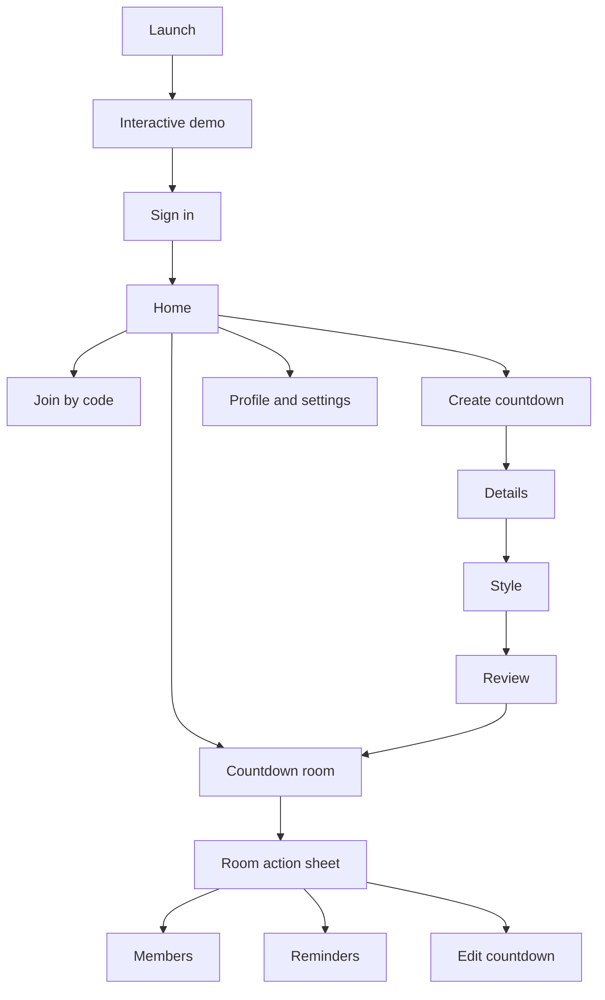

# Hyped! MVP UI/UX Design

**Status:** Draft for review  
**Last updated:** 2026-09-06  
**Related documents:** [`02-requirements.md`](./02-requirements.md), [`03-user-flows.md`](./03-user-flows.md)

## 1. Purpose

This document defines the mobile information architecture, screen behaviour, visual system, interaction states, accessibility rules, home-screen widgets, and Google Stitch workflow for the Hyped! MVP.

It is the design source of truth. Generated Stitch concepts and exported Figma frames must conform to this document. If a generated concept conflicts with a requirement or user flow, this document and the approved requirements take precedence.

## 2. Experience direction

Hyped! should feel **minimal and elegant**. The product shell stays calm and consistent while each countdown can express a different event through a colour, gradient, GIF, or uploaded image.

### Design principles

- **Countdown first:** The remaining time is always the strongest visual element.
- **Quiet product shell:** Navigation and controls use neutral surfaces and soft blue.
- **Event personality:** Custom media belongs inside countdown content, not global navigation.
- **Fast invitation:** Invite recipients understand the event before authentication and join only after explicit confirmation.
- **Progressive disclosure:** Advanced actions live in sheets and settings rather than crowding the countdown.
- **Native confidence:** Android and iOS share one visual identity while respecting their native gestures, pickers, sheets, share flows, and permission dialogs.
- **Accessible delight:** Motion, colour, and media never block readability or task completion.

## 3. Confirmed design decisions

| Area | Decision |
|---|---|
| Visual direction | Minimal and elegant |
| Brand colour | Aesthetic soft blue |
| Typography | Manrope with native fallback where needed |
| Appearance | System default initially; manual Light, Dark, or System setting |
| Navigation | Home, central Create action, Profile/Settings |
| Join entry | Top-right action on Home |
| Home hierarchy | Large nearest-event card followed by compact chronological cards |
| Empty Home | Suggested Trip, Birthday, Concert, Graduation, Exam, and Wedding templates |
| Room view | Immersive event cover, large countdown, bottom action sheet |
| Member summary | Total member count only; tap to open full list |
| Create flow | Details → Style → Review |
| Countdown units | Adaptive as the event approaches |
| Onboarding | Interactive theme demo before sign-in |
| Invite onboarding | Demo also appears for first-time invite recipients, with **Skip to invite** |
| Join consent | User taps **Join countdown**; creator approval is not required |
| Celebration | Minimal glow with **It's time!** |
| Notifications | Push notifications and in-app banners; no inbox |
| Widgets | Manually added; small and medium sizes; soft-blue brand style |
| App icon | Circular countdown ring with a sparkle |
| Platform strategy | Shared Hyped design with native platform behaviour |

## 4. Information architecture



An invite link enters through the demo on a recipient's first launch, then continues to the invite preview and authentication without losing the invite intent.

## 5. Global navigation

### 5.1 Primary navigation bar

| Position | Control | Behaviour |
|---|---|---|
| Left | Home | Opens the active countdown list and nearest event. |
| Centre | Create | Prominent elevated circular action that starts the three-step creation flow. |
| Right | Profile | Opens profile, appearance, notification permission help, privacy, and account settings. |

The Create control uses the circular-ring visual language but must remain clearly labelled for screen readers. It is not hidden behind a generic overflow menu.

### 5.2 Home app bar

- Left: Hyped! wordmark or compact ring mark.
- Right: **Join** text/icon action for room-code entry.
- No notification-bell icon because the MVP has no notification inbox.

### 5.3 Native platform behaviour

| Interaction | iOS | Android |
|---|---|---|
| Back navigation | Edge-swipe and navigation back control | System back gesture/button |
| Date and time | Native Cupertino-style picker behaviour | Native Material picker behaviour |
| Action menus | Native-feeling bottom sheets | Native-feeling modal bottom sheets |
| Sharing | iOS share sheet | Android Sharesheet |
| Notifications | iOS permission prompt and Settings route | Android runtime permission where required and Settings route |
| Widget setup | WidgetKit gallery/configuration | App widget picker/configuration |

Visual tokens, information hierarchy, labels, and outcomes remain consistent across both platforms.

## 6. Screen inventory

| ID | Screen or surface | Audience | Primary purpose |
|---|---|---|---|
| UI-01 | Splash/launch | Everyone | Restore session and route links without unnecessary delay. |
| UI-02 | Interactive demo | First-time users | Demonstrate the countdown and theme switching. |
| UI-03 | Sign-in | Signed-out users | Authenticate with Google or Apple. |
| UI-04 | Home | Signed-in users | View nearest and remaining countdowns. |
| UI-05 | Join by code sheet | Signed-in users | Enter a human-readable room code. |
| UI-06 | Invite preview | Invite recipients | Review safe event details and confirm joining. |
| UI-07 | Create: Details | Creator | Enter required and optional event information. |
| UI-08 | Create: Style | Creator | Choose a preset, GIF, or static image. |
| UI-09 | Create: Review | Creator | Verify appearance and exact event time. |
| UI-10 | Countdown room | Members | View the immersive synchronized countdown. |
| UI-11 | Room actions sheet | Members | Access role-appropriate secondary actions. |
| UI-12 | Member list | Members | View people; manage roles/access when permitted. |
| UI-13 | Reminder settings | Members | Configure personal reminders. |
| UI-14 | Edit countdown | Creator/co-host | Change details or visual style. |
| UI-15 | Invitation settings | Creator | Share or regenerate invitation credentials. |
| UI-16 | Widget guidance | Members | Explain native widget addition and selection. |
| UI-17 | Profile | Signed-in users | Edit Hyped! display name and photo. |
| UI-18 | Settings | Signed-in users | Select appearance and manage account/privacy settings. |
| UI-19 | Celebration/archive | Members | Mark event arrival and show the 24-hour archive state. |
| UI-20 | Destructive confirmation | Authorized users | Confirm leave, removal, transfer, reset, or deletion. |

## 7. Core screen specifications

### UI-02: Interactive demo

**Layout order**

1. Compact Hyped! mark.
2. Sample event title, such as **Summer trip**.
3. Large live sample countdown.
4. Three compact theme options.
5. Primary **Continue** action.
6. **Skip to invite** when an invite intent exists.

Changing a theme cross-fades the background and gently updates the countdown surface. The demo requires no account and creates no room. It must remain useful with Reduce Motion enabled by replacing movement with an instant or short fade.

### UI-03: Sign-in

- Short heading: **Count down together.**
- One-sentence explanation of private shared countdowns.
- **Continue with Google** and **Continue with Apple** buttons.
- Privacy and Terms links below the actions.
- If an invite is pending, show a small **Joining: [event title]** context card.
- Cancellation returns safely to the demo or invite preview.

### UI-04: Home

**Hierarchy**

1. App bar with greeting/wordmark and Join action.
2. **Up next** label.
3. Large card for the nearest active event.
4. **More countdowns** list of compact cards, sorted by event instant.
5. Collapsed **Archived** section when applicable.
6. Primary navigation with centre Create action.

**Featured card content**

- Event title
- Adaptive countdown
- Local event date and time
- Optional location, limited to one line
- Role label only when it affects available actions
- Event visual with validated contrast overlay

**Compact card content**

- Small theme thumbnail or gradient strip
- Title
- Largest meaningful remaining unit
- Local date

**Empty state**

- Heading: **What are you looking forward to?**
- Template cards: Trip, Birthday, Concert, Graduation, Exam, Wedding
- Selecting a template opens Create: Details and preselects a matching style.
- Join remains available in the app bar.

### UI-05: Join by code

- Opens as a platform-native modal sheet.
- One room-code field with automatic uppercase conversion and grouping.
- Paste support.
- Continue action disabled until the basic code format is valid.
- Server validation uses an inline loading state and prevents duplicate submissions.
- A valid code opens UI-06; invalid/regenerated codes preserve the field and show a concise correction.

### UI-06: Invite preview

**Safe preview content**

- Event title
- Cover image/theme or safe fallback
- Current adaptive countdown
- Inviter display name and photo/fallback avatar
- Event date, time, and time zone
- Optional location

The full member list, description, room-management actions, and invite credentials are not exposed before joining.

**Actions**

- Primary: **Join countdown**
- Secondary: Back or Not now
- Signed-out users authenticate as part of this action, then return to the same preview for final confirmation if needed.
- Confirmation creates membership immediately without creator approval.

**Blocking states**

- Invalid invitation
- Invitation regenerated
- Room full
- User reached joined-room limit
- Room deleted
- Archived room no longer joinable
- Network unavailable

### UI-07: Create countdown, Details

| Field | Requirement | Behaviour |
|---|---|---|
| Title | Required | Single line with visible character counter near the limit. |
| Date | Required | Native picker; past dates blocked where possible. |
| Time | Required | Native picker. |
| Time zone | Required | Defaults to device zone; searchable IANA zone selection. |
| Location | Optional | Plain text in MVP; no map dependency required. |
| Description | Optional | Multiline with visible character counter near the limit. |

The footer contains Back when applicable and a persistent **Next: Style** action. Valid entries survive backward navigation and recoverable failures.

### UI-08: Create countdown, Style

Style choices appear in this order:

1. Preset soft colour swatches
2. Curated gradients
3. GIF search
4. Upload static image

The live preview keeps countdown text visible while choices change. Every media theme receives an automatic overlay, text-colour selection, or rejection when sufficient contrast cannot be maintained.

For GIF search:

- Search, results, loading, empty, and provider-error states are required.
- Provider attribution appears when required by the selected provider's terms.
- Reduced Motion shows a representative static frame until the user explicitly plays or platform settings allow motion.

For image upload:

- Use native photo selection.
- Show crop/position preview for the portrait room surface.
- Show upload progress only after final creation/save begins.
- Rejected media leaves the last valid style selected.

### UI-09: Create countdown, Review

- Shows the immersive countdown exactly as it will appear in the app.
- Displays selected local date/time and time zone clearly.
- Also shows the converted device-local time when it differs.
- Edit links return to Details or Style without losing data.
- Primary action: **Create countdown**.
- On success, open UI-10 and offer sharing guidance.

### UI-10: Countdown room

The room is visually immersive but keeps controls legible over every theme.

**Visual layers**

1. Event colour, gradient, static image, or looping GIF.
2. Validated scrim for contrast.
3. Minimal top bar with Back and More/actions.
4. Event title and optional location.
5. Large adaptive countdown.
6. Local event date/time plus original time-zone context.
7. Subtle **N people counting down** control.
8. Bottom grab handle/action affordance.

**Adaptive countdown format**

| Remaining time | Primary units |
|---|---|
| 7 days or more | Days and hours |
| 1 to 7 days | Days, hours, and minutes |
| Under 24 hours | Hours, minutes, and seconds |
| Final minute | Large minutes and seconds |
| Zero | **It's time!** |

The foreground app updates at least once per second. Numerals use tabular spacing so the layout does not jump as values change.

### UI-11: Room actions sheet

Actions are grouped and shown only when the current role permits them.

| Group | Member | Co-host | Creator |
|---|---|---|---|
| Share invite | Yes | Yes | Yes |
| Personal reminders | Yes | Yes | Yes |
| View members | Yes | Yes | Yes |
| Widget help | Yes | Yes | Yes |
| Edit details/style | No | Yes | Yes |
| Remove regular member | No | Yes | Yes |
| Manage co-hosts | No | No | Yes |
| Regenerate invitation | No | No | Yes |
| Transfer ownership | No | No | Yes |
| Leave room | Yes | Yes | After ownership transfer |
| Delete room | No | No | Yes |

Destructive actions are visually separated at the bottom and always require an impact-specific confirmation.

### UI-12: Member list

- Header shows **Members · N/25**.
- Creator appears first, co-hosts next, then members alphabetically.
- Each row contains avatar, display name, and role.
- Creator sees role-management actions.
- Creator and co-hosts see Remove only for regular members.
- Removing a member explains that they may rejoin with a valid invitation.
- Creator is prompted to regenerate the invite when preventing re-entry matters.

### UI-13: Personal reminders

- Default selected reminders: 24 hours, 1 hour, and event time.
- Each reminder can be toggled independently.
- A custom reminder may replace or supplement defaults, subject to later notification-service design.
- If OS permission is denied, show an explanation and **Open Settings** without blocking room use.
- Settings affect only the current user.

### UI-14: Edit countdown

Editing reuses the Details and Style components. Save remains disabled until a meaningful valid change exists. Important changes display a note that members will be notified.

If the room revision changed elsewhere, show:

- Heading: **This countdown was updated**
- Primary: **Reload latest**
- Secondary: **Review my changes** when safe reconciliation is supported

No local edit overwrites a newer server revision silently.

### UI-15: Invitation settings

- Shows share link, room code, Copy, and Share.
- **Generate new invite** opens a warning that both current values will stop working immediately.
- After confirmation, replace both values and show a success banner.

### UI-16: Widget guidance

The app cannot silently place widgets. Guidance uses short platform-specific steps and a preview of the small and medium widget.

- Primary label: **How to add widget**
- Android and iOS instructions adapt to the current platform.
- Room selection happens in the native widget configuration flow.
- The guide states that OS refresh limits prevent guaranteed second-by-second updates.

### UI-17 and UI-18: Profile and Settings

**Profile**

- Editable profile photo
- Editable display name
- Connected sign-in provider summary
- Created and joined room counts

**Settings**

- Appearance: System, Light, Dark
- Notification permission status and Settings route
- Privacy Policy and Terms
- Sign out
- Delete account

Account deletion displays unresolved prerequisites. Users must transfer owned rooms and leave joined rooms before re-authentication and final deletion.

### UI-19: Celebration and archive

- Transition uses a restrained soft-blue/white glow.
- Main message: **It's time!**
- Event title remains visible.
- Reduced Motion uses a short static fade.
- Archived state states that the room will be deleted 24 hours after the event.
- Editing and joining are unavailable during the archive window.

## 8. Home-screen widget design

Widgets always use Hyped’s soft-blue brand treatment rather than the room's custom theme.

### Small widget

| Region | Content |
|---|---|
| Top | Small ring-and-sparkle mark |
| Middle | Largest remaining unit, for example **12 days** |
| Bottom | Event title, maximum two lines |

### Medium widget

| Region | Content |
|---|---|
| Left | Ring mark, event title, and local date |
| Right | Adaptive countdown with up to three units |

### Widget states

- Active: current stored event and latest permitted refresh.
- Offline: last safe countdown state without an alarming error treatment.
- Signed out: generic **Open Hyped! to sign in** state.
- Access revoked/deleted: remove event details and show **Countdown unavailable**.
- Archived: show **It's time!** until deletion/reconfiguration.

## 9. Visual design system

### 9.1 Colour tokens

| Token | Light | Dark | Usage |
|---|---|---|---|
| Brand soft blue | `#6C8CFF` | `#8EA8FF` | Brand surfaces, decorative ring, selected states |
| Brand pale blue | `#B8C7FF` | `#334777` | Tinted panels and subtle highlights |
| Interactive blue | `#4567D6` | `#AFC2FF` | Links, focus, active icons |
| Background | `#F7F9FF` | `#0E1320` | App background |
| Surface | `#FFFFFF` | `#171E2E` | Cards and sheets |
| Surface subtle | `#EEF3FF` | `#202A3E` | Inputs and grouped content |
| Primary text | `#182033` | `#F4F7FF` | Main text |
| Secondary text | `#5F687A` | `#B9C2D4` | Supporting labels |
| Critical | `#B3261E` | `#FFB4AB` | Destructive actions and errors |
| Success | `#287A55` | `#73D6A6` | Success confirmation |

Soft blue is not used with white normal-sized text because the contrast is insufficient. Filled soft-blue controls use dark text; white button text uses the deeper Interactive blue where contrast passes.

### 9.2 Typography

| Style | Font | Weight | Suggested size |
|---|---|---:|---:|
| Countdown hero | Manrope | 600 | 56–72 sp, responsive |
| Display heading | Manrope | 600 | 32 sp |
| Screen title | Manrope | 600 | 24 sp |
| Section heading | Manrope | 600 | 18 sp |
| Body | Manrope | 400 | 16 sp |
| Supporting | Manrope | 400/500 | 14 sp |
| Caption | Manrope | 500 | 12 sp minimum |

- Countdown numbers use tabular figures.
- Text scales with OS accessibility settings.
- Critical controls never rely on truncation to communicate meaning.
- Native fallback fonts are permitted in widgets and platform-owned surfaces.

### 9.3 Shape, spacing, and elevation

- Base spacing unit: 4 dp.
- Common gaps: 8, 12, 16, 24, and 32 dp.
- Screen horizontal padding: 20 dp on phones.
- Card radius: 20 dp featured, 16 dp compact.
- Button and input radius: 14 dp.
- Modal-sheet top radius: 28 dp.
- Minimum interactive target: 44×44 pt on iOS and 48×48 dp on Android.
- Use borders and tonal separation before shadows. Elevation stays subtle.

### 9.4 Icons and imagery

- Use a consistent rounded outline icon family.
- Do not use emoji as functional icons.
- App icon: circular countdown ring with a small sparkle on soft blue.
- Uploaded images use centre crop with creator-controlled positioning.
- Media always has a readable scrim behind essential text.

## 10. Motion and feedback

| Interaction | Motion |
|---|---|
| Page transition | Native platform transition |
| Theme selection | 180–240 ms cross-fade |
| Card press | Subtle scale/tonal response, no bounce-heavy effect |
| Bottom sheet | Native spring/slide behaviour |
| Countdown digit change | Stable tabular update; optional soft fade near unit transitions |
| Event completion | Restrained glow and text fade to **It's time!** |
| In-app banner | Short slide/fade, dismissible where appropriate |

Reduced Motion disables scale, looping decorative movement, and animated GIF playback by default where platform settings require it. Functional state changes remain clear without motion.

## 11. Loading, empty, success, error, and offline states

| State | UI rule |
|---|---|
| Initial loading | Use a lightweight skeleton matching the actual layout; avoid indefinite spinners. |
| Refreshing | Preserve existing safe content and use subtle progress. |
| Empty | Explain the state and present the next useful action or template. |
| Success | Update the content immediately and show a brief accessible banner. |
| Field error | Place the message beside the field and preserve valid entries. |
| Page error | State what failed and offer Retry or Back. |
| Offline cached | Keep the countdown visible with a calm offline label. |
| Offline mutation | Disable submission and explain that internet is required. |
| Access revoked | Remove private content and return toward Home. |
| Media failure | Keep the previous valid visual and offer Retry/change. |
| Destructive action | Explain exact impact and require explicit confirmation. |

In-app banners must be announced by screen readers and must not cover navigation or the primary action.

## 12. Accessibility requirements

- Meet WCAG 2.2 AA contrast where applicable to mobile UI.
- Support screen readers with meaningful labels, roles, values, and action hints.
- Countdown announcements must not fire every second. Screen readers receive an on-demand or sensibly throttled value.
- Support Dynamic Type/font scaling without hiding primary actions.
- Use text/icons in addition to colour for status and validation.
- Honour Reduce Motion and platform media autoplay settings.
- Provide logical focus order for sheets, forms, and previews.
- Trap focus correctly in modal surfaces and return it to the invoking control.
- Ensure date/time and time-zone controls announce the complete selected value.
- Do not require precise gestures; every gesture has a visible control equivalent.
- Test light, dark, high-contrast, large-text, screen-reader, and reduced-motion configurations.

## 13. Responsive and device behaviour

The MVP is phone-first. Tablets may use the phone layout in a centred maximum-width column until tablet-specific layouts are designed.

- Support narrow phones without horizontal scrolling.
- Respect safe areas, display cut-outs, rounded corners, and gesture regions.
- Immersive media extends behind safe areas, but text and controls do not.
- Keyboard appearance must keep the focused field and primary action reachable.
- Landscape is supported for functional continuity, but portrait is the optimized creation and countdown experience.
- The web fallback does not reproduce the full mobile UI; it only handles platform routing.

## 14. Destructive confirmations

| Action | Confirmation must explain |
|---|---|
| Leave room | Membership and widget access are removed. |
| Remove member | Access ends, but the person can rejoin using a valid invitation. |
| Regenerate invite | Current link and room code stop working immediately. |
| Transfer ownership | Recipient gains creator permissions; previous creator becomes a member. |
| Delete active room | Room disappears for everyone and members are notified. |
| Delete account | Ownership transfers and room departures must be completed first; profile deletion is permanent. |

Confirmation controls use specific verbs, such as **Delete countdown**, instead of generic **Yes**.

## 15. Google Stitch workflow

Google Stitch is used for fast visual exploration and high-fidelity screen variants. It is not used to invent missing behaviour or change approved product decisions.

### 15.1 Workflow

1. Use this document's master prompt and one screen prompt.
2. Generate two or three variants for the same screen.
3. Compare hierarchy, clarity, accessibility, and platform feasibility.
4. Select one direction and apply it consistently to the remaining screens.
5. Export selected screens to Figma for review and design-system cleanup.
6. Treat exported frontend code as visual reference; implement production UI in Flutter using approved components and tokens.

### 15.2 Master Stitch prompt

```text
Design a mobile app called Hyped!, a private shared event countdown app for Android and iOS.

Style: minimal and elegant, calm rather than corporate, clean surfaces, generous spacing, rounded cards, subtle elevation, and restrained motion. Use Manrope. Use an aesthetic soft-blue brand palette: #6C8CFF primary decorative blue, #B8C7FF pale accent, #F7F9FF light background, #FFFFFF light surfaces, #0E1320 dark background, #171E2E dark surfaces, and #182033 primary light-mode text. Maintain WCAG AA contrast. Use dark text on the soft-blue filled controls.

Navigation: Home on the left, a prominent circular Create action in the centre, and Profile on the right. Put Join in the top-right of Home. The nearest event is a large featured card; later events are compact cards below. Countdown rooms are immersive with a cover image, gradient, or GIF, a high-contrast scrim, a very large adaptive countdown, and secondary actions in a bottom sheet.

Create flow: three steps, Details, Style, Review. Support light and dark mode. Use shared Hyped visual language with platform-native navigation, sheets, pickers, gestures, sharing, permissions, and widget setup. Avoid dense dashboards, excessive pills, glassmorphism, neon colours, heavy shadows, and social-feed patterns.
```

### 15.3 Initial screen prompts

#### Home

```text
Using the Hyped! master design, create a phone Home screen in light mode. Show a top app bar with the Hyped! ring-and-sparkle mark and a Join action. Feature the nearest event in one large immersive card titled “Goa trip” with an adaptive countdown, local date, and a soft coastal image with a readable scrim. Below it, show two compact chronological countdown cards. Include a collapsed Archived section and bottom navigation with Home, a central circular Create action, and Profile. Keep the screen elegant, spacious, and immediately understandable.
```

#### Countdown room

```text
Using the Hyped! master design, create an immersive countdown-room screen for “Goa trip.” Use a tasteful event image with a strong accessibility scrim, minimal top controls, a very large Manrope countdown using tabular numbers, local date/time, optional location, and the subtle label “8 people counting down.” Show a small bottom grab handle that opens room actions. Do not show avatar stacks or a busy activity feed.
```

#### Create flow

```text
Using the Hyped! master design, create three consistent mobile frames for countdown creation: Details, Style, and Review. Details contains title, native-style date/time controls, searchable time zone, optional location, and optional description. Style contains preset soft colours, gradients, GIF search, and static-image upload with a live countdown preview. Review shows the final immersive room appearance and clearly confirms the exact event date, time, and time zone. Keep progress and back navigation obvious without crowding the screens.
```

#### Invite and sign-in

```text
Using the Hyped! master design, create a first-time invite journey: an interactive sample countdown where the user can change themes, a prominent “Skip to invite” action, a safe invite preview with title, cover, countdown, inviter, and event time, and a sign-in state with Google and Apple. The final preview has a clear “Join countdown” button. Do not expose the member list or management controls before joining.
```

#### Widgets

```text
Design small and medium Hyped! home-screen widgets using only the soft-blue brand system, not event images. The small widget shows the ring-and-sparkle mark, largest remaining unit, and event title. The medium widget shows the event title and local date on the left and an adaptive countdown on the right. Make both legible in light and dark system contexts and realistic for iOS and Android widget constraints.
```

## 16. Design QA checklist

- [ ] All screens support light, dark, and system-following appearance.
- [ ] Home hierarchy makes the nearest event visually dominant.
- [ ] Join is visible in the Home app bar.
- [ ] First-time demo is interactive and invite recipients can skip to their invite.
- [ ] Invite preview exposes only approved safe information.
- [ ] **Join countdown** is explicit and creator approval is not introduced.
- [ ] Create flow preserves data across Details, Style, and Review.
- [ ] Every theme maintains countdown readability.
- [ ] Room actions are role-aware and progressively disclosed.
- [ ] Member summary shows a count, not an avatar stack.
- [ ] Countdown units adapt at the approved thresholds.
- [ ] Small and medium widgets use only the branded soft-blue design.
- [ ] Notifications use push and in-app banners; no inbox appears.
- [ ] Celebration uses the minimal glow and **It's time!** treatment.
- [ ] Loading, empty, validation, error, offline, and access-revoked states are designed.
- [ ] Destructive confirmations describe their exact consequences.
- [ ] Screen-reader, large-text, contrast, focus, touch-target, and reduced-motion checks pass.
- [ ] Android and iOS use native behaviour without drifting from the shared visual system.

## 17. Deferred design work

- Tablet-specific multi-column layouts
- Desktop or full web application
- Large home-screen widget
- Notification history/inbox
- Recurring-event controls
- Public profiles, feeds, comments, and chat
- Custom per-member widget themes
- Uploaded animated GIF files
- Paid themes, subscriptions, or commerce

