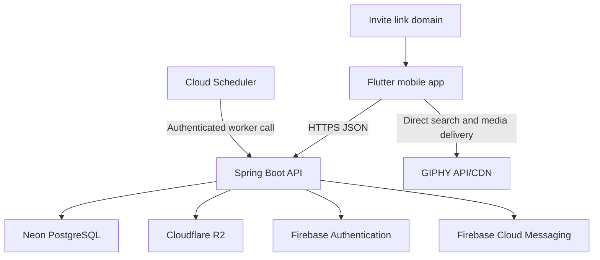
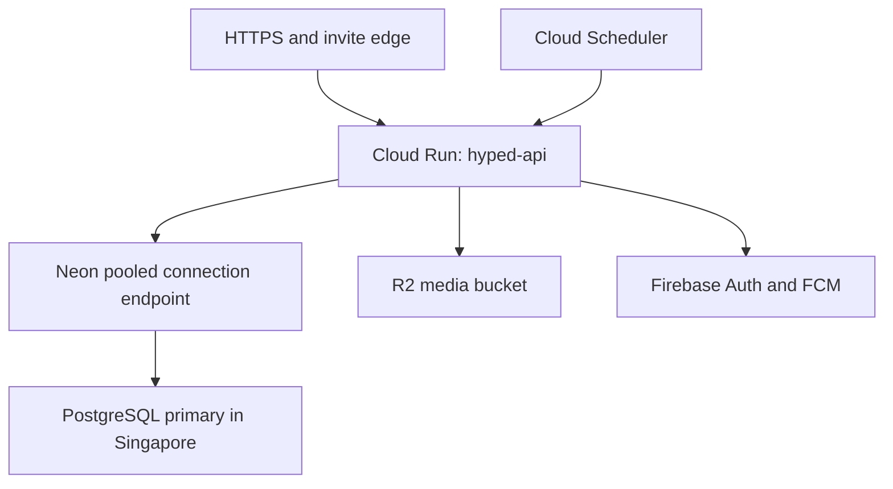
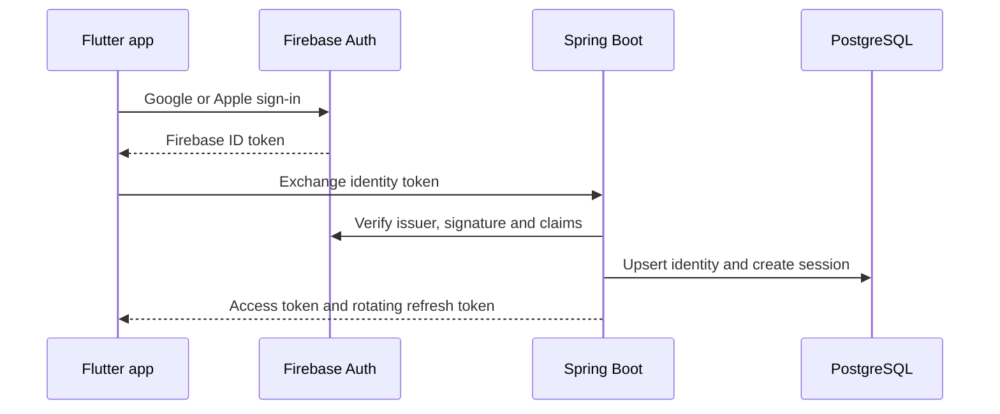
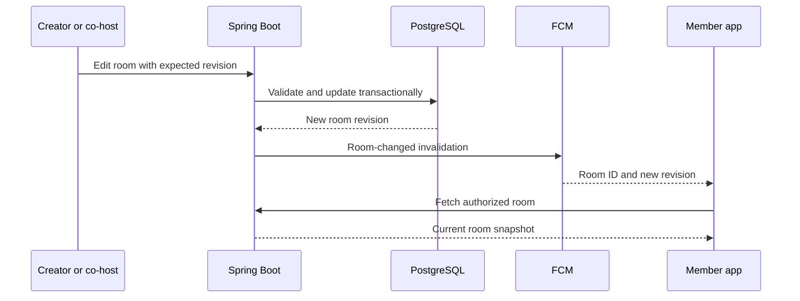
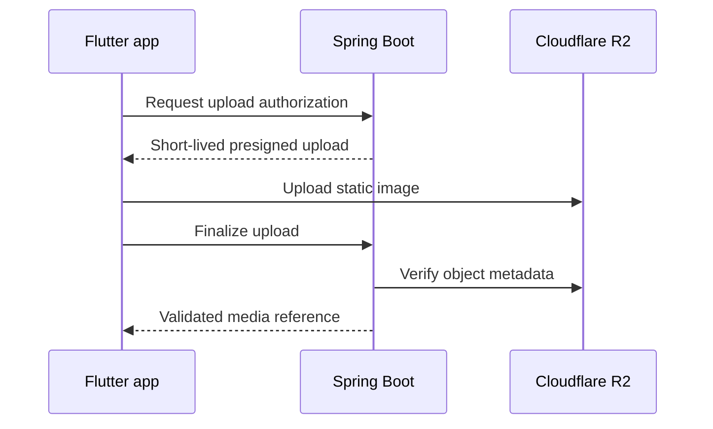
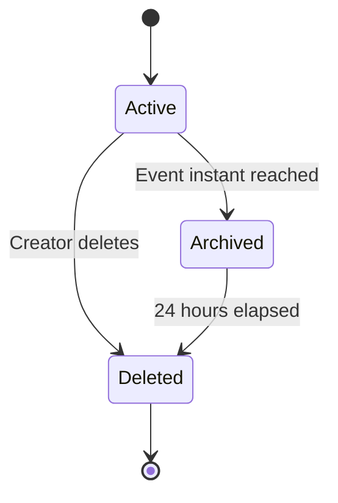

# Hyped! MVP High-Level Design

**Status:** Draft for review  
**Last updated:** 2026-09-14  
**Related documents:** [`01-problem-statement.md`](./01-problem-statement.md), [`02-requirements.md`](./02-requirements.md), [`03-user-flows.md`](./03-user-flows.md), [`04-ui-ux-design.md`](./04-ui-ux-design.md)

## 1. Purpose

This document defines the high-level architecture for the Hyped! MVP. It covers the mobile clients, Spring Boot backend, PostgreSQL database, authentication, media storage, invitation routing, notification delivery, synchronization, deployment topology, security boundaries, availability, scalability, and cost controls.

Detailed tables and indexes belong in `06-database-design.md`. Endpoint schemas belong in `07-api-spec.md`. Classes, packages, and transaction boundaries belong in `08-lld.md`.

## 2. Architecture goals

The MVP architecture shall:

- Support Android and iOS from one Flutter codebase.
- Keep one authoritative event instant and room revision on the server.
- Make countdown rendering independent of a request per second.
- Protect private rooms with server-side authentication and authorization.
- Deliver invitation, reminder, and important-change flows reliably enough for the MVP.
- Preserve useful read-only countdown behaviour while the device is offline.
- Start at the lowest practical operating cost.
- Avoid infrastructure that is not justified by current scale.
- Provide a migration path from an India-first launch to a wider global audience.

## 3. Confirmed architecture decisions

| Area | MVP decision |
|---|---|
| Mobile client | Flutter for Android and iOS |
| Backend | Spring Boot modular monolith |
| Backend hosting | Google Cloud Run with request-based billing |
| Primary database | Neon managed PostgreSQL |
| Authentication | Firebase Authentication with Google and Apple providers |
| Application sessions | Hyped!-issued short-lived access token and rotating refresh session after Firebase identity verification |
| Push delivery | Firebase Cloud Messaging (FCM) |
| Uploaded media | Cloudflare R2 object storage |
| GIF discovery | Direct Flutter integration with GIPHY using separate Android and iOS keys |
| API style | Versioned HTTPS REST APIs using JSON |
| Change synchronization | FCM invalidation message followed by an authorized REST refresh |
| Countdown ticks | Calculated locally from the stored event instant |
| Scheduled work | Google Cloud Scheduler invokes protected Spring Boot worker endpoints |
| Durable asynchronous work | PostgreSQL outbox tables; no external message broker in the MVP |
| Deployment region | Singapore for Spring Boot and PostgreSQL |
| Initial market | India first, with global expansion later |
| Architecture shape | Single deployable service with internal domain modules |
| Runtime bounds | Cloud Run minimum 0, maximum 3, concurrency 20; HikariCP maximum 5 per instance |
| Delivery | Terraform in Git; local immutable commit-SHA image pushed to Artifact Registry and deployed by digest |
| Public web | Cloudflare Pages for legal/support/deletion pages; Cloudflare Worker for invite routing |

## 4. System context

The mobile app is the only interactive client in the MVP. The invite-link domain provides Universal Link and Android App Link association files and redirects recipients without the app to the appropriate store. It is not a full web client.

## 5. Deployment view

### 5.1 MVP region

- Cloud Run shall initially use `asia-southeast1` in Singapore.
- The Neon project shall use its Singapore region.
- Keeping compute and the database in the same metropolitan region avoids a cross-region network round trip on every database operation.
- India receives acceptable nearby-region latency without paying for multiple active deployments.
- R2 and Firebase are accessed as managed external services.

Cloud Run supports Mumbai, Delhi, and Singapore. Neon does not currently provide an India region, so selecting Mumbai for compute would separate the application from its database. Region availability must be rechecked during provisioning because provider offerings can change.

### 5.2 Global expansion path

The MVP remains single-region until measurements justify a change. Expansion shall occur in stages:

1. Use CDN delivery for media and static invite assets.
2. Measure API latency by user region.
3. Increase Cloud Run capacity in Singapore without changing application architecture.
4. Add another compute region only after selecting a database strategy that avoids excessive cross-region latency.
5. Evaluate database relocation, read replicas, or a different managed PostgreSQL topology when global demand requires it.

Multi-region load balancing and replicated databases are deliberately excluded from the MVP cost baseline.

## 6. Mobile architecture

The Flutter client contains the following high-level capabilities:

| Capability | Responsibility |
|---|---|
| Presentation | Screens, navigation, design tokens, accessibility, light/dark themes, and adaptive countdown units |
| Domain | Countdown calculation, permission-aware actions, validation, and room state mapping |
| API client | HTTPS requests, access-token refresh, retries, idempotency keys, and error mapping |
| Local cache | Last authorized room list, room details, revision, selected widget data, and last-sync time |
| Secure storage | Application refresh token and device-sensitive identifiers |
| Link router | Universal Link, Android App Link, pending-invite, and widget-tap routing |
| Notification handler | FCM registration, foreground banners, notification navigation, and data refresh |
| Widget bridge | Shares safe selected-room state with WidgetKit and Android App Widgets |

### 6.1 Offline behaviour

- The client may display previously authorized cached room data with an offline or last-updated indicator.
- The countdown continues locally using the cached UTC event instant and the device clock.
- Create, join, edit, leave, invitation rotation, role changes, and destructive actions require connectivity.
- Signing out clears private cached room data and widget eligibility.
- When the server reports removal, deletion, or lost authorization, the client removes the affected cache and updates widgets to an unavailable state.

The database design will not treat the mobile cache as authoritative.

### 6.2 Widget boundary

iOS WidgetKit and Android App Widgets render from a small local snapshot supplied by the Flutter app or platform-specific background mechanisms. Widgets do not connect directly to PostgreSQL or R2 and do not hold backend credentials.

The snapshot contains only the selected room's minimum display data:

- Room identifier
- Event title
- UTC event instant
- Last authorized revision
- Safe theme reference or fallback colour
- Last refresh time
- Availability state

Operating-system refresh limits apply. Per-second widget updates are not promised.

## 7. Spring Boot backend

The backend is one deployable Spring Boot application divided into internal modules. Module boundaries prevent the modular monolith from becoming a single undifferentiated codebase.

| Module | Responsibility |
|---|---|
| Identity and Session | Verify Firebase identity, map provider identities, issue and revoke Hyped! sessions |
| Profile | Read and edit display name and profile photo metadata |
| Room | Create, read, edit, archive, and delete countdown rooms |
| Membership | Join, leave, remove, promote, demote, transfer ownership, and enforce limits |
| Invitation | Create, resolve, rotate, validate, rate-limit, and revoke invite credentials |
| Theme and Media | Validate theme selection, quarantine/sanitize/moderate uploads, issue private delivery URLs, and delete orphaned objects |
| Notification | Store preferences, create durable delivery work, and send FCM messages |
| Device | Register and retire FCM device tokens |
| Lifecycle | Detect completed events, archive rooms, and permanently delete expired archives |
| Analytics | Record privacy-safe product events and calculate basic adoption measures |
| Moderation | Accept reports and preserve the minimum data needed for review |
| Trust and Safety | Record policy acceptance, enforce 18+ eligibility, block accounts, and apply safe-room transitions |

### 7.1 API conventions

- Public application APIs use `/api/v1`.
- Requests and responses use JSON except direct object-storage transfers.
- Every authenticated request carries a short-lived Hyped! access token.
- Mutating retries use an idempotency key where duplicate execution would be harmful.
- Room edits use a revision or ETag with optimistic concurrency control.
- Errors use one stable envelope with machine-readable code, user-safe message, correlation ID, and optional field errors.
- Pagination is cursor-based for collections that can grow.
- Server timestamps use UTC; event records also preserve the selected IANA time-zone identifier.

### 7.2 Runtime configuration

The initial Cloud Run service should use:

- Request-based CPU allocation
- Minimum instances set to `0`
- Maximum instances `3` and request concurrency `20` per instance to protect the database and budget
- One vCPU and memory established through load testing, beginning at 512 MiB or 1 GiB
- Java 21 and a current supported Spring Boot 3 release
- HikariCP with minimum idle `0` and a small maximum pool, initially `5` connections per instance
- Neon's pooled PostgreSQL connection endpoint
- Startup, liveness, and readiness probes

Exact memory and JVM heap settings must be measured before production. Concurrency and maximum instances begin at the approved values and change only through a measured deployment decision.

## 8. Authentication and application sessions

### 8.1 Identity model

- Firebase Authentication handles Google and Apple provider flows.
- Spring Boot verifies the Firebase token and maps its stable provider subject to an internal Hyped! user identifier.
- Email is profile data and is never the primary key.
- Provider display name and photo initialize the Hyped! profile when available.
- Later profile edits do not modify the Google or Apple account.
- Account linking and provider-collision rules will be finalized in the security design.

### 8.2 Session model

- Hyped! access tokens are one-hour RS256 JWTs with no personal or room data.
- Refresh tokens are random, rotated after use, stored only in platform secure storage on the device, and stored as hashes on the server.
- Logout and device revocation disable refresh immediately; an already issued access JWT may remain valid until its one-hour expiry.
- Suspended, compromised, deleting, and deleted accounts are denied immediately through an authoritative account-state check.
- Server-side session records support per-device token families, refresh-reuse detection, five-device management, and security alerts.
- The backend checks current room membership and role on every private-room operation.

## 9. Core data ownership

PostgreSQL is the source of truth for:

- Users, provider identities, and application sessions
- Devices and FCM registration tokens
- Rooms, normalized event instants, time zones, status, and revisions
- Memberships and roles
- Active and rotated invitation credentials
- Notification preferences and durable delivery work
- Media metadata and ownership
- Reports and privacy-safe analytics events

R2 stores uploaded image objects and generated static previews. It does not decide authorization. Firebase holds external authentication state and push-delivery registrations but not authoritative room membership.

The detailed schema, keys, constraints, indexes, retention, and migrations will be defined in `06-database-design.md`.

## 10. Room synchronization

The visible countdown does not require a live server stream. Every client computes the remaining duration from the same UTC event instant.

### 10.1 Why the MVP does not use WebSockets

- The countdown changes can be calculated locally.
- Important edits are infrequent.
- Persistent connections keep serverless instances active and increase cost.
- FCM already exists for reminders and important-change notifications.
- A REST refresh after an invalidation always rechecks authorization and retrieves the authoritative state.

If FCM is delayed or disabled, the app refreshes when opened, resumed, manually retried, or periodically while active. FCM is an invalidation hint, not the source of truth.

### 10.2 Edit conflicts

Each room has a monotonically increasing revision. An editor submits the revision they read. If another edit already created a newer revision, the backend returns a conflict and the client asks the editor to reload before retrying. Silent last-write-wins behaviour is not permitted for room edits.

## 11. Invitation and deep-link architecture

Invite URLs use an HTTPS domain controlled by Hyped!, for example:

`https://<invite-domain>/invite/<opaque-token>`

The final production domain is intentionally not fixed in this document.

### 11.1 Installed app

- The domain publishes Apple App Site Association and Android Digital Asset Links files.
- iOS Universal Links and Android App Links route the URL to Flutter.
- The app resolves the opaque token through the backend and receives only the safe preview fields before authentication or membership.
- Joining requires authentication and an explicit **Join countdown** action.

### 11.2 App not installed

- A small edge/static route sends the recipient to the appropriate app-store listing.
- Automatic deferred deep-link restoration after installation is not required.
- The user may reopen the original link or use the room code after installation.

### 11.3 Invitation safety

- Raw invitation tokens are not written to logs or analytics.
- The database stores a one-way hash where practical.
- Token lookup and room-code entry are rate-limited.
- Regeneration rotates both credentials atomically and invalidates the old values immediately.
- Invitation resolution does not expose descriptions, member lists, management actions, or private identifiers before joining.

## 12. Media architecture

### 12.1 Preset colours and gradients

Preset themes are represented as validated identifiers and design tokens. No object storage is needed.

### 12.2 Uploaded static images

- Spring Boot authorizes the upload intent and creates an opaque object key.
- The client uploads directly to R2 so large payloads do not consume Cloud Run request time.
- File type, declared size, actual size, dimensions, and safe decoding are validated before activation.
- Only supported static image formats are accepted.
- Images are served as non-executable content through short-lived URLs or an authorization-aware delivery method.
- Replaced, abandoned, deleted-room, and expired-room objects are cleaned up by an idempotent lifecycle task.
- A safe static preview is used where widgets cannot render animated content.

### 12.3 GIF search

- Flutter calls GIPHY directly using separate Android and iOS API keys, as required by GIPHY's integration rules.
- The GIF search surface displays the required **Powered by GIPHY** attribution and requests PG-rated results.
- Hyped! stores only the chosen GIPHY asset identifier and provider name. It does not proxy, cache, rewrite, or copy GIPHY media URLs or files.
- Clients resolve the current rendition directly from GIPHY. Small renditions are used for search previews and an appropriate larger rendition is used after selection.
- Provider failure does not block preset themes or user image uploads.
- Tenor is not an MVP option because it stopped accepting new API clients in January 2026.

## 13. Notifications and scheduled lifecycle work

### 13.1 Notification types

| Type | Trigger | Delivery |
|---|---|---|
| Personal reminder | 24 hours, 1 hour, and event time, subject to member settings | FCM push |
| Important room change | Title, date, time, time zone, or location changed | FCM push plus next in-app refresh |
| Room deletion | Creator confirms deletion | FCM push plus access revocation |
| Member removal | Creator or co-host removes a permitted member | FCM push plus access revocation |
| Foreground update | App receives an applicable event while open | In-app banner |

### 13.2 Durable outbox

Room changes and their required notification records are committed in the same PostgreSQL transaction. A notification worker claims due outbox rows, sends through FCM, and records success, retry, or terminal failure.

This avoids losing required work if Cloud Run stops after committing a room edit but before calling FCM. It also avoids adding Kafka, RabbitMQ, or Redis for MVP traffic.

### 13.3 Scheduler

- One Cloud Scheduler job calls a protected worker endpoint at a small fixed interval, initially once per minute.
- The worker handles due reminders, retries, event completion, 24-hour room deletion, expired sessions, and orphan-media cleanup in bounded batches.
- Database locking or lease fields prevent duplicate workers from processing the same row.
- Deliveries are idempotent and include a deterministic logical notification key.
- FCM delivery is best effort; authoritative state remains available through the API.

If workload volume later makes the shared worker slow or noisy, it can be split into Cloud Run Jobs, Cloud Tasks, or a dedicated queue without changing the mobile contract.

## 14. Room lifecycle

- Active rooms accept authorized reads and mutations.
- At the event instant, the room enters the archived state and clients show the celebration.
- Archived rooms remain readable by existing members for 24 hours but cannot accept new joins.
- Permanent deletion removes memberships, invitations, reminder work, and associated media through an idempotent process.
- Deletion uses a short internal tombstone or completion record only when required to finish distributed cleanup safely. It must not preserve user content longer than the defined retention policy.

## 15. Security boundaries

### 15.1 Client trust

The mobile app is untrusted. Spring Boot independently validates:

- Authentication and session state
- Current membership and role
- Room and joined-room limits
- Expected room revision
- Invitation validity
- Input length and format
- Media metadata
- Rate limits and idempotency

Hiding controls in Flutter is a usability measure, not authorization.

### 15.2 Service credentials and secrets

- Secrets are stored in Google Secret Manager or the equivalent managed secret facility and injected into Cloud Run at runtime.
- Firebase service credentials, token signing material, database credentials, and R2 credentials are never committed to Git. Separate GIPHY Android/iOS keys are supplied through controlled mobile build configuration rather than source files.
- Separate credentials and resources are used for development, staging, and production.
- Database access uses TLS and a least-privileged application role.
- R2 presigned operations are short lived and constrained to the intended object.

### 15.3 Abuse controls

- Rate limits apply to authentication exchange, invite resolution, room-code attempts, joins, invite rotation, reports, and upload authorization.
- Limits may be implemented initially with PostgreSQL-backed counters or Cloud Run/edge controls to avoid a Redis dependency.
- Error messages do not confirm whether unrelated private rooms or users exist.
- Uploaded files are served with safe content types and download headers where appropriate.

Detailed threats and mitigations will be defined in `09-security-design.md`.

## 16. Reliability and data recovery

### 16.1 Availability target

The MVP targets 99.5% monthly backend availability, excluding announced maintenance. The design supports that target through managed services, stateless Cloud Run instances, health checks, bounded retries, idempotency, and a durable database outbox.

### 16.2 Failure behaviour

| Failure | Expected behaviour |
|---|---|
| Cloud Run cold start | Client shows cached/loading state and applies a bounded retry |
| PostgreSQL temporarily unavailable | Mutation fails safely; committed state is not guessed locally |
| FCM delayed or unavailable | Client refreshes on open/resume; outbox retries eligible messages |
| R2 unavailable | Existing room data remains usable with a theme fallback; upload can be retried |
| GIF provider unavailable | Preset themes and static uploads remain available |
| Scheduler invocation missed | Next run claims overdue idempotent work |
| Duplicate request | Idempotency and database constraints prevent duplicate state |

### 16.3 Backup approach

- Use Neon recovery features available to the selected plan.
- Before production, validate restore procedures rather than assuming a successful backup is restorable.
- Cloud Scheduler starts a dedicated Cloud Run Job once daily to create a compressed, application-encrypted logical backup in a private R2 backup bucket with separate credentials and seven-day retention.
- The MVP targets an RPO of 24 hours and an RTO of four hours. Restore testing occurs before public launch and every three months as defined in `11-deployment.md`.

## 17. Observability

Spring Boot emits structured JSON logs containing:

- Timestamp and severity
- Correlation/request ID
- Route template and status code
- Duration
- Safe user or room surrogate identifier when necessary
- Error code and retry classification

Logs must not include authentication tokens, refresh tokens, raw invitation credentials, database URLs, uploaded content, or unnecessary personal data.

Initial metrics include:

- Request count, p50/p95/p99 latency, and error rate
- Cloud Run instance count and cold-start behaviour
- Database connection usage and query latency
- Authentication exchange failures
- Invite resolution and join failures by safe reason code
- Optimistic-concurrency conflicts
- Outbox age, queue depth, retry count, and terminal failures
- FCM send outcomes
- Media authorization, validation, and upload-finalization failures
- Lifecycle worker lag

Google Cloud Logging and Monitoring are used first to minimize operational cost. A separate observability platform is not required for the MVP.

## 18. Analytics

The MVP records only the privacy-safe events required to measure group adoption. Events use internal or pseudonymous identifiers and never contain raw invite tokens, authentication tokens, uploaded media, or free-text event descriptions.

The initial implementation may store a compact append-only analytics record in PostgreSQL and periodically aggregate it. Raw-event retention must be bounded in the database design. A dedicated analytics warehouse is deferred until data volume or analysis needs justify it.

## 19. Cost controls

The design aims to stay within provider free allowances at small MVP usage, but a zero bill is not guaranteed.

| Cost area | MVP control |
|---|---|
| Compute | Cloud Run request billing, minimum instances `0`, maximum-instance cap |
| Database | Neon free starting plan, pooled connections, small per-instance pool |
| Push and identity | Firebase Auth allowance and no-cost FCM delivery |
| Media | R2 free allowance, upload limits, cleanup, and no duplicated GIF storage |
| Scheduled work | One batched scheduler invocation rather than one job per event |
| Logging | Sampling/retention controls and no verbose production request bodies |
| Analytics | PostgreSQL aggregates before adopting a paid warehouse |
| Networking | Backend and PostgreSQL colocated in Singapore |

Google Cloud budget alerts shall be configured before production. Alerts provide warning but do not automatically cap every charge, so hard application limits are still required for uploads, rooms, memberships, worker batches, and Cloud Run instances.

## 20. Scalability approach

### 20.1 Initial capacity model

The limits of 10 owned rooms, 25 joined rooms, and 25 members per room keep individual fan-out bounded. Countdown ticks generate no backend traffic. Most server load comes from room opens, invite conversion, edits, media operations, and scheduled notifications.

### 20.2 Scaling sequence

1. Optimize queries and add database indexes based on measured plans.
2. Tune Cloud Run concurrency, memory, and JVM startup.
3. Increase capped Cloud Run instances while respecting the database connection budget.
4. Batch notification work and analytics aggregation.
5. Add caching only for measured hot paths that cannot be fixed through query or payload design.
6. Introduce a dedicated queue only when PostgreSQL outbox polling becomes a proven bottleneck.
7. Split the modular monolith only when a module has a distinct scaling, isolation, ownership, or release requirement.

Redis, Kafka, Kubernetes, service mesh, and microservices are not part of the MVP architecture.

## 21. External dependencies

| Dependency | Purpose | Failure impact | MVP mitigation |
|---|---|---|---|
| Google Cloud Run | Spring Boot compute | API unavailable | Offline read-only cache, retry, health monitoring |
| Neon PostgreSQL | Authoritative relational data | Reads and writes unavailable | Managed recovery, safe failures, restore testing |
| Firebase Authentication | Google/Apple identity | New sign-ins unavailable | Preserve valid sessions; recoverable sign-in errors |
| Firebase Cloud Messaging | Push and invalidation delivery | Push delayed or lost | Refresh on app open/resume; durable outbox retry |
| Cloudflare R2 | Uploaded media | Media/upload unavailable | Theme fallback and retry |
| Cloud Scheduler | Periodic worker trigger | Reminders/lifecycle delayed | Idempotent overdue processing on next run |
| GIPHY | Direct GIF discovery/delivery | GIF search or display degraded | Presets and uploads remain usable |
| Apple/Google link association | Installed-app routing | Link opens browser/store path | Room-code fallback |

Each dependency's quotas, terms, region availability, pricing, and data handling must be checked again before production launch.

## 22. Environments and delivery

The project uses separate local, development, staging, and production configurations.

- Local development may use Docker Compose PostgreSQL and provider emulators/mocks where practical.
- Development may share low-cost managed infrastructure but cannot share production credentials or data.
- Staging is a reserved isolated configuration boundary but is not provisioned as an always-on environment initially.
- Production uses isolated Firebase configuration, Neon project or branch policy, R2 bucket, secrets, and Cloud Run service.
- A separate one-off Cloud Run Job applies forward-only Flyway migrations before application deployment; autoscaled application instances never migrate production concurrently.
- Initially, the solo developer runs one local verification script to build, test, scan, and package the Spring Boot and Flutter applications; CI is deferred.

The detailed pipeline, migration execution, rollback, and release process is defined in `11-deployment.md`.

## 23. Major decisions deferred to later documents

| Decision | Target document |
|---|---|
| Exact tables, indexes, invitation hashing, analytics retention, and deletion constraints | `06-database-design.md` |
| GIPHY production-key approval, pricing, and final terms | `07-api-spec.md` or an ADR |
| Complete endpoint schemas, pagination cursors, and error codes | `07-api-spec.md` |
| Spring packages, classes, validation, transactions, and worker locking | `08-lld.md` |
| Token lifetime, signing algorithm, key rotation, account linking, and detailed threat model | `09-security-design.md` |
| Local test scope, performance observations, device matrix, and deferred infrastructure tests | `10-test-plan.md` |
| Alert thresholds, dashboards, escalation, and incident recovery | `12-observability-runbook.md` |

## 24. Architecture acceptance checklist

- [ ] Flutter is the only full interactive client in the MVP.
- [ ] Spring Boot is deployed as one modular monolith on Cloud Run.
- [ ] Cloud Run and Neon PostgreSQL are colocated in Singapore.
- [ ] Countdown ticks are calculated locally and do not call the backend every second.
- [ ] Firebase verifies Google and Apple identities before Hyped! creates a session.
- [ ] Backend authorization protects every private-room operation.
- [ ] PostgreSQL is authoritative for rooms, membership, roles, invitations, and lifecycle state.
- [ ] FCM messages trigger authorized REST refreshes rather than carrying authoritative private room state.
- [ ] Durable notification and lifecycle work uses a PostgreSQL outbox.
- [ ] Uploaded static images go directly to R2 through short-lived authorized operations.
- [ ] Invitation links use Universal Links and Android App Links, not Firebase Dynamic Links.
- [ ] Offline mode is read-only and clearly identified.
- [ ] Event archiving and 24-hour deletion are idempotent.
- [ ] Provider failures have defined degraded behaviour.
- [ ] Secrets are kept out of source control and mobile binaries.
- [ ] Autoscaling, connection pools, upload sizes, logs, and scheduled work have explicit cost controls.
- [ ] Multi-region infrastructure, Redis, Kafka, and microservices remain deferred until measurements justify them.

## 25. References

- [Google Cloud Run pricing](https://cloud.google.com/run/pricing)
- [Google Cloud Run locations](https://cloud.google.com/run/docs/locations)
- [Neon pricing](https://neon.com/pricing)
- [Neon regions](https://neon.com/docs/introduction/regions)
- [Firebase pricing](https://firebase.google.com/pricing)
- [Cloudflare R2 pricing](https://developers.cloudflare.com/r2/pricing/)
- [Flutter deep linking](https://docs.flutter.dev/ui/navigation/deep-linking)
