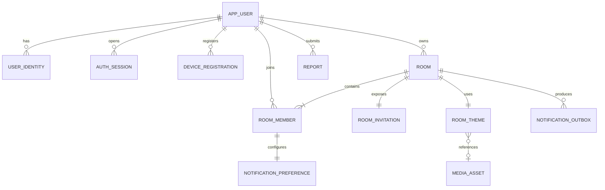
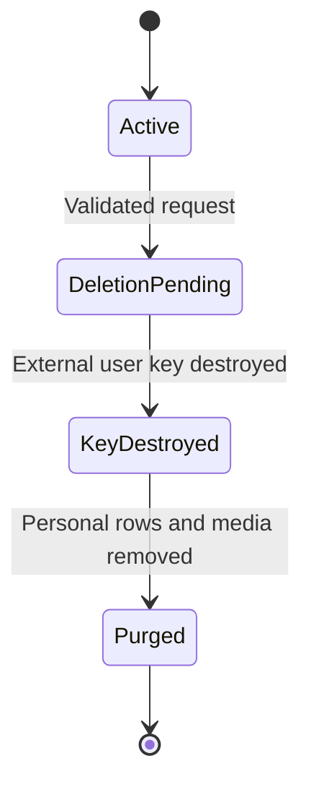

# Hyped! MVP Database Design

**Status:** Draft for review  
**Last updated:** 2026-09-09  
**Database:** PostgreSQL on Neon  
**Related documents:** [`02-requirements.md`](./02-requirements.md), [`03-user-flows.md`](./03-user-flows.md), [`05-hld.md`](./05-hld.md)

## 1. Purpose

This document defines how Hyped! stores authoritative application data for the MVP. It specifies entities, columns, relationships, keys, constraints, indexes, transaction rules, deletion behaviour, backup boundaries, retention, and schema migration strategy.

API payloads belong in `07-api-spec.md`. Spring Data repositories, services, and transaction implementation belong in `08-lld.md`. Encryption algorithms and key-management procedures belong in `09-security-design.md`.

## 2. Design goals

The database design shall:

- Keep one authoritative event instant and room revision.
- Enforce private-room membership and role invariants.
- Make room, member, and join limits safe under concurrent requests.
- Support immediate invitation rotation and idempotent joining.
- Support optimistic concurrency for creator and co-host edits.
- Make reminder, notification, archive, and deletion work durable without a message broker.
- Keep personally identifiable data separate from public identifiers and room content.
- Purge usable personal data within 24 hours of an approved account-deletion request.
- Keep storage, compute, and connection requirements small enough for a low-cost Neon plan.
- Allow safe forward migrations as the application grows.

## 3. Confirmed data decisions

| Area | Decision |
|---|---|
| Database | PostgreSQL hosted by Neon |
| Primary identifiers | Application-generated UUIDv7 values |
| Event | UTC `timestamptz` plus the selected IANA time-zone identifier |
| Maximum room size | 25 active members including the creator |
| Maximum owned rooms | 10 active rooms per user |
| Maximum joined rooms | 25 active joined rooms, excluding rooms the user owns |
| Event recurrence | One-time events only |
| Room archive | At the event instant |
| Room deletion | 24 hours after archiving, or immediately after creator-confirmed deletion |
| Room code | Eight unambiguous uppercase characters, displayed `XXXX-XXXX` |
| Event title | Maximum 80 characters |
| Location | Maximum 120 characters |
| Description | Maximum 500 characters |
| Source image | Maximum 5 MB before client-side compression; server validates final object separately |
| Account deletion | No recovery period; usable personal data purged within 24 hours |
| Deleted-data backup treatment | Destroy the external per-user decryption capability; unreadable backup bytes expire normally |
| Independent backup | Daily encrypted logical backup retained for seven days |
| Raw analytics | Retained for 30 days |
| Moderation record | Pseudonymized and retained for 90 days |
| Identity linking | Google and Apple identities link only after user confirmation |

## 4. PostgreSQL conventions

### 4.1 Names and schemas

- Tables and columns use `snake_case`.
- Application tables use the `app` schema.
- Operational worker tables use the `ops` schema.
- Privacy-safe analytics tables use the `analytics` schema.
- Flyway metadata uses its configured schema and is not modified manually.
- Singular table names are used throughout this document.

### 4.2 Common data types

| Purpose | PostgreSQL type | Rule |
|---|---|---|
| Primary/foreign ID | `uuid` | UUIDv7 created by the application |
| Instant | `timestamptz` | Written and compared in UTC |
| Calendar time zone | `varchar(64)` | Valid IANA identifier |
| Bounded user text | `varchar(n)` | Length also checked at API boundary |
| Revision/counter | `bigint` | Non-negative |
| Flexible internal payload | `jsonb` | Only for bounded outbox/error metadata, not primary domain fields |
| Hash/HMAC | `bytea` | Raw secret is never stored |
| Encrypted value | `bytea` | Versioned envelope format defined by security design |
| Status/role | `varchar` plus `check` | Avoid hard-to-change PostgreSQL enum types |

### 4.3 Common audit columns

Mutable domain tables use:

- `created_at timestamptz not null`
- `updated_at timestamptz not null`

The application supplies timestamps from one server-side clock. Database defaults may protect direct inserts, but client-provided audit timestamps are never trusted.

### 4.4 Identifier rules

- UUIDv7 improves index locality while remaining opaque enough for public API identifiers.
- Database sequence values are not exposed through the API.
- Invitation tokens and room codes are separate credentials, never room primary keys.
- Provider email addresses and provider subjects are never primary keys.

## 5. Entity relationship overview

Analytics and operational cleanup entities are intentionally omitted from the diagram to keep the core domain readable.

## 6. Identity and session tables

### 6.1 `app.app_user`

Stores the stable internal account and deletion state. It does not store raw provider credentials.

| Column | Type | Null | Notes |
|---|---|---:|---|
| `id` | `uuid` | No | Primary key, UUIDv7 |
| `status` | `varchar(20)` | No | `active`, `deletion_pending`, `deleted` |
| `pii_key_reference` | `varchar(255)` | Yes | Opaque external per-user key reference, never key material |
| `deletion_requested_at` | `timestamptz` | Yes | Set after ownership/membership validation |
| `pii_destroyed_at` | `timestamptz` | Yes | When personal data became cryptographically unreadable |
| `deleted_at` | `timestamptz` | Yes | Completion time for account deletion |
| `created_at` | `timestamptz` | No | Audit field |
| `updated_at` | `timestamptz` | No | Audit field |

Constraints:

- `status` is limited to the three values above.
- `active` users have no `deleted_at`.
- `deleted` users have `deleted_at` and `pii_destroyed_at`.
- A deleted account cannot create a new session.

The row may be reduced to a non-identifying tombstone during the seven-day restore-safety window. After no retained database backup can resurrect the account, it may be physically deleted unless a pseudonymous legal or security record requires otherwise.

### 6.2 `app.user_profile`

| Column | Type | Null | Notes |
|---|---|---:|---|
| `user_id` | `uuid` | No | Primary and foreign key to `app_user` |
| `display_name_ciphertext` | `bytea` | No | Decrypted only for authorized presentation |
| `photo_media_id` | `uuid` | Yes | Foreign key to a user-owned `media_asset` |
| `provider_photo_url_ciphertext` | `bytea` | Yes | Initial provider photo when not copied to R2 |
| `profile_revision` | `bigint` | No | Starts at 1 and increases on edit |
| `created_at` | `timestamptz` | No | Audit field |
| `updated_at` | `timestamptz` | No | Audit field |

The display-name limit is 80 characters for storage consistency; the UI may adopt a smaller recommended length. Encrypted columns use the account's external key capability.

### 6.3 `app.user_identity`

Maps a verified Firebase provider identity to one internal user.

| Column | Type | Null | Notes |
|---|---|---:|---|
| `id` | `uuid` | No | Primary key |
| `user_id` | `uuid` | No | Foreign key to `app_user` |
| `provider` | `varchar(16)` | No | `google` or `apple` |
| `provider_subject_hmac` | `bytea` | No | Deterministic keyed lookup value |
| `email_ciphertext` | `bytea` | Yes | Optional verified provider email |
| `email_hmac` | `bytea` | Yes | Candidate lookup for confirmed account linking |
| `email_verified` | `boolean` | No | Defaults false |
| `linked_at` | `timestamptz` | No | Link confirmation time |
| `last_verified_at` | `timestamptz` | No | Last successful identity verification |
| `created_at` | `timestamptz` | No | Audit field |

Constraints and indexes:

- Unique on `(provider, provider_subject_hmac)`.
- Unique on `(user_id, provider)` for MVP, allowing at most one Google and one Apple identity per account.
- `email_hmac` is not enough to link accounts automatically; it only finds a candidate requiring proof and explicit confirmation.
- Raw Firebase tokens, Apple authorization codes, and Google tokens are never stored here.

### 6.4 `app.auth_session`

| Column | Type | Null | Notes |
|---|---|---:|---|
| `id` | `uuid` | No | Primary key |
| `user_id` | `uuid` | No | Foreign key to `app_user` |
| `device_id` | `uuid` | Yes | Foreign key to `device_registration` |
| `refresh_token_hash` | `bytea` | No | Unique one-way hash |
| `token_family_id` | `uuid` | No | Groups rotating refresh tokens |
| `issued_at` | `timestamptz` | No | Session creation time |
| `last_used_at` | `timestamptz` | No | Rotation/activity time |
| `expires_at` | `timestamptz` | No | Absolute expiry |
| `revoked_at` | `timestamptz` | Yes | Logout, compromise, or deletion |
| `revoke_reason` | `varchar(32)` | Yes | Bounded internal reason code |
| `created_at` | `timestamptz` | No | Audit field |
| `updated_at` | `timestamptz` | No | Audit field |

Indexes:

- Unique on `refresh_token_hash`.
- `(user_id, revoked_at)` for session revocation/listing.
- `expires_at` for cleanup.

Token lifetime is finalized in `09-security-design.md`.

### 6.5 `app.device_registration`

| Column | Type | Null | Notes |
|---|---|---:|---|
| `id` | `uuid` | No | Primary key |
| `user_id` | `uuid` | No | Foreign key to `app_user` |
| `platform` | `varchar(16)` | No | `android` or `ios` |
| `installation_id` | `uuid` | No | App-install identifier |
| `fcm_token_ciphertext` | `bytea` | No | Encrypted using user-bound key capability |
| `fcm_token_fingerprint` | `bytea` | No | Detects duplicate registrations without revealing token |
| `notifications_enabled` | `boolean` | No | Last known application setting |
| `last_seen_at` | `timestamptz` | No | Last successful app activity |
| `invalidated_at` | `timestamptz` | Yes | Provider rejected token or user signed out |
| `created_at` | `timestamptz` | No | Audit field |
| `updated_at` | `timestamptz` | No | Audit field |

Unique on `(user_id, installation_id)`. Invalid tokens are retained only briefly for diagnostic classification, then deleted.

## 7. Room and membership tables

### 7.1 `app.room`

| Column | Type | Null | Notes |
|---|---|---:|---|
| `id` | `uuid` | No | Primary key, UUIDv7 |
| `owner_user_id` | `uuid` | No | Current creator/owner |
| `title` | `varchar(80)` | No | Required, trimmed, not blank |
| `event_at` | `timestamptz` | No | Exact authoritative event instant |
| `event_timezone` | `varchar(64)` | No | Valid IANA identifier selected by creator |
| `location` | `varchar(120)` | Yes | Optional, blank normalized to null |
| `description` | `varchar(500)` | Yes | Optional, blank normalized to null |
| `status` | `varchar(16)` | No | `active`, `archived`, `deleting` |
| `revision` | `bigint` | No | Starts at 1, increments on visible edit |
| `member_count` | `smallint` | No | Transactionally maintained active count |
| `archived_at` | `timestamptz` | Yes | Normally equals or follows `event_at` |
| `delete_after` | `timestamptz` | Yes | `archived_at + 24 hours` |
| `created_at` | `timestamptz` | No | Audit field |
| `updated_at` | `timestamptz` | No | Audit field |

Constraints:

- `title` is non-blank after trimming.
- `revision >= 1`.
- `member_count between 1 and 25` while active or archived.
- New active rooms require `event_at` in the future, enforced by the service transaction because `now()` is unsuitable for a stable check constraint.
- Archived rooms have `archived_at` and `delete_after`.
- `delete_after` is exactly 24 hours after `archived_at` for automatic completion.
- Recurrence columns do not exist in the MVP.

Indexes:

- `(owner_user_id, status)` for the ten-owned-room limit and owner list.
- `(status, event_at)` partial index for active lifecycle scanning.
- `(status, delete_after)` partial index for archived deletion scanning.
- `(updated_at)` only if operational queries demonstrate a need.

### 7.2 `app.room_member`

Contains only current membership. Leaving or removal deletes the active membership inside the same transaction that creates the required outbox event.

| Column | Type | Null | Notes |
|---|---|---:|---|
| `room_id` | `uuid` | No | Foreign key to `room` |
| `user_id` | `uuid` | No | Foreign key to `app_user` |
| `role` | `varchar(16)` | No | `creator`, `co_host`, `member` |
| `joined_via` | `varchar(16)` | No | `created`, `invite_link`, `room_code` |
| `joined_at` | `timestamptz` | No | Membership creation time |
| `updated_at` | `timestamptz` | No | Role-change time |

Keys and constraints:

- Primary key `(room_id, user_id)` prevents duplicate joining.
- `role` is limited to the three values above.
- Exactly one active `creator` membership exists per room, enforced with a unique partial index on `room_id where role = 'creator'`.
- The creator membership user must equal `room.owner_user_id`, enforced transactionally and checked by consistency tests.
- Foreign-key deletion behaviour is explicit; account deletion cannot cascade through owned active rooms because ownership must first be transferred.

Indexes:

- `(user_id, role)` for a user's room list and joined-room limit.
- `(room_id, role)` for member management.

### 7.3 Concurrent limits

Room and membership limits must remain correct when requests arrive concurrently:

- Creating a room locks the user's active-account row, counts active owned rooms, and inserts only if below 10.
- Joining locks the target room and user account in stable identifier order.
- The transaction checks `room.member_count < 25` and the user's active joined-room count `< 25`.
- Inserting the membership and incrementing `member_count` occur in the same transaction.
- The membership primary key makes join retry idempotent.
- Leaving/removal deletes membership and decrements `member_count` in one transaction.
- Ownership transfer updates `room.owner_user_id`, the old creator role, and the new creator role atomically after locking the room and both membership rows.

No application-only precheck is treated as sufficient for these invariants.

## 8. Invitation table

### 8.1 `app.room_invitation`

The MVP maintains one current invitation generation per room.

| Column | Type | Null | Notes |
|---|---|---:|---|
| `room_id` | `uuid` | No | Primary and foreign key to `room` |
| `generation` | `integer` | No | Starts at 1 and increments on rotation |
| `link_token_hash` | `bytea` | No | Hash of high-entropy opaque URL token |
| `room_code_hmac` | `bytea` | No | Keyed lookup for eight-character code |
| `created_by_user_id` | `uuid` | No | Creator who created/rotated credentials |
| `created_at` | `timestamptz` | No | Current generation time |
| `updated_at` | `timestamptz` | No | Rotation time |

Constraints and indexes:

- Unique on `link_token_hash`.
- Unique on `room_code_hmac`.
- `generation >= 1`.
- Raw invite link tokens and room codes are returned once and never persisted.
- The displayed hyphen is formatting and is removed before canonicalization.
- Code alphabet excludes `0`, `O`, `1`, and `I`.
- A keyed HMAC, rather than a fast unkeyed hash, prevents an offline table scan across the small room-code space.

Rotation updates both stored credential values and increments `generation` in one locked transaction. Old credentials become unusable immediately.

## 9. Theme and media tables

### 9.1 `app.media_asset`

| Column | Type | Null | Notes |
|---|---|---:|---|
| `id` | `uuid` | No | Primary key |
| `owner_user_id` | `uuid` | No | User who initiated upload/selection |
| `scope` | `varchar(16)` | No | `room_cover` or `profile_photo` |
| `source` | `varchar(16)` | No | `r2_upload` or `gif_provider` |
| `status` | `varchar(16)` | No | `pending`, `validating`, `ready`, `rejected`, `deleting` |
| `object_key` | `varchar(512)` | Yes | Opaque R2 key for uploaded image |
| `preview_object_key` | `varchar(512)` | Yes | Safe static preview where required |
| `provider` | `varchar(32)` | Yes | GIF provider identifier |
| `provider_asset_id` | `varchar(255)` | Yes | Provider's stable asset ID |
| `provider_url` | `varchar(2048)` | Yes | Approved delivery URL |
| `mime_type` | `varchar(64)` | Yes | Verified type, not client claim |
| `size_bytes` | `bigint` | Yes | Verified final object size |
| `width_px` | `integer` | Yes | Verified decoded width |
| `height_px` | `integer` | Yes | Verified decoded height |
| `content_hash` | `bytea` | Yes | Integrity/deduplication aid, not public |
| `failure_code` | `varchar(32)` | Yes | Bounded safe reason |
| `created_at` | `timestamptz` | No | Audit field |
| `updated_at` | `timestamptz` | No | Audit field |

Source-specific checks ensure that R2 assets have object metadata and GIF assets have provider metadata. The server-side final upload limit will be lower than or equal to the compressed-output limit set in the API specification.

Indexes:

- `(owner_user_id, created_at desc)`.
- `(status, created_at)` for pending/orphan cleanup.
- Unique partial index on `object_key where object_key is not null`.

### 9.2 `app.room_theme`

| Column | Type | Null | Notes |
|---|---|---:|---|
| `room_id` | `uuid` | No | Primary and foreign key to `room` |
| `kind` | `varchar(16)` | No | `preset`, `gradient`, `uploaded_image`, `provider_gif` |
| `preset_key` | `varchar(64)` | Yes | Versioned application design token |
| `media_asset_id` | `uuid` | Yes | Foreign key to ready `media_asset` |
| `overlay_key` | `varchar(64)` | No | Validated readability treatment |
| `updated_by_user_id` | `uuid` | No | Creator or co-host |
| `created_at` | `timestamptz` | No | Audit field |
| `updated_at` | `timestamptz` | No | Audit field |

Exactly one of `preset_key` and `media_asset_id` is present according to `kind`. A failed upload never replaces the current ready theme.

## 10. Notification tables

### 10.1 `app.notification_preference`

One row exists for each current room membership.

| Column | Type | Null | Notes |
|---|---|---:|---|
| `room_id` | `uuid` | No | Part of primary/foreign key |
| `user_id` | `uuid` | No | Part of primary/foreign key |
| `remind_24h` | `boolean` | No | Defaults true |
| `remind_1h` | `boolean` | No | Defaults true |
| `remind_at_event` | `boolean` | No | Defaults true |
| `preference_revision` | `bigint` | No | Starts at 1 |
| `created_at` | `timestamptz` | No | Audit field |
| `updated_at` | `timestamptz` | No | Audit field |

Primary key `(room_id, user_id)` and composite foreign key to `room_member`. Membership deletion cascades to this preference.

### 10.2 `ops.notification_outbox`

Durably stores pending reminders, invalidations, important changes, removal notices, deletion notices, and lifecycle work.

| Column | Type | Null | Notes |
|---|---|---:|---|
| `id` | `uuid` | No | Primary key |
| `event_type` | `varchar(48)` | No | Bounded internal event name |
| `room_id` | `uuid` | Yes | Logical room reference without cascading FK |
| `target_user_id` | `uuid` | Yes | Target for personal delivery |
| `room_revision` | `bigint` | Yes | Revision that produced invalidation |
| `logical_key` | `varchar(255)` | No | Deterministic idempotency key |
| `payload` | `jsonb` | No | Minimal bounded non-secret metadata |
| `status` | `varchar(16)` | No | `pending`, `processing`, `retry`, `sent`, `failed` |
| `available_at` | `timestamptz` | No | Due time |
| `attempt_count` | `smallint` | No | Starts at 0 |
| `lease_owner` | `uuid` | Yes | Current worker claim |
| `lease_until` | `timestamptz` | Yes | Claim expiry |
| `last_error_code` | `varchar(64)` | Yes | Safe bounded classification |
| `sent_at` | `timestamptz` | Yes | Successful completion |
| `created_at` | `timestamptz` | No | Audit field |
| `updated_at` | `timestamptz` | No | Audit field |

Indexes:

- Unique on `logical_key`.
- Partial `(available_at, created_at) where status in ('pending','retry')`.
- Partial `lease_until where status = 'processing'`.
- `(room_id, created_at)` for lifecycle diagnosis.

Workers claim bounded batches with `for update skip locked`. Payloads never contain raw invitation credentials, tokens, free-text descriptions, or media bodies.

### 10.3 Reminder generation

- Joining inserts default notification preferences and three reminder outbox rows in the membership transaction.
- Editing the event instant cancels/replaces pending reminder rows using deterministic logical keys tied to the new room revision.
- Changing personal preferences cancels or creates only that member's pending reminders.
- Leaving, removal, or deletion cancels applicable pending work.
- The event-time job archives the room and emits celebration invalidation once.

## 11. Idempotency and reporting tables

### 11.1 `ops.idempotency_record`

| Column | Type | Null | Notes |
|---|---|---:|---|
| `user_id` | `uuid` | No | Authenticated caller |
| `idempotency_key` | `varchar(128)` | No | Client-generated opaque key |
| `operation` | `varchar(64)` | No | Stable route/command identifier |
| `request_hash` | `bytea` | No | Detects key reuse with different request |
| `resource_id` | `uuid` | Yes | Created/affected resource |
| `response_status` | `smallint` | Yes | Stored terminal response status |
| `response_body` | `jsonb` | Yes | Small bounded replay response only |
| `expires_at` | `timestamptz` | No | Cleanup boundary |
| `created_at` | `timestamptz` | No | Audit field |

Primary key `(user_id, idempotency_key, operation)`. Initial retention is 24 hours unless the API specification requires longer for a specific operation.

### 11.2 `app.report`

| Column | Type | Null | Notes |
|---|---|---:|---|
| `id` | `uuid` | No | Primary key |
| `room_id` | `uuid` | Yes | Nullable after room deletion |
| `reporter_user_id` | `uuid` | Yes | Removed/pseudonymized on account deletion |
| `subject_type` | `varchar(24)` | No | `room` or `theme` |
| `reason_code` | `varchar(32)` | No | Controlled category |
| `details_ciphertext` | `bytea` | Yes | Optional bounded report detail |
| `status` | `varchar(16)` | No | `open`, `reviewed`, `closed` |
| `resolved_at` | `timestamptz` | Yes | Review completion |
| `retain_until` | `timestamptz` | No | At most 90 days from creation |
| `created_at` | `timestamptz` | No | Audit field |
| `updated_at` | `timestamptz` | No | Audit field |

After account deletion, reporter identity is removed and any user-key-encrypted free text becomes unreadable. The controlled reason, timestamps, and non-reversible subject fingerprints may remain until `retain_until`.

## 12. Analytics tables

### 12.1 `analytics.product_event`

| Column | Type | Null | Notes |
|---|---|---:|---|
| `id` | `uuid` | No | Primary key |
| `event_name` | `varchar(48)` | No | Approved event catalogue value |
| `anonymous_actor_id` | `bytea` | Yes | Rotatable HMAC, not application user ID |
| `anonymous_room_id` | `bytea` | Yes | HMAC, not room ID |
| `join_channel` | `varchar(16)` | Yes | `invite_link` or `room_code` |
| `properties` | `jsonb` | No | Allowlisted, bounded, non-PII fields |
| `occurred_at` | `timestamptz` | No | Event time |
| `expires_at` | `timestamptz` | No | `occurred_at + 30 days` |
| `created_at` | `timestamptz` | No | Ingestion time |

Indexes:

- `(event_name, occurred_at)`.
- `expires_at` for deletion.
- BRIN on `occurred_at` may replace/add to B-tree only after volume justifies it.

Free text, authentication data, raw invite credentials, media URLs, device tokens, email addresses, and exact profile values are forbidden.

### 12.2 `analytics.daily_metric`

| Column | Type | Null | Notes |
|---|---|---:|---|
| `metric_date` | `date` | No | Part of primary key |
| `metric_name` | `varchar(64)` | No | Part of primary key |
| `dimension_key` | `varchar(64)` | No | Part of primary key; `all` when absent |
| `metric_value` | `numeric(20,4)` | No | Count, duration, or rate numerator/denominator |
| `sample_count` | `bigint` | No | Aggregation base |
| `created_at` | `timestamptz` | No | Audit field |
| `updated_at` | `timestamptz` | No | Audit field |

Anonymous daily aggregates may be retained while useful because they cannot be traced back to a user, room, or invitation.

## 13. Account deletion and cryptographic deletion

### 13.1 Preconditions

The deletion transaction begins only when:

- The user has no owned rooms.
- Ownership was transferred or each owned room was explicitly deleted.
- The user has left all joined rooms.
- Recent authentication is proven.

### 13.2 Deletion flow

Within 24 hours, an idempotent deletion worker:

1. Rechecks that the account owns and joins no rooms.
2. Revokes all sessions.
3. Invalidates device registrations.
4. Deletes or detaches profile media.
5. Removes provider identity mappings and profile ciphertext.
6. Destroys the external per-user decryption capability.
7. Pseudonymizes eligible moderation records.
8. Removes raw analytics actor linkage through key rotation/deletion rules.
9. Marks the minimal account tombstone deleted until backup restore safety no longer requires it.

### 13.3 Backup semantics

Existing encrypted backup files are not rewritten for each deletion. Instead:

- Personal fields are encrypted using a per-user capability whose usable key material is not stored in the PostgreSQL backup.
- Destroying that capability makes personal ciphertext in every retained backup permanently unreadable.
- Daily backup objects expire after seven days.
- A restore must apply the external deletion journal before traffic is enabled, preventing deleted sessions or relationships from becoming active.
- The deletion journal contains only the minimum encrypted/pseudonymous identifiers needed during the seven-day restore window.

The exact external key store, destruction guarantees, key versioning, and deletion-journal protection require a security ADR before implementation. This requirement must not be implemented by storing recoverable per-user keys inside the same database backup.

## 14. Room deletion

### 14.1 Automatic completion

- A worker selects due active rooms using `(status, event_at)`.
- It locks a bounded batch, sets `status = 'archived'`, sets `archived_at`, and sets `delete_after = archived_at + interval '24 hours'`.
- It creates the celebration/invalidation outbox record in the same transaction.

### 14.2 Permanent deletion

At `delete_after`, or after creator-confirmed deletion:

- The room first enters `deleting` so new reads and joins are blocked.
- Pending notifications are cancelled.
- Current memberships, preferences, invitation, and theme references are removed.
- R2 object-deletion work is placed in the durable outbox.
- The room row is physically deleted after required cleanup state is durably captured.
- Deletion is idempotent; retrying cannot recreate access or decrement counts twice.

Room content may remain encrypted inside a daily database backup until its normal seven-day expiry. The public product must document this operational backup window accurately rather than claiming physical backup rewriting.

## 15. Foreign-key deletion policy

| Parent | Child | Policy |
|---|---|---|
| `app_user` | `user_profile` | Cascade after deletion preconditions |
| `app_user` | `user_identity` | Cascade |
| `app_user` | `auth_session` | Cascade after revocation/audit completion |
| `app_user` | `room` as owner | Restrict |
| `app_user` | `room_member` | Restrict until user leaves |
| `room` | `room_member` | Cascade during room deletion |
| `room` | `room_invitation` | Cascade |
| `room` | `room_theme` | Cascade |
| `room_member` | `notification_preference` | Cascade |
| `media_asset` | `room_theme` | Restrict while active |
| `room`/`user` | `notification_outbox` | No cascading FK; preserve bounded cleanup work |
| `room`/`user` | `product_event` | No direct FK; analytics uses anonymous IDs |

Restrict is preferred where an accidental cascade could violate an ownership-transfer or privacy workflow.

## 16. Transaction boundaries

The following operations are atomic database transactions:

- Create room, creator membership, default preferences, invitation, theme, and initial outbox work.
- Join room, insert membership, increment member count, insert preferences, reminders, and join analytics event.
- Leave/remove member, cancel reminders, decrement member count, and create notification/invalidation work.
- Promote/demote member with authorization and consistency checks.
- Transfer ownership across room and both membership roles.
- Edit room with expected revision, update theme if applicable, replace reminders, and create important-change outbox work.
- Rotate both invitation credentials together.
- Archive room and create event-time work.
- Begin deletion and durably enqueue external cleanup.

External calls to FCM, R2, Firebase, or a GIF provider do not occur inside a database transaction. The transaction commits durable intent, and a worker performs the external call afterward.

## 17. Query and index strategy

### 17.1 Critical queries

| Query | Supporting index |
|---|---|
| User's active room list | `room_member(user_id)` joined to `room(status, event_at)` |
| Nearest event | User membership plus active `event_at` ordering |
| Room members | `room_member(room_id, role)` |
| Owned-room limit | `room(owner_user_id, status)` |
| Joined-room limit | `room_member(user_id, role)` plus room status |
| Invite-token lookup | Unique `link_token_hash` |
| Room-code lookup | Unique `room_code_hmac` |
| Due archive | Partial `room(status, event_at)` |
| Due deletion | Partial `room(status, delete_after)` |
| Due outbox | Partial `notification_outbox(available_at, created_at)` |
| Expired sessions | `auth_session(expires_at)` |
| Analytics expiry | `product_event(expires_at)` |

### 17.2 Index rules

- Add an index only for a defined query or measured plan.
- Keep high-write operational tables free of redundant indexes.
- Use partial indexes for active/due subsets.
- Review `explain (analyze, buffers)` in staging with representative data.
- Monitor unused and duplicate indexes before every major release.

## 18. Connection and cost controls

- Spring Boot connects through Neon's pooled endpoint.
- HikariCP begins with `minimumIdle=0` and `maximumPoolSize=5` per Cloud Run instance.
- Cloud Run maximum instances are capped so total possible connections remain under the Neon plan limit.
- API requests do not hold transactions while calling external services.
- Worker batch size and lock duration are bounded.
- Analytics writes may be batched but must not delay authoritative room transactions.
- Large image bytes never enter PostgreSQL; only metadata and opaque object keys are stored.
- GIF files are not copied into the database or R2.
- Raw analytics expires after 30 days.
- Successful outbox and idempotency rows are removed on a short schedule.

## 19. Retention matrix

| Data | Live retention | Backup treatment |
|---|---|---|
| Active room | Until event/deletion | Daily encrypted backup, seven-day expiry |
| Archived room | 24 hours | Backup bytes expire within seven days |
| Uploaded room media | Until replacement or room deletion | R2 lifecycle and backup policy separated |
| Pending upload | Maximum 24 hours without finalization | Not included in database backup beyond metadata |
| Current membership | Until leave, removal, room deletion, or account deletion | Restore must replay deletion journal |
| Invitation credentials | Current generation only | Hashed/HMAC values; old generation overwritten |
| Active session | Until expiry, logout, or revocation | Refresh secret stored only as hash |
| Invalid device token | Short diagnostic window, maximum 30 days | Encrypted token unreadable after user-key destruction |
| Successful outbox row | Seven days | May exist in daily backup until expiry |
| Terminal failed outbox row | 30 days for diagnosis | No secrets or free text |
| Idempotency record | 24 hours by default | Small bounded response only |
| Raw product analytics | 30 days | Expiry reapplied after restore |
| Anonymous aggregate analytics | While useful | Contains no user/room identifier |
| Moderation record | 90 days, pseudonymized after deletion | Personal ciphertext unreadable after key destruction |
| Account personal data | Purged/unreadable within 24 hours | Per-user decryption capability destroyed |
| Deletion journal entry | Backup lifetime plus restore safety margin | Stored separately from main backup |
| Daily logical backup | Seven days | Encrypted and access restricted |

Exact operational log retention is defined in the observability runbook, not in PostgreSQL.

## 20. Backup and restore strategy

### 20.1 Backup

- Use Neon recovery features available to the selected plan.
- Create one independent encrypted logical backup daily.
- Store backups in a restricted backup bucket separate from public media.
- Apply an automatic seven-day object lifecycle.
- Do not include plaintext secrets or external per-user decryption capabilities.
- Record backup start, completion, size, checksum, schema version, and failure status.

### 20.2 Restore

A restore is not complete until all steps pass:

1. Restore into an isolated environment with no public traffic.
2. Verify backup checksum and Flyway schema version.
3. Apply migrations needed by the target application version.
4. Replay the external deletion journal and remove expired data.
5. Verify personal-key references and ensure destroyed keys cannot decrypt restored ciphertext.
6. Reconcile or safely invalidate sessions and device registrations.
7. Reconcile R2 object references and mark missing media for fallback.
8. Run integrity checks for room owner, creator membership, member count, invitation, and lifecycle state.
9. Perform application smoke tests.
10. Enable traffic only after an authorized recovery decision.

Restore testing occurs on a schedule defined in `11-deployment.md` and `12-observability-runbook.md`.

## 21. Migration strategy

Flyway is the preferred migration tool for the Spring Boot service unless implementation selects Liquibase through an ADR.

Rules:

- Every schema change is a versioned, immutable migration.
- Applied migrations are never edited; a new migration corrects mistakes.
- CI applies migrations to an empty database and to a representative previous schema.
- Production migration runs as a controlled deployment step, not from every autoscaled application instance.
- Backward-compatible expand/migrate/contract changes span multiple releases.
- New required columns first allow null/default/backfill before constraints become strict.
- Large backfills use bounded batches and resumable checkpoints.
- Indexes that may lock large tables use PostgreSQL's safe concurrent approach outside a surrounding transaction where required.
- Destructive drops occur only after old application versions no longer read the field.
- Rollback prefers application rollback plus forward-repair migration over reversing a destructive data change.

## 22. Integrity checks

Scheduled or operational checks shall detect:

- Room owner without matching creator membership
- More than one creator membership per room
- `member_count` different from active membership count
- Active room without current invitation or theme
- Archived room without `delete_after`
- Notification preference without membership
- Ready R2 media without required verified metadata
- Room theme referencing non-ready media
- Leases expired while outbox row remains processing
- Raw analytics past `expires_at`
- Deleted account with a remaining usable personal-key reference
- Account deletion older than 24 hours without completion

Integrity repair is explicit and audited; checks do not silently invent membership or ownership.

## 23. Capacity expectations

The MVP's product limits naturally bound fan-out:

- A room has at most 25 memberships and 75 default reminder decisions.
- A user owns at most 10 active rooms.
- A user joins at most 25 additional active rooms.
- Countdown ticks generate no database queries.
- Most rows are small metadata records; uploaded images remain in R2.

No partitioning is required initially. Partitioning for analytics or outbox tables is considered only after row volume and deletion cost justify it.

## 24. Database acceptance checklist

- [ ] Every table has a defined primary key.
- [ ] Every relationship has an explicit foreign-key or documented reason not to use one.
- [ ] UUIDv7 identifiers are generated by trusted application code.
- [ ] Event time uses UTC `timestamptz` and retains its IANA zone.
- [ ] Title, location, and description lengths are enforced by backend and database.
- [ ] Concurrent room creation and joining cannot exceed limits.
- [ ] Exactly one creator membership matches each room owner.
- [ ] Join and invitation rotation are idempotent.
- [ ] Old invite tokens and codes become invalid atomically.
- [ ] Raw credentials, identity tokens, refresh tokens, and invite secrets are never stored.
- [ ] Room edits use a monotonic revision and optimistic concurrency.
- [ ] External calls never occur inside domain transactions.
- [ ] Notification/lifecycle work is committed through a durable outbox.
- [ ] Uploaded bytes are stored in R2, not PostgreSQL.
- [ ] Account deletion makes personal ciphertext unusable within 24 hours.
- [ ] Per-user usable key material is not present in database backups.
- [ ] Daily encrypted backups expire after seven days.
- [ ] Restore requires deletion-journal replay before traffic.
- [ ] Raw analytics expires after 30 days.
- [ ] Pseudonymized moderation data expires after 90 days.
- [ ] Flyway migrations pass empty-database and upgrade-path tests.
- [ ] Pool size and Cloud Run instance caps respect Neon connection limits.

## 25. Open implementation decisions

The following decisions require later security, API, or implementation work but do not block this logical schema:

- External per-user key technology and verifiable destruction procedure
- Deletion-journal storage and encryption mechanism
- Hyped! access and refresh token lifetimes
- Final compressed-upload byte, pixel, and dimension limits
- Approved static image MIME types
- GIF provider and required attribution fields
- Exact provider-profile-photo copying policy
- Anonymous analytics HMAC rotation schedule
- Operational audit-log location and retention
- Database recovery point and recovery time targets

Each item must be resolved before the related production feature is enabled.
