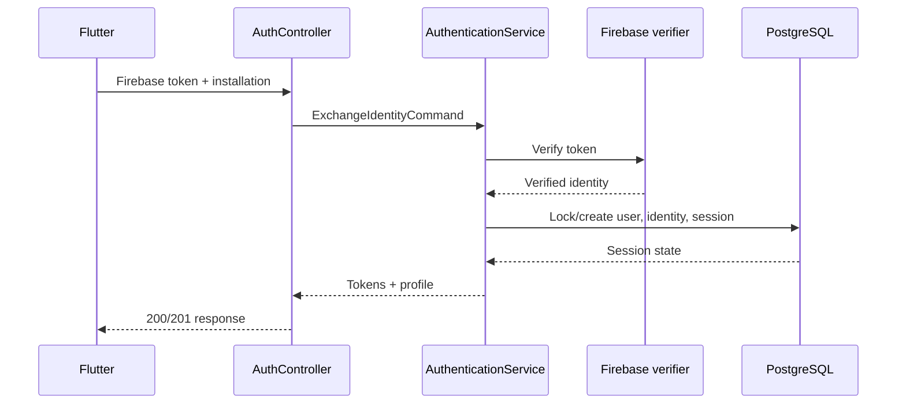
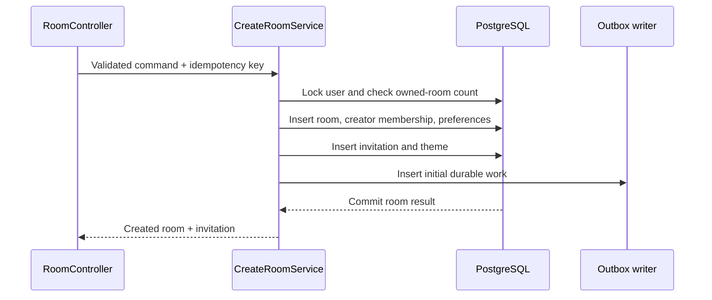
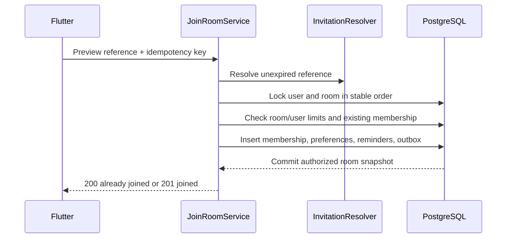
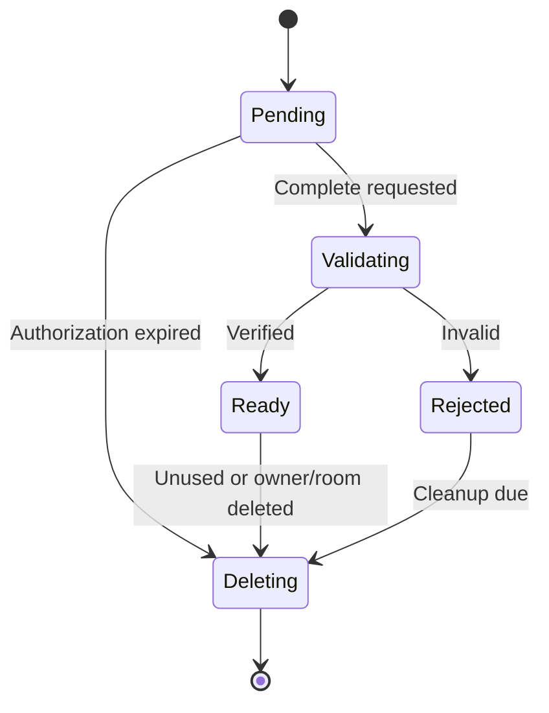

# Hyped! MVP Low-Level Design

**Status:** Draft for review  
**Last updated:** 2026-09-09  
**Backend:** Java 21, Spring Boot 3, Maven  
**Mobile:** Flutter, Riverpod, Drift, Dio, Freezed, json_serializable, go_router  
**Related documents:** [`05-hld.md`](./05-hld.md), [`06-database-design.md`](./06-database-design.md), [`07-api-spec.md`](./07-api-spec.md)

## 1. Purpose

This document describes how the approved Hyped! architecture will be implemented inside the Spring Boot backend and Flutter applications. It defines module boundaries, packages, key classes and interfaces, important methods, state transitions, sequence flows, validation, transactions, concurrency, error handling, local synchronization, and testing seams.

It does not replace the API or database contracts. When examples here conflict with `07-api-spec.md` or `06-database-design.md`, those documents take precedence until an explicit change updates all affected documents.

## 2. Confirmed implementation decisions

| Area | Decision |
|---|---|
| Backend language/runtime | Java 21 |
| Backend framework | Current supported Spring Boot 3 release at implementation time |
| Build | Maven Wrapper |
| Persistence | Spring Data JPA; native PostgreSQL SQL for critical queries |
| Migrations | Flyway versioned SQL; Hibernate schema validation only |
| Backend structure | Feature-first modules with internal API/application/domain/infrastructure layers |
| API DTOs | Java records |
| Mapping | MapStruct |
| Backend tests | JUnit 5, AssertJ, Mockito, Testcontainers, WireMock |
| Flutter state | Riverpod |
| Flutter local data | Drift with SQLite |
| Flutter HTTP | Dio |
| Flutter models | Freezed with json_serializable |
| Flutter navigation | go_router |
| Durable async work | PostgreSQL outbox claimed with native SQL |
| Critical concurrency | Explicit PostgreSQL row locks and conditional updates |

## 3. Repository layout

```text
Hyped/
├── backend/
│   ├── pom.xml
│   ├── mvnw
│   ├── mvnw.cmd
│   └── src/
│       ├── main/
│       │   ├── java/com/hyped/app/
│       │   └── resources/
│       │       ├── application.yml
│       │       └── db/migration/
│       └── test/
├── frontend/
│   ├── pubspec.yaml
│   ├── lib/
│   ├── android/
│   ├── ios/
│   └── test/
├── infrastructure/
│   ├── cloud-run/
│   ├── scheduler/
│   └── scripts/
└── docs/
```

Backend and Flutter remain separately buildable. Generated Java/Dart files are produced during builds and follow repository policy established during project scaffolding.

## 4. Backend dependency rules

Every feature follows:

```text
api -> application -> domain
                    -> ports
infrastructure -> application ports
infrastructure -> domain
```

Rules:

- `api` owns controllers, request/response records, API validation, and HTTP mapping.
- `application` owns use-case orchestration, authorization decisions, transaction boundaries, and commands/results.
- `domain` owns entities/value objects, invariants, state transitions, and domain error types.
- `infrastructure` owns JPA entities/repositories, SQL, Firebase/R2/FCM adapters, clocks, cryptography, and configuration.
- A feature cannot call another feature's repository directly.
- Cross-feature work uses an application-level facade/port or a durable outbox event.
- Durable behaviour never depends only on an in-process Spring event.
- ArchUnit tests enforce package and module dependencies.

## 5. Backend package structure

```text
com.hyped.app
├── HypedApplication
├── common
│   ├── api
│   ├── auth
│   ├── config
│   ├── error
│   ├── idempotency
│   ├── persistence
│   ├── security
│   └── time
├── identity
│   ├── api
│   ├── application
│   ├── domain
│   └── infrastructure
├── profile
├── room
├── membership
├── invitation
├── media
├── notification
├── lifecycle
├── moderation
└── analytics
```

Each feature expands into the same four internal packages only when needed. Small modules should not create empty abstractions.

## 6. Shared backend components

### 6.1 Web and error handling

| Component | Responsibility |
|---|---|
| `RequestContextFilter` | Validate/generate request ID, platform, and app-version context |
| `AccessTokenAuthenticationFilter` | Parse and verify Hyped! bearer access token |
| `CurrentActor` | Immutable authenticated user/session/installation context |
| `GlobalProblemHandler` | Map known exceptions to `application/problem+json` |
| `FieldErrorMapper` | Convert Jakarta Validation errors to stable field codes |
| `EtagCodec` | Encode/decode strong room and profile ETags |
| `CursorCodec` | Sign, encode, decode, and scope opaque pagination cursors |
| `RateLimitInterceptor` | Enforce general and sensitive operation limits |
| `RequestLoggingFilter` | Emit safe structured request completion log |

`GlobalProblemHandler` owns one mapping table from domain/application exceptions to the status and error code defined in `07-api-spec.md`. Controllers do not construct ad hoc error JSON.

### 6.2 Time and IDs

| Port | Implementation |
|---|---|
| `TimeProvider` | `SystemUtcTimeProvider` backed by injected `java.time.Clock` |
| `IdGenerator` | Monotonic/thread-safe UUIDv7 implementation |
| `SecureTokenGenerator` | `SecureRandom`-backed invite and refresh-token generator |

Tests inject fixed/mutable clocks and deterministic IDs. Domain services never call `Instant.now()` directly.

### 6.3 Persistence conventions

- JPA entities are package-private where practical.
- API records are never JPA entities.
- Lazy relationships are not traversed during JSON serialization.
- Repositories return domain projections/results rather than open persistence graphs.
- Read APIs use explicit projections/entity graphs to prevent N+1 queries.
- `open-in-view` is disabled.
- Hibernate uses `ddl-auto=validate` outside tests.
- Flyway is the sole production schema writer.

## 7. Identity and session module

### 7.1 Key types

```text
AuthController
  -> AuthenticationService
       -> FirebaseIdentityVerifier
       -> UserAccountRepository
       -> IdentityRepository
       -> SessionRepository
       -> AccessTokenIssuer
       -> RefreshTokenCodec
```

| Type | Important methods |
|---|---|
| `AuthController` | `exchange()`, `refresh()`, `logout()`, `listSessions()`, `revokeSession()` |
| `AuthenticationService` | `exchangeIdentity(ExchangeIdentityCommand)`, `rotateRefreshToken(RotateTokenCommand)`, `revokeCurrentSession(CurrentActor)` |
| `AccountLinkingService` | `prepareLink()`, `confirmLink()` |
| `FirebaseIdentityVerifier` | `verify(String firebaseIdToken)` |
| `AccessTokenIssuer` | `issue(UserId, SessionId, InstallationId, Instant)` |
| `RefreshTokenService` | `createFamily()`, `rotate()`, `detectReuseAndRevokeFamily()` |
| `SessionRepository` | `findByRefreshHashForUpdate()`, `countActiveDevices()`, `revokeFamily()` |

### 7.2 Exchange flow



The Firebase call occurs before the database transaction. The verified identity is short-lived input to the transaction and is never persisted as a raw token.

### 7.3 Refresh rotation

`AuthenticationService.rotateRefreshToken`:

1. Hash submitted token.
2. Start transaction and lock matching session/token-family row.
3. Reject expired, revoked, or installation-mismatched session.
4. If token was already rotated, revoke the entire family and return reuse-detected.
5. Generate a new random refresh token.
6. Store only its hash and mark previous token consumed.
7. Commit and issue the one-hour access token.

The raw new refresh token exists only in request-local memory and the TLS response.

### 7.4 Five-device limit

- `installationId` identifies an app installation, not physical hardware.
- Reauthentication from an existing active installation refreshes its session rather than consuming another slot.
- Creation of a new installation locks the user row before counting active installations.
- A sixth installation returns `DEVICE_LIMIT_REACHED` and safe active-session summaries.
- Revoking a session also invalidates its push registration.

## 8. Profile module

| Type | Responsibility |
|---|---|
| `ProfileController` | Get and merge-patch current profile |
| `ProfileService` | Validate ownership, expected revision, display name, and media reference |
| `ProfileRepository` | Read/decrypt authorized projection and conditional update |
| `ProfileMapper` | Map domain projection to API record |
| `PersonalDataCipher` | Encrypt/decrypt fields through user key capability |

Profile updates use a conditional statement equivalent to:

```sql
update app.user_profile
set display_name_ciphertext = :name,
    photo_media_id = :photo,
    profile_revision = profile_revision + 1,
    updated_at = :now
where user_id = :userId
  and profile_revision = :expectedRevision;
```

Zero updated rows produce `PROFILE_REVISION_MISMATCH` unless authorization/account state changed.

## 9. Room module

### 9.1 Domain types

| Type | Responsibility |
|---|---|
| `RoomId`, `UserId`, `MediaAssetId` | Strongly typed UUID value objects |
| `EventSchedule` | Valid local date/time/zone and normalized instant |
| `RoomDetails` | Title, location, and description validation |
| `RoomTheme` | Valid preset/gradient/upload/GIPHY choice |
| `RoomRevision` | Positive monotonic revision |
| `RoomStatus` | `ACTIVE`, `ARCHIVED`, `DELETING` transitions |
| `RoomPermissions` | Role-derived allowed actions returned to client |

### 9.2 Application components

```text
RoomController
  -> CreateRoomService
  -> GetRoomService
  -> ListRoomsService
  -> EditRoomService
  -> DeleteRoomService
```

| Service | Important methods |
|---|---|
| `CreateRoomService` | `create(CurrentActor, CreateRoomCommand, IdempotencyKey)` |
| `GetRoomService` | `getAuthorized(CurrentActor, RoomId)` |
| `ListRoomsService` | `list(CurrentActor, RoomFilter, Cursor, Limit)` |
| `EditRoomService` | `edit(CurrentActor, RoomId, ExpectedRevision, EditRoomPatch)` |
| `DeleteRoomService` | `requestDeletion(CurrentActor, RoomId, IdempotencyKey)` |
| `EventTimeResolver` | `resolve(LocalDate, LocalTime, ZoneId)` with DST error results |
| `RoomAuthorization` | `requireMember()`, `requireEditor()`, `requireCreator()` |

### 9.3 Create-room transaction



The idempotency record and all domain rows commit together. No Firebase, FCM, R2, or GIPHY network call occurs in this transaction.

### 9.4 Edit-room concurrency

Room edits do not rely on JPA `@Version`, because the API revision must increase only for user-visible room changes. `RoomWriteRepository.updateVisibleFields` performs a conditional update:

```sql
update app.room
set title = :title,
    event_at = :eventAt,
    event_timezone = :eventTimezone,
    location = :location,
    description = :description,
    revision = revision + 1,
    updated_at = :now
where id = :roomId
  and revision = :expectedRevision
  and status = 'active';
```

The service then updates the theme, replaces affected reminder work, and inserts change notifications in the same transaction. A zero-row update is disambiguated into not found/forbidden, inactive room, or revision mismatch without leaking private existence.

### 9.5 Event-time validation

`EventTimeResolver` uses `ZoneRules.getValidOffsets(LocalDateTime)`:

- No offsets: nonexistent local time.
- One offset: normal resolution.
- Two offsets: ambiguous time; return the allowed offsets for explicit user choice.
- Normalized `Instant` must be after `TimeProvider.now()` at commit validation.

The client preview is advisory. The backend resolves and validates again.

## 10. Membership module

### 10.1 Components

| Type | Important methods |
|---|---|
| `MembershipController` | `list()`, `changeRole()`, `remove()`, `leave()`, `transferOwnership()` |
| `JoinRoomService` | `joinByPreviewReference()` |
| `MembershipService` | `leave()`, `removeMember()`, `changeRole()` |
| `OwnershipTransferService` | `transfer()` |
| `MembershipLockRepository` | Native locked room/user/member queries |
| `MembershipPolicy` | Role transition/removal rules |

### 10.2 Join transaction



Lock order is always lower-level account row, then room row, then membership rows ordered by UUID. All commands that touch both account and room follow the same order to reduce deadlocks.

### 10.3 Membership rules

- A room lock protects `member_count` and room capacity.
- A user lock protects the joined-room limit.
- The `(room_id, user_id)` primary key prevents duplicate membership.
- Already joined is a successful idempotent outcome.
- Removing a member deletes current membership and reminder preferences, decrements count, and writes notification/invalidation records atomically.
- Rejoining with valid credentials creates a new current membership immediately.
- A creator cannot leave until ownership is transferred or the room is deleted.

### 10.4 Ownership transfer

The service:

1. Locks room and both membership rows.
2. Confirms caller remains creator.
3. Confirms target is a current member/co-host.
4. Changes the former creator role to co-host.
5. Changes the target role to creator.
6. Updates `room.owner_user_id` to the target.
7. Writes member-change invalidations.
8. Commits all changes together.

The unique creator index guarantees there is never more than one committed creator membership.

## 11. Invitation module

### 11.1 Components

| Type | Responsibility |
|---|---|
| `InvitationController` | Get/rotate current room credentials |
| `PublicInvitationController` | Link/code safe preview |
| `InvitationService` | Create, decrypt for member, and rotate credentials |
| `InvitationResolver` | Constant-behaviour lookup by token hash or code HMAC |
| `PreviewReferenceService` | Issue/verify short-lived single-purpose join reference |
| `InvitationCipher` | Authenticated encryption for redisplayable active credentials |
| `RoomCodeGenerator` | Eight characters from approved unambiguous alphabet |

### 11.2 Credential handling

- Link tokens contain at least 128 bits of cryptographic randomness.
- Room codes use exactly eight approved uppercase characters.
- Lookup uses link hash or keyed room-code HMAC.
- Redisplay uses authenticated ciphertext protected by key material outside PostgreSQL.
- Plaintext exists only during generation, authorized display, preview submission, and request-local matching.
- Controller paths never include raw tokens/codes; preview endpoints accept them in `no-store` POST bodies.
- Logging filters redact relevant request bodies and never record credentials.

### 11.3 Rotation transaction

`InvitationService.rotate` locks the current invitation row, verifies creator role, creates both new credentials, replaces both hashes/HMACs/ciphertexts, increments generation, and commits one idempotent result. An old link and old room code fail immediately after commit.

## 12. Media module

### 12.1 Ports and adapters

| Port | Adapter |
|---|---|
| `ObjectStoragePort` | `R2ObjectStorageAdapter` using S3-compatible SDK |
| `ImageInspector` | Safe bounded decoder/metadata implementation |
| `MediaRepository` | Spring Data JPA plus explicit state updates |
| `MediaDeliverySigner` | Short-lived authorized R2 delivery URL |

### 12.2 Upload state machine



### 12.3 Upload authorization

`MediaUploadService.authorize`:

1. Validates declared JPEG/PNG/WebP type, size up to 1.5 MB, and dimensions up to 2048 by 2048.
2. Enforces ten authorizations per account per hour.
3. Inserts `PENDING` media record with an opaque R2 key.
4. Requests a ten-minute single-object presigned PUT URL.
5. Returns required headers without persisting the URL.

### 12.4 Finalization

Finalization is a small saga because R2 inspection is external:

1. Transactionally move `PENDING` to `VALIDATING` if caller owns the asset.
2. Outside transaction, read bounded metadata/content needed for verification.
3. Verify actual MIME, bytes, dimensions, decodability, animation absence, and requested SHA-256.
4. Conditionally move `VALIDATING` to `READY` or `REJECTED`.
5. Queue object deletion when rejected.

Repeated completion returns the current terminal state. It cannot create two assets.

### 12.5 GIPHY boundary

- No Spring `GiphyClient` exists.
- Flutter calls GIPHY directly using its platform key.
- Backend room commands accept only `provider=GIPHY` and a bounded asset ID.
- Backend stores no GIPHY URL or file.
- Flutter resolves current provider renditions and submits required provider analytics directly.

## 13. Notification and outbox module

### 13.1 Components

```text
Cloud Scheduler
  -> InternalJobController
       -> WorkerCoordinator
            -> NotificationOutboxProcessor
            -> RoomLifecycleProcessor
            -> DataRetentionProcessor
            -> MediaCleanupProcessor
```

| Type | Responsibility |
|---|---|
| `NotificationPreferenceService` | Read/replace three personal toggles |
| `ReminderPlanner` | Compute 24h, 1h, and event-time logical work |
| `OutboxWriter` | Insert deterministic durable events inside domain transaction |
| `OutboxClaimRepository` | Native `for update skip locked` claim/update |
| `NotificationOutboxProcessor` | Resolve devices, render safe push, send, retry |
| `FcmPort` | Provider-neutral push send contract |
| `FirebaseFcmAdapter` | Firebase Admin SDK implementation |

### 13.2 Claim algorithm

One short transaction claims a bounded batch:

```sql
select id
from ops.notification_outbox
where status in ('pending', 'retry')
  and available_at <= :now
order by available_at, created_at
for update skip locked
limit :batchSize;
```

The same transaction sets `PROCESSING`, `lease_owner`, `lease_until`, and increments `attempt_count`. External sends occur after commit. Each result is recorded in a new short transaction.

### 13.3 Retry policy

- Retry only errors classified as transient.
- Use exponential backoff with jitter and an upper delay bound.
- Do not retry invalid/unregistered FCM tokens; invalidate registration.
- Expired reminders are marked terminal rather than delivered late beyond the configured tolerance.
- Expired processing leases return to retry safely.
- `logical_key` prevents duplicate durable work.
- `notificationId` lets clients suppress duplicate visual presentation where possible.

Exact retry counts and timing are configuration values tested in `10-test-plan.md`.

## 14. Lifecycle and deletion module

### 14.1 Room lifecycle processor

`RoomLifecycleProcessor` runs bounded, repeatable steps:

- Lock due active rooms and mark archived.
- Set `delete_after` to 24 hours after archive.
- Write celebration invalidations once.
- Lock due archived rooms and move them to deleting.
- Cancel reminder work and capture required media-deletion commands.
- Delete dependent rows and room without exposing partial active state.
- Retry R2 cleanup independently.

### 14.2 Account deletion components

| Type | Responsibility |
|---|---|
| `DeletionReadinessService` | Return owned/joined blockers |
| `AccountDeletionService` | Verify recent identity, preconditions, and create irreversible request |
| `PersonalKeyPort` | Destroy external per-user decryption capability |
| `DeletionJournalPort` | Record/replay minimal restore-safety entry |
| `AccountDeletionProcessor` | Revoke, purge, pseudonymize, and verify completion |

`AccountDeletionProcessor` uses explicit resumable steps rather than one long transaction across PostgreSQL, key management, Firebase, and R2. Each step has a durable status and is safe to repeat. Completion must occur within 24 hours or produce an alert.

## 15. Moderation and analytics modules

### 15.1 Moderation

`ReportService.create` confirms current membership, validates controlled reason and optional 500-character detail, rate-limits to five reports per day, and creates an idempotent report. Account deletion removes reporter identity and makes user-key-encrypted detail unreadable. Retention cleanup deletes the pseudonymized row at 90 days.

### 15.2 Analytics

`ProductAnalyticsService.ingest`:

- Accepts at most 20 events.
- Deduplicates by event ID.
- Allows only catalogued event names and properties.
- Converts user/room identifiers to rotatable HMAC pseudonyms server-side.
- Rejects or drops forbidden free text and secrets.
- Sets expiry to 30 days.

`AnalyticsAggregationProcessor` computes daily anonymous metrics before raw-event deletion. Analytics failures never roll back authoritative room operations; server-originated critical lifecycle events use transactional outbox/after-commit ingestion as appropriate.

## 16. Idempotency implementation

### 16.1 Components

| Type | Responsibility |
|---|---|
| `IdempotencyKey` | Validated opaque value object |
| `CanonicalRequestHasher` | Hash stable method/path/body representation |
| `IdempotentCommandExecutor` | Claim, execute, and store terminal result/reference |
| `IdempotencyRepository` | Insert/find/lock/expire records |

### 16.2 Execution rules

1. Validate key before domain processing.
2. Canonicalize and hash the request.
3. Attempt to insert the scoped in-progress record.
4. If an existing record has a different hash, return key-reused conflict.
5. If terminal, return stored result/reference.
6. If still in progress, return request-in-progress with `Retry-After`.
7. Execute domain transaction and record its durable result atomically where possible.
8. Expire records after 24 hours.

For results too large to retain, store the affected resource ID/status and rebuild the authorized response.

## 17. Backend validation strategy

Validation occurs at three levels:

| Level | Examples |
|---|---|
| API record | Required fields, syntax, sizes, supported enum names |
| Domain/application | Future event, role transition, ownership, media readiness, DST resolution |
| Database | Unique membership/credential, foreign keys, status checks, count bounds |

Important limits:

| Field/operation | Rule |
|---|---|
| Event title | Trimmed, non-blank, maximum 80 characters |
| Location | Optional, maximum 120 characters |
| Description | Optional, maximum 500 characters |
| Time zone | Existing IANA identifier |
| Event instant | Strictly future at creation/edit commit |
| Room code | Eight unambiguous characters after canonicalization |
| GIPHY search text | Maximum 50 characters, enforced in Flutter/provider request |
| Uploaded image | JPEG/PNG/WebP, 1.5 MB, 2048 px each side, non-animated |
| Room membership | Maximum 25 including creator |
| Owned rooms | Maximum 10 active |
| Joined rooms | Maximum 25 active non-owned |
| Active devices | Maximum 5 |

Validation codes are stable; natural-language fallback messages are not used as program logic.

## 18. Backend error handling

Domain exceptions contain safe typed data only:

```text
HypedException
├── AuthenticationException
├── AuthorizationException
├── ValidationException
├── ResourceUnavailableException
├── LimitReachedException
├── RevisionMismatchException
├── IdempotencyConflictException
└── DependencyException
```

`GlobalProblemHandler` maps these to the API problem contract. Unexpected exceptions return `INTERNAL_ERROR`, log the request ID and safe stack trace server-side, and never expose SQL/provider/internal details.

Private resource rules:

- Unknown room and unauthorized room normally map to the same `404 ROOM_UNAVAILABLE`.
- A removed member does not receive member-list or room-state details.
- Public invitation errors reveal only invalid/ended/full outcomes approved by the user flow.

## 19. Flutter application structure

```text
lib/
├── main.dart
├── app/
│   ├── bootstrap/
│   ├── router/
│   └── theme/
├── core/
│   ├── api/
│   ├── auth/
│   ├── database/
│   ├── errors/
│   ├── links/
│   ├── notifications/
│   ├── secure_storage/
│   └── widgets_bridge/
└── features/
    ├── onboarding/
    ├── authentication/
    ├── home/
    ├── room/
    ├── create_room/
    ├── join_room/
    ├── membership/
    ├── reminders/
    ├── media/
    ├── profile/
    └── settings/
```

Each feature may contain:

```text
feature/
├── data/
│   ├── local/
│   ├── remote/
│   ├── models/
│   └── repositories/
├── domain/
│   ├── entities/
│   └── repositories/
└── presentation/
    ├── controllers/
    ├── screens/
    └── widgets/
```

Only create layers a feature uses. Shared business behaviour stays in domain/application code rather than generic UI utilities.

## 20. Riverpod state design

### 20.1 Provider groups

| Provider | Responsibility |
|---|---|
| `authSessionProvider` | Current session and refresh/logout lifecycle |
| `pendingInviteProvider` | Pending deep-link/code preview intent |
| `roomListProvider` | Cache-first active/archived summaries |
| `roomDetailProvider(roomId)` | One authorized room snapshot and refresh state |
| `createRoomControllerProvider` | Three-step draft, validation, and submission |
| `memberListProvider(roomId)` | Current member list and role actions |
| `reminderPreferencesProvider(roomId)` | Three personal toggles |
| `mediaUploadProvider` | Select, transform, upload, finalize, retry |
| `profileProvider` | Profile read/edit and revision handling |
| `themeModeProvider` | System/light/dark preference |

Controllers expose Freezed sealed states such as:

```text
initial | loading | data | refreshing | offlineData | submitting | failure
```

Room cached data can remain visible during `refreshing` or recoverable failure. Mutation failures never pretend that local edits were committed.

### 20.2 Provider lifecycle

- Family providers key by typed UUID value/string.
- Auto-dispose is used for short-lived previews and forms.
- Room detail remains cached while a screen/widget needs it.
- Controllers depend on repository interfaces through Riverpod providers.
- Provider overrides supply fakes for unit/widget tests.

## 21. Dio networking design

Interceptor order:

1. `ClientMetadataInterceptor`: platform, app version, request ID.
2. `AuthenticationInterceptor`: current access token.
3. `IdempotencyInterceptor`: stable key for designated command.
4. `LoggingInterceptor`: metadata-only redacted logs in non-production builds.
5. `ErrorMappingInterceptor`: API problem to typed application failure.

### 21.1 Single-flight token refresh

When multiple requests receive an expired-token `401`:

- The first request starts refresh.
- Other eligible requests await the same future.
- On success, each retries once with the new access token.
- On refresh failure/reuse detection, secure tokens are cleared and the router moves to sign-in while preserving safe pending invite intent.
- Refresh and exchange endpoints are never recursively retried by the auth interceptor.

### 21.2 Retry rules

- Retry idempotent GET requests for transient connection/`503` failures with small exponential backoff and jitter.
- Retry a mutation only with its original persisted idempotency key.
- Never retry validation, authorization, limit, revision, or rate-limit errors automatically.
- Respect `Retry-After`.
- Cancel obsolete room/media requests when the user leaves the flow.

## 22. Drift local database

### 22.1 Local tables

| Table | Purpose |
|---|---|
| `CachedRoom` | Authorized summary/detail fields, event instant, zone, status, role, revision |
| `CachedTheme` | Safe preset/media/provider reference and local fallback |
| `CachedReminderPreference` | Last synchronized three-toggle state |
| `WidgetSelection` | Widget instance to selected room mapping |
| `PendingMutation` | Transport-uncertain mutation key and minimal retry metadata |
| `LocalSetting` | Theme mode, demo completion, non-sensitive preferences |

Tokens, raw invitations, Firebase credentials, FCM tokens, and presigned upload URLs are not stored in Drift.

### 22.2 Cache rules

- All cached private rows are scoped to the current internal user ID.
- Sign-out deletes the user's private cache before returning to signed-out UI.
- Server revision lower than local revision is ignored and logged as a consistency warning.
- Server `404/410` for a formerly authorized room removes cache and widget eligibility.
- Archived rows expire after the server-defined delete time.
- Schema migrations are versioned and tested from each supported local version.

### 22.3 Pending mutation rule

`PendingMutation` is not an offline command queue. It exists only when a connected mutation may have reached the server but its response was lost. The app reuses the same idempotency key to resolve that uncertain outcome. New edits and destructive actions remain unavailable offline.

## 23. Synchronization algorithm

### 23.1 Room open

1. Read authorized cached room and show it immediately with last-sync/offline state.
2. If connected and authenticated, request current room.
3. Apply response only if revision is equal/newer and authorization remains valid.
4. Store room/theme/preferences in one Drift transaction.
5. Refresh widget snapshot when selected room data changes.

### 23.2 FCM invalidation

1. Validate notification type and parse room ID/revision.
2. Deduplicate notification ID for visual presentation.
3. Mark matching cached room stale.
4. If app is active and authorized, fetch the room.
5. If background execution is unavailable, refresh on next resume/open.
6. Never apply private fields directly from FCM data.

### 23.3 Offline countdown

Countdown value is:

```text
remaining = max(Duration.zero, eventAtUtc - correctedCurrentInstant)
```

`correctedCurrentInstant` may use a bounded server-clock offset learned from authenticated responses. Large device/server drift displays a warning and triggers refresh; the client does not call the server per tick.

## 24. go_router and link state

### 24.1 Route groups

```text
/demo
/sign-in
/home
/create/details
/create/style
/create/review
/join/code
/invite/preview
/rooms/:roomId
/rooms/:roomId/members
/rooms/:roomId/reminders
/profile
/settings
```

### 24.2 Redirect rules

- First launch without invitation: demo, then sign-in.
- First launch with invitation: demo with **Skip to invite**, then safe preview/sign-in/join flow.
- Authenticated home/room routes proceed normally.
- Signed-out private route redirects to sign-in with a bounded pending destination.
- Account deletion pending redirects to a restricted deletion status/logout path.
- Unknown/deleted room resolves to safe unavailable UI.

### 24.3 Pending invite state

The pending invite stores a short-lived preview reference or original app-link intent only for the active installed-app flow. Raw invite credentials are not written to logs, analytics, or general preferences. If the app was installed from the store after redirect, automatic deferred restoration is not promised.

## 25. Flutter media flow

`MediaUploadController`:

1. Opens native picker.
2. Rejects source above 5 MB.
3. Converts HEIC/HEIF to JPEG or WebP.
4. Corrects orientation, strips unnecessary metadata, resizes within 2048 by 2048, and compresses within 1.5 MB.
5. Computes SHA-256.
6. Requests upload authorization from Spring Boot.
7. Uploads directly to R2 with a separate Dio client that does not attach Hyped! bearer tokens.
8. Calls completion with the same idempotency key strategy.
9. Polls only if server returns `VALIDATING`.
10. Makes the ready media selectable; failure preserves the previous theme/photo.

GIPHY uses a separate client/provider adapter, platform key, PG filter, 50-character query limit, required attribution, and direct provider URLs.

## 26. Native widget bridge

Flutter writes a minimal selected-room snapshot to platform-specific shared storage through a typed bridge.

| Platform | Implementation boundary |
|---|---|
| iOS | App Group storage plus WidgetKit timeline reload |
| Android | App widget configuration plus platform-supported storage/update scheduling |

Snapshot writes are atomic. Widgets show only title, event instant-derived countdown, safe theme fallback, and availability state. Signing out, leaving, removal, or deletion overwrites the snapshot with an unavailable state.

## 27. Flutter error mapping

`ApiProblemMapper` converts server codes into typed failures:

```text
AppFailure
├── NetworkUnavailable
├── SessionExpired
├── AuthorizationLost
├── RoomUnavailable
├── LimitReached
├── RevisionConflict
├── ValidationFailure
├── RateLimited
├── MediaFailure
└── UnexpectedFailure
```

Screens map typed failures to localized messages/actions. A server `detail` is a safe fallback for unsupported codes. UI never branches on English text.

## 28. Testing design

### 28.1 Backend unit tests

JUnit 5, AssertJ, and Mockito cover:

- Domain validation and state transitions
- Permission matrix
- DST ambiguity/nonexistence
- Reminder planning
- Error mapping
- Token rotation/reuse classification
- Media state transitions
- Idempotency decisions

### 28.2 Backend integration tests

Testcontainers PostgreSQL covers:

- Flyway from empty schema
- JPA mappings with `ddl-auto=validate`
- Native lock queries
- Concurrent join at member limits
- Concurrent owned/joined-room limits
- Ownership transfer uniqueness
- Conditional room revision updates
- Invitation rotation atomicity
- Outbox `skip locked` claims and expired leases
- Retention queries and cascade/restrict behaviour

H2 is not used for database behaviour tests.

### 28.3 External adapter tests

WireMock or provider emulators cover:

- Firebase identity verification boundary
- FCM retryable and terminal responses
- R2 presign, metadata, download, and deletion responses
- Cloud Scheduler OIDC verification inputs

Contract tests assert exact request/response records against OpenAPI examples.

### 28.4 Flutter tests

- Pure Dart unit tests for countdown, time zones, models, repositories, and error mapping
- Riverpod `ProviderContainer` tests for controller transitions
- Drift tests against an in-memory/native test database
- Dio adapter tests for headers, refresh single-flight, retries, and redaction
- Widget tests for loading, offline, error, member-role, and accessibility states
- Golden tests for light/dark small/medium widget and key screens
- Integration tests for create, invite, join, edit, reminder, leave, transfer, and deletion flows

## 29. Configuration

### 29.1 Backend configuration groups

```text
hyped.auth.*
hyped.invitation.*
hyped.media.*
hyped.notifications.*
hyped.rate-limits.*
hyped.retention.*
hyped.workers.*
spring.datasource.*
spring.flyway.*
```

Configuration records use `@ConfigurationProperties` with startup validation. Secrets are references/injected values, never defaults in committed YAML.

### 29.2 Flutter flavours

Development, staging, and production use separate:

- API base URL
- Firebase project configuration
- GIPHY platform keys
- App-link/universal-link association
- Bundle/application identifiers
- Logging and analytics settings

Production secrets/tokens are never printed. GIPHY keys are treated according to provider mobile-key guidance and restricted/separated by platform and environment.

## 30. Logging and observability hooks

Application services add safe structured context:

- Request/correlation ID
- Operation name
- Anonymous actor/room surrogate where required
- Result code
- Duration
- Retry/idempotency/revision outcome

Metrics include transaction conflict count, lock wait, pool usage, outbox lag, worker batch results, FCM failures, R2 validation failures, cache refresh failures, and token refresh/reuse events.

Never log raw request bodies for authentication, invitation, upload authorization, account linking, or deletion routes.

## 31. Implementation order

1. Scaffold Maven/Spring Boot and Flutter projects.
2. Add shared API error, time, ID, configuration, and test foundations.
3. Create Flyway schemas and identity/session tables.
4. Implement Firebase exchange, Hyped! sessions, secure Flutter auth, and go_router redirects.
5. Implement room, membership, invitation, and concurrency tests.
6. Implement Flutter room cache, home, create, preview, and join flows.
7. Implement theme presets, direct R2 upload, and GIPHY client integration.
8. Implement device registration, reminder preferences, outbox, and worker tick.
9. Implement widgets and FCM invalidation refresh.
10. Implement reporting, analytics retention, account deletion, and restore-safety workflow.
11. Complete integration, performance, accessibility, security, and failure testing.

## 32. Deferred implementation decisions

These belong to later security, testing, or deployment work:

- Exact access-token signing algorithm and key rotation
- External per-user key provider and cryptographic deletion proof
- Deletion journal storage and replay implementation
- Exact outbox batch size, lease, retry count, and late-reminder tolerance
- Cloud Run memory, concurrency, and maximum-instance values
- Database connection timeout and statement timeout values
- R2 image-inspection library and malware/content scanning depth
- Final Android/iOS minimum versions
- GIPHY production approval and pricing
- Operational audit-log retention

## 33. LLD acceptance checklist

- [ ] Backend packages are feature-first with enforced dependency rules.
- [ ] Controllers use Java records and never return JPA entities.
- [ ] MapStruct mapping is compile-time checked.
- [ ] Flyway owns schema changes and Hibernate validates only.
- [ ] Critical PostgreSQL behaviour uses explicit native SQL and Testcontainers tests.
- [ ] Cross-feature durable side effects use the outbox, not only in-process events.
- [ ] Transaction boundaries never contain Firebase, FCM, R2, or GIPHY network calls.
- [ ] Concurrent create/join operations cannot exceed product limits.
- [ ] Room revisions use explicit conditional updates and ETags.
- [ ] Invitation plaintext is never logged or stored unencrypted.
- [ ] Refresh rotation and token-reuse detection lock the session family.
- [ ] A sixth device returns a recoverable device-limit response.
- [ ] Media state transitions are conditional and idempotent.
- [ ] GIPHY has no backend proxy/client and is called directly from Flutter.
- [ ] Outbox claims use bounded `for update skip locked` batches.
- [ ] Account deletion is a resumable cross-service workflow completed within 24 hours.
- [ ] Riverpod controllers expose explicit loading/data/offline/submitting/failure states.
- [ ] Dio token refresh is single-flight and retries each request at most once.
- [ ] Drift never stores authentication or invitation secrets.
- [ ] Pending mutations resolve uncertain responses; they do not enable offline writes.
- [ ] go_router preserves safe invite intent through authentication.
- [ ] Widgets receive minimal atomic snapshots and safe unavailable states.
- [ ] Backend, Flutter, database, provider, and contract tests cover critical flows.
