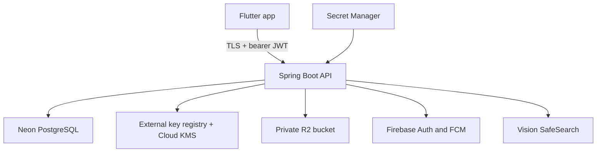
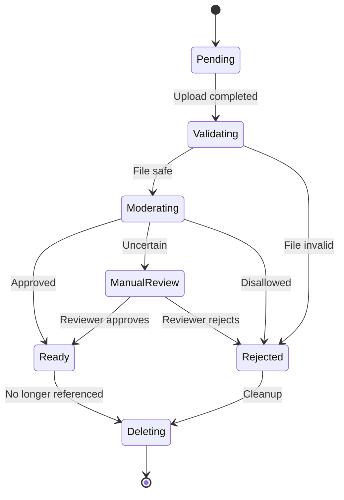

# Hyped! MVP Security Design

**Status:** Draft for review  
**Last updated:** 2026-09-13  
**Related documents:** [`05-hld.md`](./05-hld.md), [`06-database-design.md`](./06-database-design.md), [`07-api-spec.md`](./07-api-spec.md), [`08-lld.md`](./08-lld.md)

## 1. Purpose

This document defines the security design for the Hyped! MVP. It covers identity, sessions, authorization, secrets, encryption, deletion keys, invitations, media, automated moderation, app attestation, abuse controls, logging, dependency security, incident response, and verification.

This is a build contract, not a claim of certification. Privacy policy, terms, support procedures, deployment commands, and operational dashboards belong in later documents.

## 2. Security goals

The MVP shall:

- Allow only authenticated room members to access private room data.
- Enforce creator, co-host, and member permissions on the server.
- Limit damage from stolen access or refresh tokens.
- Avoid putting personal or secret data in JWTs, logs, analytics, URLs, or mobile SQLite.
- Make deleted personal fields cryptographically unreadable within 24 hours.
- Keep uploaded media private and hidden until validation and moderation succeed.
- Resist invitation guessing, automated abuse, replay, and common API attacks.
- Support immediate denial for suspended or known-compromised accounts.
- Keep controls proportional to a low-cost modular-monolith MVP.

## 3. Confirmed security decisions

| Area | Decision |
|---|---|
| Access token | RS256 JWT, one-hour lifetime |
| Refresh token | Opaque random token, 30-day lifetime, rotated on every use |
| Normal logout/revocation | Refresh family revoked immediately; issued access JWT may work until expiry |
| Refresh-token reuse | Revoke only the affected device token family and require sign-in there |
| Active devices | Maximum five; show device name, platform, last active time, current-device marker, and revoke action |
| Secure mobile storage | iOS Keychain and Android Keystore-backed encrypted storage |
| New-device alert | Push existing active devices |
| Failed authentication | Lock after five attributable failures for 15 minutes; threshold and duration configurable |
| Emergency state | Immediately deny every request from suspended or compromised accounts |
| Secret storage | Google Secret Manager, separated by development, staging, and production |
| Personal-field encryption | Unique data-encryption key per user, wrapped under Google Cloud KMS and stored outside PostgreSQL backups |
| Public invite preview | Title, cover/theme, event date, creator display name, and member count only |
| R2 access | Private bucket with authorized 15-minute signed delivery URLs |
| Upload moderation | Automated before publication; uncertain images stay hidden for manual review |
| Mobile attestation | Play Integrity and App Attest with gradual enforcement |

## 4. Trust boundaries



Trust assumptions:

- The mobile client is untrusted. UI hiding never grants authorization.
- PostgreSQL is authoritative for users, account state, membership, roles, sessions, and resource state.
- Firebase proves an external Google or Apple identity; it does not grant room access.
- R2 stores bytes but never decides who may see them.
- Automated moderation is a safety signal, not an authorization system.
- App attestation raises abuse cost but does not make a device fully trusted.
- GIPHY is called directly by Flutter and receives no Hyped! access token or private room data.

## 5. Threat model

### 5.1 Protected assets

- Provider identity mapping, verified email, display name, and profile photo
- Room title, event instant, time zone, description, location, theme, and membership
- Invitation link tokens and room codes
- Access JWTs, refresh tokens, FCM tokens, installation identifiers, and attestation assertions
- Uploaded images and moderation results
- Per-user encryption keys, signing keys, HMAC keys, R2 credentials, Firebase credentials, and database credentials
- Reports, audit records, deletion journal, and backups

### 5.2 Main threats

| Threat | Primary controls |
|---|---|
| Stolen mobile token | Secure storage, short JWT lifetime, rotating refresh tokens, family reuse detection, device revocation |
| Broken object authorization | Membership and role checks on every resource operation; non-enumerating errors |
| Invitation guessing | High-entropy link token, unambiguous eight-character code, keyed lookup, rate limits, attestation |
| Account enumeration or lockout abuse | Uniform errors, attributable-failure rule, IP/installation throttles |
| Malicious upload | Private quarantine, bounded decode, re-encode, metadata stripping, hash verification, moderation |
| Secret leakage | Secret Manager, environment separation, least privilege, log redaction, secret scanning |
| Database or backup disclosure | TLS, provider encryption, field encryption, external per-user keys, seven-day backup expiry |
| Replay or duplicate mutation | TLS, token expiry, idempotency keys, refresh rotation, single-purpose preview references |
| Compromised account | Immediate account-state denial, session-family revocation, device alert, security audit |
| Dependency or build compromise | Locked dependencies, automated scans, protected branches, provenance-aware release process |

Out of scope for the MVP are protection against a fully compromised operating system, nation-state attacks, and formal regulatory certification. Rooted or jailbroken devices are risk signals rather than an automatic permanent ban.

## 6. Identity and sign-in

### 6.1 Provider exchange

1. Flutter completes Google or Apple sign-in through Firebase Authentication.
2. Flutter sends the Firebase ID token, installation ID, platform, app version, and available attestation assertion to `/api/v1/auth/exchange`.
3. Spring Boot verifies signature, issuer, audience, expiry, project, provider, subject, and verified-email claim where used.
4. The backend maps the provider subject HMAC to an internal user.
5. The backend checks account state and attributable failure/lock state.
6. A successful exchange creates or restores one device-bound refresh family and issues a one-hour RS256 JWT.
7. Existing active devices receive a safe new-device push when the installation is new.

Firebase tokens, Google tokens, Apple authorization codes, and raw provider subjects are never persisted or logged.

### 6.2 Account linking

- Matching verified email finds a candidate only; it never silently merges accounts.
- Linking requires an authenticated session, a recently issued provider proof, and explicit confirmation.
- The provider identity must not already belong to another user at commit time.
- The transaction locks both candidate identity/account rows in deterministic order.
- Linking and unlinking are security-audited without storing tokens or raw email.
- The last usable provider cannot be unlinked unless another supported sign-in method is active.

## 7. Access JWTs

### 7.1 Claims

JWTs are signed with RS256 and contain only:

| Claim | Purpose |
|---|---|
| `iss` | Exact Hyped! issuer |
| `aud` | Exact mobile API audience |
| `sub` | Internal user UUID |
| `sid` | Session/token-family UUID |
| `iid` | Installation UUID |
| `iat`, `nbf`, `exp` | Time bounds |
| `jti` | Unique token identifier |

JWTs must not contain email, display name, provider subject, FCM token, room ID, membership, role, or other personal data.

### 7.2 Validation

Spring Security shall:

- Accept only the configured `RS256` algorithm; never trust the token header to choose an algorithm.
- Select only a known active `kid` from the local/public key set.
- Verify signature, issuer, audience, expiry, not-before time, and required claims.
- Allow a small bounded clock skew, initially 60 seconds.
- Reject malformed, oversized, duplicate-claim, or unsupported tokens.
- Never fetch a key from a URL supplied by a JWT header.

Access JWT lifetime is one hour. Keys and accepted issuers/audiences are environment-specific.

### 7.3 Revocation semantics

- Normal logout or device revoke marks the refresh family revoked immediately and invalidates its FCM registration.
- A previously issued access JWT from that device may remain valid until its one-hour expiry.
- Private-room authorization is still evaluated on every request, so removal from a room takes effect immediately for that room.
- Account deletion, administrative suspension, or confirmed compromise is an emergency exception: every request is denied immediately through an authoritative account-state check.
- Sensitive destructive operations require recent authentication even when the access JWT remains valid.

The UI must state that device revocation can take up to one hour to end an already active API token. This is an accepted MVP trade-off.

### 7.4 Signing-key lifecycle

- The RS256 private key is stored in Google Secret Manager and exposed only to the production Cloud Run service identity.
- The public key is published as a bounded JWKS or loaded into verifiers through trusted configuration.
- Every key has a unique `kid`; signing uses one current key while verification temporarily accepts the retiring key.
- Rotate on a scheduled cadence, initially every 90 days, and immediately after suspected exposure.
- Keep an old public key for at least the maximum JWT lifetime plus clock skew after signing stops.
- Key rotation is tested in staging and must not require simultaneous client release.
- Private key material is never placed in Git, container images, logs, crash reports, or Flutter.

## 8. Refresh sessions and devices

### 8.1 Token construction and storage

- Refresh tokens contain at least 256 bits from a cryptographically secure random generator.
- The server stores a keyed token digest, never the raw token.
- Flutter stores refresh tokens only in Keychain or Keystore-backed encrypted storage.
- Access tokens remain in memory where practical and are reacquired after process restart.
- Drift, shared preferences, analytics, logs, widgets, and notification payloads never contain either token.

### 8.2 Atomic rotation and reuse detection

```mermaid
sequenceDiagram
    participant App as Flutter
    participant API as Spring Boot
    participant DB as PostgreSQL
    App->>API: Refresh token + installation ID
    API->>DB: Lock token family and token record
    DB-->>API: Active unused token
    API->>DB: Consume old token; insert replacement
    API-->>App: New JWT + new refresh token
```

Rotation occurs in one transaction:

1. Compute the server-side digest and lock the matching record and family.
2. Verify family, installation, expiry, account state, and token state.
3. Mark the presented token consumed and insert the replacement digest.
4. Commit before returning the replacement raw token.
5. If a consumed token is presented again, revoke the whole family for that device.
6. Require fresh provider sign-in only on that device; other device families remain active.
7. Record a redacted reuse event and notify another existing device when available.

Consumed token digests are retained until the family expires plus a short investigation window so reuse remains detectable.

### 8.3 Device management

- An account supports at most five active installations.
- A new sixth installation must first revoke an older one.
- The Active Devices response contains device name, platform, created time, last active time, and current-device marker.
- Device names are normalized and length-bounded; they are display metadata, not trusted identifiers.
- A user may revoke any other device and may sign out the current device.
- New-device pushes say that a new device signed in and link to Active Devices; they contain no location, IP address, token, or provider email.

## 9. Authentication abuse and lockout

The default threshold is five attributable failures followed by a 15-minute lock. Both values are typed configuration and may change without redeployment.

An account failure is attributable only after a provider identity has been cryptographically verified or a presented refresh token maps to a known family. Random invalid Firebase tokens, guessed emails, and unknown identifiers must not lock an account. They are throttled by IP prefix, installation, attestation verdict, and global abuse signals instead.

Rules:

- Successful authentication resets the attributable counter.
- The response does not reveal whether an account exists, is locked, or is suspended.
- Counters use atomic updates and expiry; concurrent requests cannot bypass the threshold.
- Repeated lockouts may trigger longer IP/installation throttling and a security alert, but the account lock remains configurable.
- Administrative unlock requires an audited privileged action.
- Firebase provider-side brute-force protections remain enabled.

## 10. Authorization model

Authorization is deny-by-default and enforced in application services, with repository queries scoped to the current actor.

| Action | Creator | Co-host | Member | Public |
|---|:---:|:---:|:---:|:---:|
| View joined room | Yes | Yes | Yes | No |
| Edit event/theme | Yes | Yes | No | No |
| Remove member | Yes | Yes, except creator | No | No |
| Promote/demote co-host | Yes | No | No | No |
| Transfer ownership | Yes | No | No | No |
| Rotate invitation | Yes | No | No | No |
| Delete room | Yes | No | No | No |
| View safe invitation preview | Yes | Yes | Yes | Selected fields only |

Controls:

- Never accept role, owner ID, user ID, or room membership from client assertions.
- Every private-room read checks active membership; every mutation also checks the required current role.
- Use the same `404 ROOM_UNAVAILABLE` shape for missing and unauthorized private rooms where disclosure would help enumeration.
- Recheck authorization inside the same transaction used for a role, membership, invitation, or deletion mutation.
- Widget snapshots contain only the minimum last-authorized display data and are cleared on logout or access loss.

## 11. Invitations and public previews

### 11.1 Credentials

- Link tokens contain at least 128 bits of random entropy.
- Room codes use eight characters from the approved unambiguous alphabet.
- Link tokens use a one-way lookup digest; room codes use a keyed HMAC to resist offline enumeration.
- Redisplayable current credentials use authenticated encryption under key material outside PostgreSQL.
- Rotation replaces link and code credentials atomically; old generations stop resolving at commit.
- Credentials are accepted only in `no-store` POST bodies or the initial app-link handoff, never logs, analytics, error details, or referrer-bearing web pages.

### 11.2 Safe public preview

An unauthenticated valid preview may return only:

- Event title
- Event instant/date and necessary display time-zone data
- Safe cover or theme representation
- Creator display name
- Total member count

It must not return location, description, member identities, profile photo by default, room ID, user IDs, roles, invitation generation, management controls, or internal media object keys.

The preview response is `Cache-Control: no-store` and issues a short-lived, single-purpose preview reference. Joining requires authentication and an explicit **Join countdown** action. Preview and code attempts use the balanced rate limit, progressive throttling, and attestation signals without revealing credential validity in error timing or shape.

## 12. Secrets and service identities

### 12.1 Secret separation

Development, staging, and production use separate:

- JWT signing keys and `kid` values
- HMAC/encryption keys
- Database users and connection strings
- Firebase projects/service identities
- R2 credentials and buckets
- KMS keys and external key registries
- Vision moderation configuration
- GIPHY mobile keys

Google Secret Manager stores server secrets. Cloud Run receives only the versions needed by its environment. Local development uses documented placeholders or developer-specific secret injection, never production values.

### 12.2 Least privilege

- Runtime, scheduler, deployment, backup, and human administration use different identities.
- The API runtime may read required secrets, sign/unwrap allowed data, send FCM, call moderation, and access only the application R2 prefix.
- The scheduler may invoke only authenticated worker endpoints.
- The backup identity may read the database export and write the backup bucket but cannot read per-user decryption keys.
- CI may build and deploy approved artifacts but does not receive user data.
- Production database credentials are not shared with developers for routine work.

Secret access and privileged configuration changes are audited. Secrets rotate after exposure and on an established schedule.

## 13. Personal-field encryption and cryptographic deletion

### 13.1 Envelope model

Sensitive personal fields use application-level authenticated envelope encryption:

1. Generate one random data-encryption key (DEK) per user.
2. Encrypt fields with AES-256-GCM using a fresh nonce per value and bound associated data.
3. Wrap the DEK under an environment-specific Google Cloud KMS key-encryption key (KEK).
4. Store the wrapped DEK and its version in a narrowly scoped external key registry excluded from PostgreSQL backups.
5. Store only an opaque key reference and versioned ciphertext envelope in PostgreSQL.

Associated data binds at least environment, user ID, table, column, and schema/envelope version so ciphertext cannot be silently moved between contexts. Nonces must never repeat for the same key.

### 13.2 External key registry

- The registry contains opaque user ID/reference, wrapped DEK, KEK version, envelope version, and lifecycle timestamps only.
- It contains no profile values, room content, provider tokens, or refresh tokens.
- Scheduled exports/backups of the registry are disabled unless a future design preserves deletion guarantees.
- API runtime may read a key record only for the current authorized operation.
- Registry access is separate from database backup access.
- Cache entries are short-lived and actively evicted when deletion or suspension begins.

The initial implementation may use a dedicated Firestore database or equivalent managed key registry with exports disabled. Before production, a security ADR must verify provider deletion behaviour, IAM isolation, cost, and evidence available for destruction.

### 13.3 Deletion

- Account deletion is irreversible and finishes within 24 hours after preconditions pass.
- Delete the external wrapped-DEK record, evict cached plaintext DEKs, remove profile/identity rows, revoke sessions, invalidate devices, and delete media.
- Write a minimal pseudonymous deletion-journal entry outside the main backup before declaring completion.
- Existing PostgreSQL backup ciphertext becomes unavailable to the application because the external DEK capability no longer exists.
- Daily database backups expire after seven days and are never rewritten per user.
- Restore occurs in isolation, replays the deletion journal, verifies missing key capability, and only then permits traffic.

Key deletion is idempotent. A missing key is treated as already destroyed, never recreated from provider or profile data.

## 14. Transport, API, and browser-facing controls

- Use TLS 1.2 or newer; redirect/reject plaintext traffic at the edge.
- Flutter validates the normal operating-system trust chain. Certificate pinning is deferred because unsafe pin rotation can cause a full outage.
- Bearer tokens appear only in the `Authorization` header, never query parameters.
- API responses carrying private data use `Cache-Control: no-store` where intermediary caching is possible.
- CORS is disabled for the mobile-only API except explicitly required, exact trusted origins for invite assets or administration.
- JSON content type, body size, nesting depth, collection length, text length, and enum values are bounded.
- Deserialization rejects unknown polymorphic types and never enables unsafe native Java type metadata.
- Database access uses parameterized JPA/native queries; no string-built SQL from user input.
- Errors expose a correlation ID and safe code, not stack traces, SQL, provider bodies, secrets, or resource-existence details.
- State-changing requests use idempotency where specified. ETags protect conflicting room edits.

## 15. Media security and moderation

### 15.1 Private upload pipeline



- Upload authorization is valid for ten minutes, one opaque object key, declared content type, and maximum bytes.
- New objects land in a private quarantine prefix and cannot be referenced by a profile or room.
- Completion checks actual object size, content hash, magic bytes, MIME, decoded dimensions, pixel/decompression limits, animation absence, and successful bounded decode.
- The service re-encodes accepted JPEG, PNG, or WebP and strips EXIF/XMP/IPTC metadata, including coordinates and device information.
- Parsing uses maintained libraries in a memory/time-bounded worker. A failed or timed-out decode rejects the asset.
- Google Cloud Vision SafeSearch evaluates the sanitized image before publication.
- Approved images move to `READY`; disallowed images move to `REJECTED`; uncertain images remain hidden in `MANUAL_REVIEW`.
- Moderation jobs and transitions are idempotent. Users see a neutral processing/review status without provider internals.
- Manual reviewer access is least-privilege, authenticated, time-bounded, and audited.
- Rejected/quarantined objects are removed by a bounded cleanup worker.

Automated moderation does not replace reporting. False positives and uncertain outcomes need a documented review and appeal path before production.

### 15.2 Delivery

- All R2 buckets remain private; object keys are opaque and never returned as public identifiers.
- Spring Boot checks current preview/media authorization and returns a signed GET URL valid for 15 minutes.
- Signed URLs are scoped to one object and GET only, and are never written to logs or analytics.
- Public invite preview cover URLs reveal only already approved preview-safe media.
- Authorized Flutter cache may support offline display. Logout, removal, deletion, or compromise clears related cached media on the next controlled app opportunity.
- Profile and room responses fall back to a safe preset if media is unavailable, rejected, or deleted.

## 16. App attestation

- Android uses Play Integrity; iOS uses App Attest with DeviceCheck fallback only where documented.
- The server verifies signature, application/package identity, nonce/challenge binding, freshness, and replay protection.
- Attestation verdicts are not logged raw and are retained only as bounded classifications needed for abuse defense.
- Rollout begins in observe mode, then warn/limit mode, then enforce mode after measuring legitimate failures.
- Initial enforcement covers upload authorization/finalization, invitation/code attempts, account linking, session/device changes, reports, and destructive operations.
- Accessibility devices, restored phones, provider outages, and unsupported OS versions need a safe recovery path.
- A failed verdict never grants access, but product policy may allow low-risk authenticated reads during gradual rollout.

## 17. Rate limits and abuse controls

Balanced product limits remain:

| Operation | Default |
|---|---:|
| Authenticated reads | 120/minute/account |
| Authenticated mutations | 60/minute/account |
| Invitation or room-code attempts | 10/minute/source scope |
| Upload authorizations | 10/hour/account |
| Reports | 5/day/account |
| Active devices | 5/account |

Authentication, linking, deletion, device revocation, and moderation administration have tighter independent limits. Limits combine account, installation, attestation, and privacy-preserving IP-prefix signals where appropriate. Configuration changes are validated and audited.

`429` includes `Retry-After` and a generic code. It does not reveal whether an account, invitation, room, or device exists. Rate-limit state may initially use PostgreSQL for low-volume sensitive operations; a dedicated distributed limiter is added only when measured scale requires it.

## 18. Push-notification security

- FCM payloads carry a safe event type and opaque resource identifier/revision only.
- Notifications do not contain access tokens, invitation credentials, email, location, description, full member lists, or signed media URLs.
- Opening a notification always performs an authenticated authorization check and refresh.
- FCM registration tokens are encrypted with the user's field-encryption capability and never returned after registration.
- Invalid provider tokens are retired promptly.
- New-device and compromise alerts go to other active devices when available and link to device management.

## 19. Logging, audit, and analytics

### 19.1 Never log

- Authorization headers, JWTs, refresh tokens, Firebase tokens, provider codes
- Invitation tokens, room codes, preview references, signed R2 URLs
- FCM tokens, attestation assertions, private keys, DEKs, wrapped keys
- Email, display name, title, description, location, uploaded bytes, or report free text
- Full request/response bodies on authentication, invitations, media, linking, reporting, and deletion routes

### 19.2 Security events

Record bounded events for sign-in success/failure class, lock/unlock, new device, device revoke, refresh reuse, account-state change, provider link, invitation rotation, rate-limit enforcement, moderation decision, reviewer action, secret/key change, and deletion-key destruction.

Events use request ID, timestamp, environment, safe action code, outcome, pseudonymous actor/resource fingerprint, and coarse risk classification. They do not contain raw credentials or user content.

Anonymized security/audit records are retained for 30 days. Pseudonymized abuse reports are retained for at most 90 days. Raw privacy-safe product analytics are retained for 30 days, after which only anonymous aggregates may remain.

## 20. Account states and emergency denial

Account states include `ACTIVE`, `LOCKED`, `SUSPENDED`, `COMPROMISED`, `DELETION_PENDING`, and `DELETED`.

- `LOCKED` blocks new authentication/refresh until its configured expiry; existing JWT handling follows the risk decision applied at lock time.
- `SUSPENDED` and `COMPROMISED` deny all public-account and authenticated operations immediately, including reads.
- `DELETION_PENDING` permits only the minimum deletion-status/support flow and blocks new sessions.
- `DELETED` never decrypts profile data or restores a session.
- Middleware loads authoritative account state for authenticated requests before controller execution. This is an account check, not ordinary per-session JWT revocation.
- Emergency transition revokes every refresh family and FCM registration, evicts key/cache state, and records a redacted audit event.

## 21. Secure development and supply chain

- Protect `main`; require reviewed pull requests and passing checks.
- Pin Maven and Flutter dependency lock state; do not use unbounded dynamic versions.
- Run unit/integration tests, secret scanning, dependency vulnerability scanning, static analysis, and container-image scanning in CI.
- Use Testcontainers PostgreSQL for authorization, lockout, token rotation, and concurrency behaviour.
- Generate an SBOM for release artifacts and retain build provenance where the platform supports it.
- Build the runtime image from a minimal maintained base, run as non-root, use a read-only filesystem where compatible, and omit build tools from the final image.
- Apply security updates through a defined severity-based SLA; immediately assess known exploited vulnerabilities affecting exposed components.
- Production deployment uses immutable image digests and a dedicated deployment identity.

## 22. Security testing

Before production, tests shall cover:

- JWT algorithm confusion, invalid signature, wrong issuer/audience, expired/not-yet-valid tokens, unknown `kid`, and rotation overlap
- Refresh concurrency, replay after rotation, family-only revocation, installation mismatch, and five-device races
- Normal logout's bounded one-hour access-token behaviour
- Immediate suspension/compromise denial with otherwise valid JWTs
- Creator/co-host/member authorization matrices and membership changes during a request
- Account-link collision and recent-authentication requirements
- Invitation guessing, rotation, uniform errors, preview expiry, and public-field allowlist
- Lockout threshold, expiry, reset, concurrency, configuration, and anti-enumeration behaviour
- Upload type confusion, decompression bombs, malformed images, metadata stripping, hash mismatch, quarantine bypass, and moderation retries
- Signed URL expiry, object scoping, unauthorized media, and deleted-media fallback
- App-attestation replay, wrong app identity, outage/recovery, and staged enforcement
- Encryption round trips, associated-data mismatch, key rotation, deleted-key failure, and restore after deletion
- Log/analytics redaction and error-body disclosure
- SSRF, injection, mass assignment, oversized payloads, pagination abuse, and idempotency collisions

Use OWASP ASVS and the OWASP API Security Top 10 as review checklists, not as a substitute for threat-specific tests.

## 23. Incident response

Minimum runbooks shall cover:

1. JWT signing-key exposure: stop signing, rotate key/`kid`, deploy verifier set, revoke refresh families when warranted, and notify affected users.
2. Refresh-token theft/reuse: revoke affected family, alert other devices, preserve redacted evidence, and require provider sign-in on that device.
3. Account compromise: transition to `COMPROMISED`, deny all requests, revoke sessions/devices, and provide a verified recovery path.
4. Database disclosure: rotate database/HMAC/wrapping credentials, assess ciphertext/key separation, preserve evidence, and follow notification obligations.
5. R2 exposure: make affected access unavailable, rotate credentials, inspect access logs, delete leaked signed links through expiry/credential action, and notify as required.
6. Malicious or missed media: hide asset immediately, disable references, review related reports, and improve moderation controls.
7. Dependency compromise: block deployment, identify affected builds, rotate exposed secrets, rebuild from clean pinned inputs, and verify artifacts.

Runbooks name an owner, decision authority, evidence location, communication path, and post-incident review requirement before launch.

## 24. Privacy and retention summary

| Data | Protection | Retention/deletion |
|---|---|---|
| Profile/verified email | Per-user authenticated encryption | Purged or key-destroyed within 24 hours of deletion |
| Refresh token | Server digest; secure mobile storage | Family expiry/revocation plus bounded reuse window |
| Access JWT | Signed, no PII | One hour |
| FCM token | Per-user encrypted | Delete on invalidation/account deletion |
| Uploaded image | Private R2, sanitized, moderated | Delete on replacement/room/account deletion and cleanup policy |
| Security audit | Redacted/pseudonymous | 30 days |
| Abuse report | Pseudonymized after deletion | Maximum 90 days |
| Raw product analytics | Allowlisted and privacy-safe | 30 days |
| Database backup | Encrypted, no usable per-user keys | Seven days |
| Deletion journal | Minimal and access-restricted | Backup lifetime plus restore safety margin |

## 25. Deferred controls

The following remain outside the initial MVP unless risk or launch requirements change:

- Certificate pinning
- Mandatory attestation for every low-risk read
- Redis or a dedicated rate-limit service
- A full web application or public room pages
- Enterprise SSO, administrator roles, and organization tenancy
- User-configurable multi-factor authentication beyond Google/Apple provider controls
- Automated geographic anomaly scoring based on precise IP history
- External penetration-test certification or compliance attestation

## 26. Implementation checklist

- [ ] RS256 validation pins algorithm, issuer, audience, required claims, and trusted `kid` values.
- [ ] JWTs contain no personal or room data and expire after one hour.
- [ ] Refresh tokens rotate atomically and reuse revokes only the affected device family.
- [ ] Keychain/Keystore is the only persistent client token store.
- [ ] Active Devices supports safe listing and individual revocation up to five installations.
- [ ] Existing devices receive a safe new-device push.
- [ ] Five attributable failures lock authentication for the configurable 15-minute default.
- [ ] Unknown identities cannot be used to lock a victim's account.
- [ ] Suspended and compromised accounts are denied immediately.
- [ ] Membership and role are rechecked server-side for every private operation.
- [ ] Secret Manager and service IAM are isolated by environment and duty.
- [ ] Per-user wrapped DEKs are outside PostgreSQL backups and deletion is verifiable.
- [ ] Public invitation previews expose only the approved field allowlist.
- [ ] R2 is private and delivery URLs are authorized, GET-only, and valid for 15 minutes.
- [ ] Uploads remain quarantined through validation, sanitization, and moderation.
- [ ] Uncertain images remain hidden until manual review.
- [ ] Play Integrity and App Attest rollout has observe, warn, and enforce stages.
- [ ] Security logs, analytics, notifications, and errors contain no prohibited data.
- [ ] CI scans secrets, dependencies, source, and container images.
- [ ] Security tests and incident runbooks pass before production launch.

## 27. Remaining implementation ADRs

These do not change the approved product policy but require concrete selection before production:

- External key-registry product/configuration and proof of deletion behaviour
- Java image decoding/re-encoding library and sandbox limits
- Manual moderation console and reviewer identity provider
- Exact SafeSearch category thresholds and appeal workflow
- Exact JWT rotation automation and emergency key-revocation procedure
- App Attest/Play Integrity fallback rules for supported OS versions
- Backup recovery-point and recovery-time objectives

