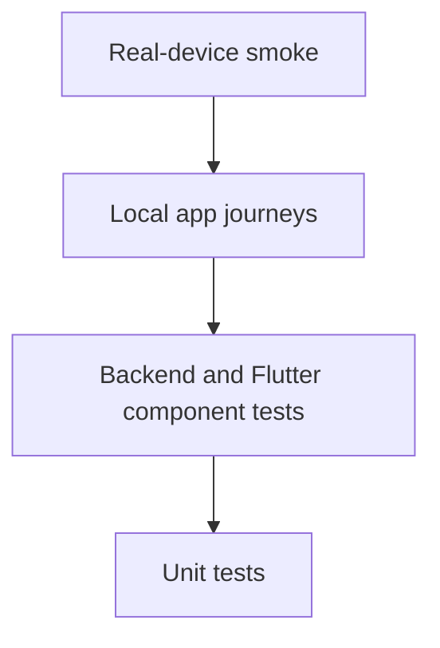
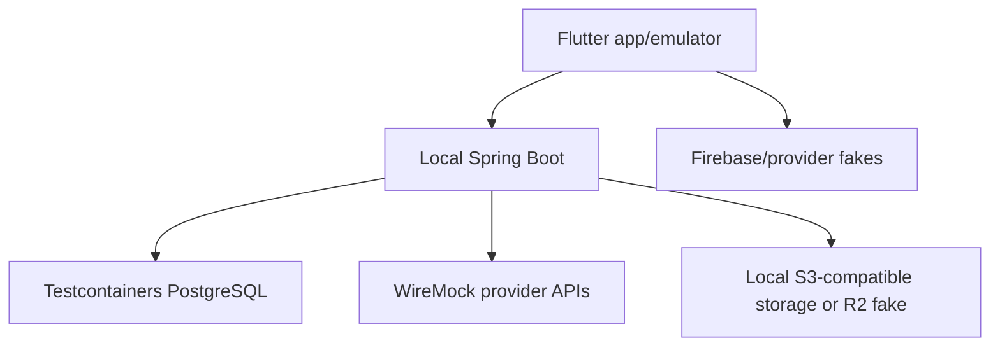

# Hyped! MVP Test Plan

**Status:** Draft for review  
**Last updated:** 2026-09-14  
**Related documents:** [`02-requirements.md`](./02-requirements.md), [`07-api-spec.md`](./07-api-spec.md), [`08-lld.md`](./08-lld.md), [`09-security-design.md`](./09-security-design.md)

## 1. Purpose

This document defines the initial test approach for the Hyped! MVP. It identifies what a solo developer must verify locally before release, the supported mobile matrix, tools, happy-path scenarios, local provider substitutes, performance measurements, evidence, release gates, and explicitly deferred testing.

The plan is intentionally lean. It does not pretend that local mocks provide the same assurance as a cloud test environment or that happy-path tests prove failure recovery. Those gaps are recorded as accepted MVP risks and future work.

## 2. Confirmed test decisions

| Area | MVP decision |
|---|---|
| Release gate | Critical journeys pass on Android and iOS, all backend integration tests pass, and no known critical/high defects remain open |
| Mobile execution | Emulators/simulators during development plus real Android and iPhone smoke tests before release |
| Performance | Measure and record baselines; no initial pass/fail thresholds |
| Code coverage | No percentage target and no coverage gate |
| Test environments | Local only; no continuously hosted or temporary staging environment |
| External dependencies | Local emulators, fakes, and mocks only; automated tests never call cloud services |
| Automation | No CI initially; the developer runs verification manually before release |
| Verification entry point | One `scripts/verify-local.sh` command |
| Exploratory data | Created manually as needed; no maintained shared seed dataset |
| Automated test data | Minimum isolated records owned by each test |
| Initial functional scope | Successful flows only; provider/dependency failures and recovery tests deferred |
| Minimum Android | Android 9, API 28 |
| Minimum iOS | iOS 15 |

## 3. Test objectives

The initial suite shall give reasonable evidence that:

- The backend builds and starts from a clean local checkout.
- Flyway creates the expected PostgreSQL schema.
- The selected Spring Data JPA and native SQL happy paths work against PostgreSQL, not H2.
- A user can sign in through the local identity substitute and maintain one device session.
- A newly signed-in adult can explicitly accept the current Terms/content rules before creating or joining.
- A creator can create, view, edit, share, archive, and delete a countdown.
- A second user can preview an invitation, explicitly join, view the room, and leave.
- Creator/co-host/member successful actions work for their intended roles.
- Membership, owned-room, joined-room, and active-device limits do not exceed defined values in successful boundary scenarios.
- Uploaded-image happy paths reach approved/ready state through local storage and moderation substitutes.
- Reporting and account-level blocking complete the defined safe-room transition.
- Fixed reminder preferences and successful outbox delivery behave as designed.
- Flutter renders the selected light/dark screens, counts down locally, caches authorized state, and updates small/medium widgets.
- The supported Android and iOS baselines can install, launch, and complete the critical smoke journey.
- Performance observations are captured for comparison even though they do not block the release.

## 4. Scope boundaries

### 4.1 Included in the initial release suite

- Backend unit tests for successful domain behaviour
- PostgreSQL integration tests for successful repositories, Flyway migrations, transactions, locks, and bounds
- API contract examples for successful responses
- Flutter unit tests for countdown, serialization, Riverpod state, and cache behaviour
- Flutter widget tests for primary happy states
- Selected golden tests for core light/dark surfaces and widgets
- Local end-to-end happy journeys using emulators/mocks
- Manual real-device smoke tests before release
- One pre-launch production backup/restore exercise under the controls in `11-deployment.md`
- Local formatting, static analysis, dependency/secret scans, and build checks
- Performance measurement without thresholds

### 4.2 Explicitly deferred

- Dependency outage, timeout, retry, malformed response, and partial-failure scenarios
- Security-negative and adversarial tests beyond checks inherent in the implemented happy paths
- Chaos, soak, stress, automated failover, and recurring disaster-recovery automation beyond the explicitly required restore exercise
- Automated tests against Firebase, FCM, R2, Google Vision, Secret Manager, KMS, Cloud Run, Neon, GIPHY, or app-attestation production services
- Hosted staging and per-pull-request environments
- Continuous integration
- Code-coverage targets or gates
- Large maintained fixture/seed catalogues
- Hard performance release thresholds
- Automated device-farm testing

Deferred items are tracked in the test-debt register in Section 18. They are not silently treated as covered.

## 5. Test levels

| Level | Purpose | Initial execution |
|---|---|---|
| Unit | Fast deterministic business and presentation behaviour | Every local verification run |
| Component | JPA/PostgreSQL, HTTP contract, Drift, Riverpod, Dio, widget rendering | Every local verification run where tagged `release` |
| Local journey | Flutter-to-local-Spring happy paths with provider substitutes | Before release candidate approval |
| Manual smoke | Native install, sign-in substitute/test path, room journey, widgets | On real Android and iPhone before release |
| Performance observation | Establish latency/resource baselines | Before release and after material architecture changes |

## 6. Local test architecture

The local environment contains no production credentials. Tests use:

- Testcontainers PostgreSQL for authoritative database behaviour
- WireMock for Firebase verification, FCM, Google Vision, R2 HTTP/S3 boundaries where practical, Cloud Scheduler identity, and other backend HTTP dependencies
- A local S3-compatible container or in-process object-storage fake for upload happy paths
- Firebase Local Emulator Suite or a narrow identity fake for successful local authentication
- Fake attestation verifier returning an approved local verdict
- Fake KMS/key-registry adapters using ephemeral test keys
- Fake clock and deterministic ID generator where time/ordering controls are required by an automated test
- In-memory/native test Drift database
- Dio test adapters for Flutter networking

Mocks return only committed provider contract shapes. Provider response samples must record their source/version in test code comments or fixtures without including secrets.

## 7. Supported platform matrix

### 7.1 Automated/local matrix

| Platform | Required version | Execution |
|---|---:|---|
| Android | API 28 | Emulator release smoke and widget checks |
| Android | Locally available recent stable API | Emulator development regression |
| iOS | iOS 15 | Simulator release smoke and widget checks |
| iOS | Locally available recent stable iOS | Simulator development regression |

The exact recent version follows the locally installed supported Flutter/Xcode/Android toolchain and is recorded in release evidence. Beta operating systems do not block release.

### 7.2 Real-device matrix

At minimum before release:

- One physical Android device on API 28 or the oldest practically available supported version
- One physical Android device on a recent stable Android version when available
- One physical iPhone on iOS 15 or the oldest practically available supported version
- One physical iPhone on a recent stable iOS version when available

If the solo developer cannot obtain the exact minimum physical version, the minimum-version emulator/simulator remains mandatory and the real-device gap is recorded in the release notes. One device may satisfy both minimum/recent categories only if it actually represents both requirements, which is normally impossible.

## 8. Backend unit tests

JUnit 5, AssertJ, and Mockito cover successful behaviour for:

- Event instant and IANA time-zone normalization
- Adaptive countdown inputs and reminder calculation
- Creator, co-host, and member permitted actions
- Room/member count transitions within limits
- Invitation token/code creation and canonicalization
- Profile validation and revision increment
- RS256 claim construction through an issuer abstraction
- Refresh-family creation and successful rotation
- Media validation-to-approved state transitions
- Notification planning and safe payload construction
- Analytics allowlist mapping and expiry calculation
- Account deletion workflow step ordering

Tests use explicit arrange/act/assert sections or descriptive helper methods. Each test names the observable rule, not the implementation method.

## 9. Backend PostgreSQL integration tests

Every backend integration run starts a clean PostgreSQL Testcontainer and applies Flyway from version zero. H2 is prohibited for database-behaviour tests.

Required successful-path tests:

- Flyway migration from empty database
- Hibernate `ddl-auto=validate`
- Create and retrieve user, identity, device, session family, and refresh-token record
- Successful refresh rotation transaction
- Create room with creator membership, preferences, invitation, theme, and outbox work
- Join room and create member preference/reminder rows atomically
- Promote member, edit as co-host, demote, and transfer ownership
- Leave/remove member with counter and reminder updates
- Rotate invitation link/code in one transaction
- Apply room edit with matching revision and create outbox record
- Claim/process a bounded outbox batch with `for update skip locked`
- Move an uploaded image through validating, moderating, and ready states
- Archive an event and delete it after the 24-hour lifecycle
- Complete account deletion workflow with local key-registry fake
- Aggregate and expire raw analytics at 30 days
- Retain/pseudonymize and expire moderation records at 90 days

Boundary tests may prove a successful operation at the maximum allowed count. Attempts beyond a limit are negative tests and are deferred under the initial happy-path-only policy unless needed to prove a database invariant during implementation.

## 10. Backend contract and adapter tests

### 10.1 API contracts

Successful contract tests verify:

- HTTP method and route
- Required request headers
- JSON names, types, enum values, and time formats
- Status code and response envelope
- ETag/revision on room reads/edits
- Idempotency response for an already successful command replay
- Cache headers for authentication, invitation preview, and private media responses
- Fifteen-minute signed-media expiry field
- `VALIDATING`, `MODERATING`, `MANUAL_REVIEW`, and `READY` media representations used by successful/continuing flows

The future `openapi.yaml` becomes the machine-readable source. Examples in `07-api-spec.md` remain acceptance references until it exists.

### 10.2 Provider substitutes

Initial adapter tests cover only successful responses from:

- Firebase identity verification
- Firebase Cloud Messaging send
- R2 authorization, metadata lookup, object read/write/delete
- Google Vision SafeSearch approved result and uncertain-to-manual-review workflow
- Cloud Scheduler OIDC verification
- External per-user key registry and KMS wrapping adapter
- Play Integrity and App Attest verifier adapters

GIPHY is called directly by Flutter. Its initial test uses a fake client with approved PG-rated result data and required attribution state.

## 11. Flutter unit and component tests

### 11.1 Pure Dart tests

- Countdown units at representative future durations and zero
- Event instant parsing and local display conversion
- Freezed/json_serializable request and response models
- API problem-to-typed-failure mapping for shapes required by successful flows
- Room/member role projections
- Reminder toggle model
- Theme and media-state mapping
- Widget snapshot construction

### 11.2 Riverpod tests

- Authentication reaches signed-in state through fake successful exchange
- Room list loads cache then fresh local API result
- Room detail refreshes to a newer revision
- Create-room three-step draft submits successfully
- Invite preview proceeds through sign-in and explicit join
- Media controller progresses from selection to ready/manual review
- Reminder settings persist successfully
- Account deletion confirmation reaches completion state

### 11.3 Drift tests

- Store/read room list and detail atomically
- Replace data only with equal/newer revision
- Update selected widget snapshot from cached room
- Remove current user's private cache on sign-out
- Migrate from every schema version that has shipped publicly

### 11.4 Widget and golden tests

Core widget tests cover successful/loading/empty states for:

- Interactive demo and Skip to invite
- Sign-in
- Home with nearest event and compact events
- Empty home templates
- Create Details, Style, and Review
- Invitation preview and Join countdown
- Room detail and action sheet
- Members and role-appropriate actions
- Reminder toggles
- Active Devices
- Image moderation/review-in-progress state
- Small and medium home-screen widget layouts

Golden tests cover a small stable set in light and dark mode. Cosmetic golden drift is reviewed visually and intentionally accepted rather than updated blindly.

## 12. Critical happy-path journeys

### J-01 First launch and sign-in

1. Launch a clean install.
2. Complete or skip the interactive demo as allowed.
3. Sign in through the successful local identity substitute.
4. Select the unselected 18+ affirmation and Terms/content-rules checkbox.
5. Continue only after both acceptances are recorded.
6. Confirm profile defaults and Home.
7. Confirm the device appears in Active Devices.

### J-02 Create and share a countdown

1. Select a suggested template.
2. Complete Details, Style, and Review.
3. Create the room.
4. Open room details and invitation controls.
5. Copy/share the active invite link and room code.

### J-03 Preview and join

1. Open an invite as a second clean-install user.
2. View only approved public preview fields.
3. Complete/skip demo, sign in, and return to preview.
4. Tap **Join countdown**.
5. Confirm the room appears on Home and opens successfully.

### J-04 Collaborate

1. Creator promotes the second user to co-host.
2. Co-host edits an allowed event field.
3. Creator refreshes and receives the new revision.
4. Member count remains correct.

### J-05 Upload image

1. Select a supported source image under 5 MB.
2. Flutter converts/resizes/compresses it within 1.5 MB and 2048 px.
3. Upload to local storage substitute.
4. Complete local validation, sanitization, and approved moderation.
5. Select ready media as the room cover.
6. Fetch it through the local 15-minute signed-delivery substitute.

### J-06 Reminders and event completion

1. Set the 24-hour, 1-hour, and event-time toggles.
2. Advance the controlled worker clock.
3. Confirm successful local FCM substitute delivery and outbox completion.
4. Reach event instant and show the minimal glow with **It's time!**.
5. Archive and remove the room after its 24-hour period using the controlled clock.

### J-07 Widgets

1. Add small and medium widgets manually through native flows.
2. Select a countdown.
3. Verify soft-blue style, event title, adaptive countdown, and medium event date.
4. Edit the room and refresh the app/widget snapshot.
5. Verify both widget sizes use the updated authorized snapshot.

### J-08 Leave, transfer, and delete account

1. Transfer ownership where required.
2. Leave joined rooms.
3. Start irreversible deletion.
4. Complete local profile/media/session/device cleanup and key deletion.
5. Confirm the deleted account cannot restore the prior local session.

Repeat the request-entry portion through the local public-web deletion page using the identity-verification fake and confirm it reaches the same deletion workflow.

### J-09 Report and block

1. Create two local users that share rooms owned by each account and by a third user.
2. Submit one report from the member surface and receive its created status.
3. Block the reported account and confirm the operation completes idempotently.
4. Confirm the blocked account is removed from blocker-owned rooms and the blocker leaves blocked-account-owned rooms using valid safe ownership data.
5. Confirm the third-party-owned room uses the hidden-profile representation and exposes no direct role action between the pair.
6. Confirm no block notification or blocker identity is emitted.

All nine journeys must pass on the applicable local platform matrix. J-01, J-02, J-03, J-05, J-07, J-09, and basic sign-out are the minimum real-device smoke subset.

## 13. Manual exploratory data

Manual data is created only when needed. The developer may create:

- Two or three local users representing creator, co-host, and member
- A near event for seconds/minutes behaviour
- A future event for days/hours behaviour
- One JPEG, PNG, and WebP within approved limits
- One uploaded image configured by the moderation mock as approved
- One uploaded image configured as uncertain for the successful manual-review continuation
- Rooms near product limits when manually exploring boundary behaviour

Do not use real customer details, production exports, personal photos, real provider tokens, or production invitation links. Local reset instructions must delete the disposable database, object store, secure storage, and app cache together.

## 14. Performance observation

Performance is measured but does not block the initial release. Record at least:

- Warm API p50, p95, and p99 for room list, room detail, create, preview, and join
- Local cold application start and first backend request
- Spring Boot startup time and peak memory
- PostgreSQL query count and slowest queries per critical journey
- HikariCP active/idle/wait measurements during the local load sample
- Invite link to preview/sign-in handoff duration on a stable local network
- Flutter first-frame/raster timing for Home and room detail
- Image processing, local upload, sanitization, and moderation-mock duration
- Small/medium widget refresh observation

Use a small repeatable local workload, record machine/tool versions, and compare against the previous release. A material regression is reviewed, but there is no numeric release gate until real usage and stable baselines exist.

## 15. `scripts/verify-local.sh`

The repository shall add the executable script when backend and Flutter scaffolding are created. The script is the single local release-verification entry point and must:

1. Use `set -euo pipefail`.
2. Resolve repository paths relative to the script, not the caller's directory.
3. Print tool versions without printing environment secrets.
4. Verify required local tools and Docker availability.
5. Run Java formatting/static analysis.
6. Run Maven unit and Testcontainers integration tests.
7. Validate Flyway migration from an empty PostgreSQL container.
8. Build the Spring Boot artifact/container locally.
9. Run Dart formatting and `flutter analyze`.
10. Run Flutter unit, widget, golden, and selected local journey tests.
11. Build Android for the configured local release mode.
12. Build/compile iOS without signing on macOS.
13. Run local dependency and secret scans when the chosen scanners are installed/configured.
14. Produce a timestamped summary under ignored local build output.
15. Exit non-zero on any required check failure.

The script does not download credentials, deploy infrastructure, call cloud APIs, alter production state, or automatically approve a release. Individual commands remain documented so failures can be rerun directly.

## 16. Manual release procedure

1. Start from a clean tracked source state and record the commit SHA.
2. Confirm no critical or high-severity defect is open.
3. Run `scripts/verify-local.sh` and retain its summary.
4. Run all critical happy-path journeys on required emulators/simulators.
5. Run the minimum real-device smoke subset on Android and iPhone.
6. Record OS/device/tool versions and any unsupported minimum-device gap.
7. Record performance observations and compare with the prior release.
8. Review deferred-test debt and confirm no change makes a deferred scenario newly critical.
9. Build immutable release artifacts from the verified commit.
10. Confirm the pre-launch or current quarterly backup/restore exercise required by `11-deployment.md` has passed.
11. Follow the production deployment and smoke/rollback process in `11-deployment.md`.

Because no staging environment exists, the deployment plan must use a low-exposure rollout, minimal production smoke data, observability, and a fast rollback path. Production customer data must never become general-purpose test data.

## 17. Release gates

A release candidate may proceed only when:

- [ ] `scripts/verify-local.sh` completes successfully.
- [ ] Every backend PostgreSQL integration test passes.
- [ ] Critical happy-path journeys pass on Android and iOS local matrix.
- [ ] Minimum real-device smoke subset passes on one Android device and one iPhone.
- [ ] Android API 28 and iOS 15 installation/launch are verified by emulator/simulator.
- [ ] No known critical or high-severity defect remains open.
- [ ] Formatting, static analysis, dependency/secret scans, and builds report no blocking result.
- [ ] Performance observations and tool/device versions are recorded.
- [ ] Test evidence points to the exact release commit.
- [ ] Accepted risks and deferred tests are reviewed and visible.
- [ ] Terms/content-rule acceptance, account blocking, public deletion entry, moderation, and minimal-permission checks pass.
- [ ] The required pre-launch restore exercise and current store-compliance checklist pass before public release.

There is no coverage percentage gate, hosted-environment gate, provider-live integration gate, or numeric performance gate for the initial MVP.

## 18. Test-debt register

| Priority after initial MVP | Deferred work | Why it matters |
|---|---|---|
| P0 before wider public exposure | Live non-production provider/IAM contract tests | Local mocks cannot prove credentials, permissions, quotas, callbacks, or provider configuration |
| P0 | Authentication/authorization negative tests | Prevent token, role, enumeration, and account-state bypasses |
| P0 | Refresh replay and concurrent limit rejection tests | Protect sessions and database invariants under hostile/concurrent requests |
| P0 | Upload adversarial tests | Protect decoders and moderation/quarantine boundary |
| P0 | Backup restore plus deletion-journal exercise | Prove recovery and cryptographic deletion behaviour |
| P1 | Provider timeout/retry/idempotency tests | Prevent duplicate or stuck external work |
| P1 | Offline, interruption, and process-death tests | Mobile networks and OS lifecycle are unreliable |
| P1 | Hard load/capacity thresholds | Prevent uncontrolled Cloud Run/Neon cost and saturation |
| P1 | Continuous integration | Ensure every change receives the same repeatable checks |
| P2 | Automated device farm | Broaden OEM, screen, and OS coverage |
| P2 | Coverage reporting | Identify untested areas once the suite and team grow |
| P2 | Soak, chaos, and regional latency tests | Needed as traffic and global reach increase |

P0 indicates the first testing expansion after the initial MVP, not that the current happy-path suite covers the risk.

## 19. Defect handling

Severity definitions:

| Severity | Meaning | Initial release treatment |
|---|---|---|
| Critical | Data exposure/loss, account takeover, unusable app, irreversible corruption | Release blocked |
| High | Critical journey unavailable, incorrect authorization, widespread crash, wrong deletion/payment-like irreversible behaviour | Release blocked |
| Medium | Important function impaired with a reasonable workaround | Explicit decision required |
| Low | Cosmetic/minor issue without material functional impact | May defer with note |

Closing a defect requires reproducing the fixed happy path and adding an automated regression test when practical. A deferred defect retains steps, environment, expected/actual result, severity, and owner.

## 20. Evidence and reporting

For each release, retain a small Markdown or JSON record containing:

- Release version and commit SHA
- Verification start/end time
- Local machine OS and CPU architecture
- Java, Maven, Flutter, Dart, Android SDK, Xcode, Docker, and PostgreSQL versions
- Passed/failed/skipped suite counts
- Emulator/simulator and real-device versions
- Critical-journey checklist
- Performance observations
- Known defects and test-debt acknowledgement
- Final go/no-go decision

Generated reports, test databases, object-store data, keys, screenshots with personal content, and logs remain excluded from Git unless intentionally sanitized documentation is required.

## 21. Acceptance checklist

- [ ] The plan uses local-only emulators, containers, fakes, and mocks.
- [ ] No automated test requires a cloud credential or service.
- [ ] Android API 28 and iOS 15 are the documented minimum versions.
- [ ] Test code uses the selected JUnit/AssertJ/Mockito/Testcontainers/WireMock and Flutter stacks.
- [ ] Initial release automation focuses on successful flows.
- [ ] Manual exploratory data contains no real customer/production data.
- [ ] One local verification script runs every required automated release check.
- [ ] No code-coverage or numeric performance gate is imposed initially.
- [ ] Backend integration success and critical Android/iOS journeys block release.
- [ ] Critical/high defects block release.
- [ ] Real Android and iPhone smoke tests are recorded.
- [ ] Deferred failure/security/provider tests remain explicit in the debt register.
