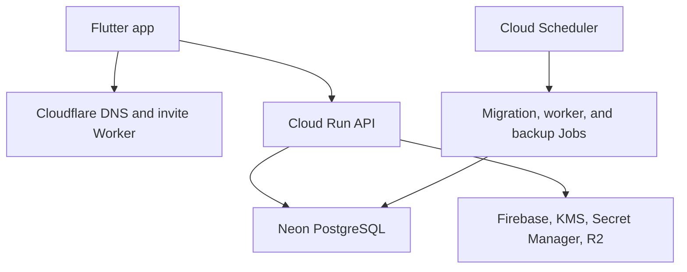

# Hyped! MVP Deployment and Release Plan

**Status:** Draft for review  
**Last updated:** 2026-09-14  
**Related documents:** [`05-hld.md`](./05-hld.md), [`06-database-design.md`](./06-database-design.md), [`09-security-design.md`](./09-security-design.md), [`10-test-plan.md`](./10-test-plan.md)

## 1. Purpose

This document defines how the Hyped! MVP is provisioned, backed up, deployed, verified, rolled back, and released through Google Play and the Apple App Store. It is the operational contract for a solo developer using local builds and manual release approval.

The plan deliberately keeps recurring cost low. It does not weaken data isolation, migration safety, restore testing, app-store policy checks, or release traceability. Provider rules and SDK requirements change, so every public submission must recheck the current official store requirements.

## 2. Confirmed deployment decisions

| Area | Decision |
|---|---|
| Initial region | Singapore, with Cloud Run and Neon colocated as closely as available |
| Backend | Spring Boot modular monolith on Google Cloud Run |
| Runtime rollout | Deploy a new revision and send 100% traffic to it after smoke checks |
| Runtime rollback | Automatically return 100% traffic to the previous healthy revision when the production smoke gate fails |
| Database migrations | Separate one-off Cloud Run Job before application deployment |
| Migration policy | Forward-only, backward-compatible expand-and-contract |
| RPO / RTO | 24 hours / 4 hours |
| Independent backup | Daily compressed, application-encrypted PostgreSQL logical dump in a private R2 backup bucket |
| Backup trigger | Cloud Scheduler invokes a dedicated Cloud Run Job once daily |
| Backup retention | Seven days |
| Restore exercise | Before public launch and every three months |
| Infrastructure | Terraform configuration committed to Git |
| Terraform state | Private versioned GCS bucket with public access prevention and 30-day old-version cleanup |
| Container build | Build locally and push an immutable commit-SHA tag to Artifact Registry |
| Container deployment | Deploy by image digest; never deploy `latest` |
| Deployment entry point | `scripts/deploy-production.sh` with explicit confirmations |
| Cloud Run scaling | Minimum 0, maximum 3 instances, concurrency 20 per instance |
| Database pool | Maximum 5 connections per instance initially |
| Invite edge | Cloudflare Worker on the invite domain |
| Public web pages | Cloudflare Pages on the Hyped! domain |
| Mobile pre-release | Google Play Internal Testing and closed testing; Apple TestFlight |
| Google production gate | For an affected personal account, 12 opted-in closed testers continuously for at least 14 days before the first production-access application for this app |
| Public mobile rollout | Phased rollout on both stores |
| Mobile monitoring | Firebase Crashlytics |
| Backend monitoring | Google Cloud Logging and Error Reporting |
| Alert destination | Developer email |
| Publisher | Individual/personal developer accounts initially |
| Store review access | Reviewers create accounts with their own Google or Apple identity and receive a valid seeded-room invitation |
| Domain and app IDs | Placeholders until the final domain and identifiers are selected |

## 3. Delivery principles

- One source commit produces one immutable backend image and one traceable set of mobile artifacts.
- Infrastructure changes are reviewed as Terraform before they are applied.
- Production credentials never enter Git, Flutter assets, shell history, release evidence, or container layers.
- Database expansion is deployed before code that uses it; destructive contraction occurs only after all compatible code is live and the rollback window has passed.
- A failed production smoke test restores the previous backend revision. It never attempts to reverse a committed migration.
- Mobile rollout is slower than backend rollout because installed binaries cannot be recalled immediately.
- Store approval is not proof of compliance. The developer remains responsible for the app, SDKs, disclosures, moderation, and account-deletion behaviour.
- No production customer record is used as general-purpose test data.

## 4. Environment model

| Environment | Purpose | External services | Data rule |
|---|---|---|---|
| Local | Development and all automated tests | Containers, emulators, fakes, and mocks only | Disposable synthetic data |
| Development | Optional manual provider setup verification | Lowest-cost isolated provider resources when explicitly created | Synthetic developer data only |
| Staging | Reserved configuration boundary; no always-on environment initially | Separate secrets and projects if activated later | Never copied from production |
| Production | Public backend and store builds | Dedicated production Cloud Run, Neon, Firebase, R2, KMS, Worker, Pages, and monitoring resources | Real user data |

There is no hosted CI or permanent staging environment for the initial MVP. The absence of staging is an accepted risk recorded in `10-test-plan.md`. Any temporary provider verification resource must be isolated from production and removed or scaled to zero when no longer needed.

## 5. Names and placeholders

Until the owner registers a domain and reserves store identifiers, documentation and Terraform use conspicuous placeholders:

| Placeholder | Example only | Replacement gate |
|---|---|---|
| Public domain | `hyped.example` | Before DNS, legal-page, or store metadata configuration |
| Invite host | `invite.hyped.example` | Before Universal Link/App Link verification |
| API host | `api.hyped.example` | Before production mobile signing |
| Support email | `support@hyped.example` | Before store submission |
| Android application ID | `com.example.hyped` | Before the first signed Android upload; treated as permanent afterward |
| Apple bundle ID | `com.example.hyped` | Before App ID, capabilities, or signed iOS build creation |
| Google Cloud project IDs | `hyped-dev`, `hyped-staging`, `hyped-prod` | Before Terraform apply |

The deploy script must fail if `.example`, `com.example`, placeholder project IDs, or placeholder support addresses remain in a production configuration.

## 6. Production topology



- Cloud Run and the Neon compute/database are placed in Singapore for the India-first MVP.
- Cloudflare Pages serves static legal and support pages. The account-deletion page obtains provider proof and calls the Spring Boot deletion API over HTTPS.
- The invite Worker serves redirects and platform association files without receiving Hyped! access tokens.
- R2 media and backup buckets are private and use separate credentials and prefixes.
- Multi-region active-active service, Kubernetes, Redis, Kafka, and always-on instances remain outside the MVP.

## 7. Terraform and state

### 7.1 Repository structure

```text
infra/
├── modules/
│   ├── cloud-run-service/
│   ├── cloud-run-job/
│   ├── scheduler/
│   ├── secret-bindings/
│   ├── artifact-registry/
│   └── monitoring/
└── environments/
    ├── development/
    ├── staging/
    └── production/
```

Terraform manages Google Cloud resources, service identities, IAM bindings, Artifact Registry, Cloud Run service/jobs, Scheduler jobs, monitoring policies, and DNS records that are supported by the chosen providers. Provider resources that cannot be safely managed through Terraform are documented with an owner, manual steps, and a drift check.

### 7.2 Remote state

- Production state lives in a dedicated private GCS bucket, not beside application data.
- Uniform bucket-level access and public access prevention are enabled.
- Object versioning is enabled; noncurrent versions expire after 30 days.
- State is encrypted by Google-managed encryption initially unless policy later requires a customer-managed key.
- Only the Terraform administration identity can mutate state. Runtime and backup identities cannot read it.
- State values are treated as sensitive even when Terraform marks an output as non-sensitive.
- `terraform plan` output is reviewed locally and retained only when sanitized.

### 7.3 Apply process

1. Pin Terraform and provider versions.
2. Run formatting and validation locally.
3. Select the explicit production environment directory.
4. Refresh and review the plan for unexpected deletion or replacement.
5. Require typed confirmation containing the environment and commit SHA.
6. Apply with the dedicated infrastructure identity.
7. Record the sanitized result and resolve drift before application deployment.

An infrastructure plan that deletes a database, bucket, KMS key, state bucket, domain, or production service requires a separate reviewed change and is never accepted automatically by the deployment script.

## 8. Service identities and secrets

Use separate identities for:

| Identity | Minimum responsibility |
|---|---|
| Runtime | Read required runtime secrets, connect to Neon, call Firebase/moderation/KMS, access application R2 objects |
| Migration job | Connect with schema-migration privileges; no media or notification access |
| Scheduled worker | Invoke/run lifecycle and outbox processing only |
| Backup job | Read logical database content and write only the backup bucket; no access to per-user decryption keys |
| Deployment | Push/deploy a selected artifact and adjust traffic |
| Terraform admin | Manage declared infrastructure and IAM |

Development, staging, and production use separate Secret Manager secrets and service identities. Production secret versions are referenced explicitly and rotated without rebuilding Flutter or baking values into images. The RS256 signing key, database credentials, R2 credentials, invitation keys, and KMS configuration must not be shared across environments.

Mobile configuration contains only public project/application identifiers and separately scoped GIPHY client keys. It never contains server credentials.

## 9. Immutable backend artifact

### 9.1 Local build

The release source must be a clean, reviewed commit. Run `scripts/verify-local.sh` first, then build the Spring Boot container locally using a pinned base image and reproducible Maven inputs.

The image is tagged with the full Git commit SHA:

```text
REGION-docker.pkg.dev/PROJECT/REPOSITORY/hyped-api:<full-commit-sha>
```

After pushing, resolve and record the registry digest. All Cloud Run deployment commands use `image@sha256:<digest>`. Mutable tags, including `latest`, are forbidden for production selection.

### 9.2 Artifact checks

- Maven lock/version policy and dependency scan pass.
- Image scan has no unresolved critical or high-severity issue.
- Container runs as a non-root user where supported.
- The image contains no `.env`, service-account key, signing key, source credential, or local test artifact.
- OCI labels record source repository, commit SHA, version, and build time.
- The digest is copied into release evidence before migration starts.

## 10. Database migration strategy

### 10.1 Separate migration job

Flyway does not run automatically from every Cloud Run application instance. A dedicated one-off Cloud Run Job uses the same immutable image or a migration-specific immutable image and starts only the migration entry point.

The sequence is:

1. Confirm the daily backup is recent enough for the 24-hour RPO.
2. Record current Flyway version, application revision, and image digest.
3. Execute a migration dry validation against a fresh local PostgreSQL database.
4. Run the production migration job once.
5. Require a successful exit code and verify Flyway history.
6. Run schema compatibility checks using the current production revision.
7. Deploy the new application revision only after those checks pass.

If the migration job fails, application deployment stops and existing traffic remains unchanged.

### 10.2 Expand-and-contract

Every production schema change is forward-only and backward compatible:

1. **Expand:** add nullable columns, new tables, new indexes, or dual-readable structures.
2. **Deploy compatible code:** old and new revisions can operate during the transition.
3. **Backfill:** use bounded, resumable batches with observable progress.
4. **Switch:** make the new representation authoritative only after verification.
5. **Contract:** remove old structures in a later release after the rollback window and retained mobile-version compatibility are understood.

Do not rename/drop a used column, tighten a constraint on unverified data, or perform an unbounded table rewrite in the same release that introduces its replacement. Rollback means returning application traffic to compatible code, not applying a down migration.

## 11. Backend deployment

### 11.1 Preflight

The production script verifies:

- Clean source tree and exact commit SHA
- Successful local verification evidence for the same commit
- No open critical/high defect
- Correct Google Cloud project, account, region, and service name
- Expected Terraform state and no pending destructive drift
- Image digest exists and matches the recorded commit
- Recent successful backup and sufficient restore confidence
- Migration job identity and database target
- Previous healthy Cloud Run revision and its image digest
- Required Secret Manager versions and external provider configuration
- No production placeholder domain, package ID, bundle ID, or support address

### 11.2 Revision and traffic sequence

1. Run the migration process in Section 10.
2. Deploy the new Cloud Run revision by digest with **0% traffic**.
3. Verify revision startup, liveness, readiness, configuration, and database compatibility through authenticated internal checks.
4. Run bounded production smoke checks using dedicated non-sensitive smoke data.
5. Send **100% traffic** to the new revision.
6. Repeat external API smoke checks and monitor errors, latency, instances, connection pool, and provider failures.
7. Mark the release successful only after the defined observation window.

Although traffic moves to 100% at once, pre-traffic revision checks reduce exposure. Canary traffic splitting was explicitly not selected for the initial backend process.

### 11.3 Automatic rollback

If a required post-traffic smoke check fails:

1. Stop further release actions.
2. Send 100% traffic to the previously recorded healthy revision.
3. Confirm traffic assignment and previous-revision health.
4. Preserve the failed revision, logs, correlation IDs, and release evidence for diagnosis.
5. Disable or pause incompatible scheduled work if the new revision activated any.
6. Send a critical email alert.

Automatic rollback runs only when the previous revision is schema-compatible and healthy. If both revisions are unhealthy or data integrity may be affected, stop automation, fail closed for mutations where necessary, and follow the incident runbook.

## 12. Cloud Run runtime configuration

Initial production bounds:

| Setting | Initial value |
|---|---:|
| Minimum instances | 0 |
| Maximum instances | 3 |
| Concurrency per instance | 20 |
| HikariCP maximum pool per instance | 5 |
| Maximum application DB connections | 15 |

- Request CPU and memory start at the smallest configuration proven by measured startup and request behaviour.
- CPU boost, minimum instances, or more memory are added only after measurements justify their cost.
- Request and startup timeouts are bounded. No public request performs an unbounded batch.
- Cloud Run service startup must validate mandatory configuration but readiness must not create a database stampede.
- Neon pooled connections are used where compatible.
- Cloud Run maximum instances and the job connection budget must remain below the Neon plan's connection capacity with operational headroom.

## 13. Scheduled jobs

Cloud Scheduler invokes authenticated Cloud Run Jobs or protected internal worker entry points with dedicated identities.

| Work | Trigger | Safety rule |
|---|---|---|
| Notification/lifecycle processing | Scheduled bounded cadence | PostgreSQL outbox, idempotent claims, retry with limits |
| Daily database backup | Once daily | One active execution, encrypted output, checksum and retention verification |
| Retention cleanup | Scheduled bounded cadence | Resumable deletion, audit counts, no broad unbounded query |

Scheduler requests use OIDC with exact audience and service identity validation. Public unauthenticated job invocation is disabled. Missed lifecycle work is processed safely on the next successful run.

## 14. Backup and recovery

### 14.1 Objectives

- **RPO: 24 hours.** At most one daily backup interval of durable database changes may be lost in the declared disaster scenario.
- **RTO: 4 hours.** The target is to restore a usable, verified service within four hours of declaring recovery.

These are MVP engineering objectives, not contractual service guarantees.

### 14.2 Backup job

Once daily, Cloud Scheduler starts the backup Cloud Run Job. The job:

1. Acquires a singleton lease so overlapping backups cannot run.
2. Creates a consistent logical PostgreSQL dump using a supported client version.
3. Compresses the dump.
4. Encrypts it at the application layer before upload.
5. Uploads it to a dedicated private R2 backup bucket using separate credentials.
6. Writes date, source, schema version, encrypted size, and plaintext-independent checksum metadata.
7. Verifies the uploaded object's size/checksum without exposing database content.
8. Emits a success metric and deletes local temporary material.

R2 lifecycle rules delete backup objects after seven days. Media credentials cannot read backups, and backup credentials cannot read or mutate media. Backup logs never contain dump output, database passwords, personal fields, or encryption keys.

### 14.3 Cryptographic deletion boundary

PostgreSQL backups may contain encrypted personal-field ciphertext until they expire. Per-user keys are wrapped under Cloud KMS and stored in an external key registry that is excluded from PostgreSQL backups. Account deletion removes that external key capability within 24 hours, making retained ciphertext unusable.

A restore must replay the deletion journal and verify deleted users have no key capability before traffic is enabled. The backup job cannot access the external per-user keys, preventing it from creating a second recoverable copy.

### 14.4 Restore exercise

A full restore exercise is mandatory:

- Before the first public launch
- Once every three months afterward
- After a material backup-format, encryption, database-version, key-registry, or restore-process change

The exercise restores into an isolated environment, verifies checksum and Flyway history, replays deletions, samples domain invariants, proves the application can start, records actual RPO/RTO, and then destroys the isolated restore. A failed exercise blocks launch or triggers a high-priority remediation before the next release.

## 15. Cloudflare edge and public pages

### 15.1 Invite Worker

The invite host serves:

- Android App Link routing and `/.well-known/assetlinks.json`
- iOS Universal Link routing and `/.well-known/apple-app-site-association`
- Platform-appropriate store redirects when the app is unavailable
- Safe fallback and invalid-link pages

Association files are generated from the final application ID, certificate fingerprint, Apple Team ID, and bundle ID. Production release stops if placeholders remain or platform link-verification tools fail.

The Worker must not log full invite credentials. Query/path values are redacted before analytics or logs. It passes only the minimum invite handoff needed by the installed app/backend contract.

### 15.2 Cloudflare Pages

Cloudflare Pages serves:

- Privacy policy
- Terms of service
- Community/content rules
- Support and moderation contact information
- Public account-deletion request page

Static pages are versioned in Git and deployed from an approved commit. Security headers include an explicit Content Security Policy, `X-Content-Type-Options`, referrer policy, and framing restrictions. Pages must be reachable without installing or signing into the app, except identity verification required to submit a deletion request.

The deletion page uses supported Google/Apple authentication through Firebase, obtains a short-lived proof, and submits it to the Spring Boot deletion endpoint. It does not collect a password, store tokens in page analytics, or claim deletion is complete before backend preconditions and processing finish.

## 16. Android release process

### 16.1 Build and signing

- Reserve the final application ID before the first store upload.
- Use Android App Bundles and Play App Signing.
- Keep the upload key outside Git with an encrypted offline backup and recovery instructions.
- Build the release from the verified commit and record version code/name, SHA-256 artifact digest, signing identity, Flutter/Dart/Android tool versions, and mapping/symbol files.
- Target the Google Play API level required at the actual submission date while retaining Android 9/API 28 as the app's tested minimum.

### 16.2 Test tracks and production access

1. Upload to **Internal Testing** for rapid install and device smoke checks.
2. For a personal developer account subject to Google's new-account rule, run a **closed test** with at least 12 testers continuously opted in for at least 14 days.
3. Collect genuine usage/feedback and retain a summary for the production-access application.
4. Apply for production access only after the app and store setup are complete.
5. Treat this as the first production-access gate for this app. Ordinary updates do not repeat the 14-day qualification after access is granted, although Google may require more testing or change its rules.

The test plan must keep more than 12 candidates available because a tester who opts out breaks their continuous period. Tester identities are handled privately and are not committed to Git.

### 16.3 Play submission gate

- Complete Data safety using the behaviour of the exact binary and every SDK.
- Complete target-audience and content-rating declarations truthfully; initial product eligibility is adults 18+ and the app does not enrol in Families.
- Provide a public privacy-policy URL and public deletion-request URL.
- Verify in-app account deletion, reporting, blocking, moderation, support contact, terms acceptance, and Sign in with Google/Apple.
- Declare only notification permission where required. Use Android Photo Picker without broad photo/storage permission.
- Run Play pre-launch reports and resolve blocking policy/security findings.
- Supply review instructions and the seeded review invite without exposing production customer data.

## 17. iOS release process

### 17.1 Build and signing

- Reserve the final bundle ID, App ID, capabilities, and associated domains before signing.
- Use the Apple Developer account's managed signing where practical; protect signing/recovery access with MFA.
- Build/archive from the verified commit and record marketing version, build number, archive/artifact digest, Xcode/Flutter versions, entitlement set, and uploaded symbols.
- Build with the Xcode/iOS SDK required at the actual submission date while supporting iOS 15 as the tested minimum.

### 17.2 TestFlight and review

1. Upload the release candidate to TestFlight.
2. Complete internal/external testing appropriate to the available tester group.
3. Run physical-iPhone smoke tests against the TestFlight build.
4. Keep the production backend and seeded review countdown live throughout review.
5. In App Review Information, explain sign-in, invite flow, room creation, reporting, blocking, moderation, account deletion, and the review invite.

Reviewers use their own Apple or Google identity. The notes provide a valid, non-sensitive seeded-room invite so collaboration can be exercised without relying on another reviewer. The room's event remains sufficiently far in the future, membership is reset before submission, and the invitation is verified immediately before review.

### 17.3 App Store submission gate

- Complete App Privacy details from the exact binary and SDK behaviour.
- Provide privacy-policy and support URLs.
- Keep Sign in with Apple alongside Google sign-in.
- Verify in-app account deletion, reporting, blocking, content filtering/moderation, and support contact.
- Use PHPicker/system Photos picker and avoid broad Photos permission; request notifications contextually.
- Include required privacy manifests and valid reasons for covered APIs used by the app or dependencies.
- Answer age-rating questions truthfully. The product is restricted to adults 18+ at launch, but the store rating must reflect actual content/functionality rather than an invented rating.
- Ensure screenshots, description, keywords, preview media, and claims match the submitted binary.

## 18. Shared store-compliance gate

Before every public submission, verify the latest official Apple and Google requirements. At minimum:

- The privacy policy accurately describes collection, use, retention, deletion, subprocessors, and contact method.
- Terms and community rules define prohibited content and user conduct.
- A user explicitly accepts current Terms/content rules after sign-in and before creating or joining a room.
- The initial launch requires an 18+ eligibility affirmation and targets adults, not children.
- Users can report objectionable content/users and block another account inside the app.
- Uploaded images remain private until automated moderation approves them; uncertain content remains hidden pending manual review.
- A reachable moderation/support contact is present in the app and public website.
- Account deletion is available inside the app and through the public verified web flow.
- Google Data safety and Apple App Privacy answers match Firebase, Crashlytics, GIPHY, Cloudflare, R2, moderation, logs, and analytics behaviour.
- Google/Apple sign-in, reviewer access, and all external services work during review.
- SDK versions, privacy manifests, signatures, entitlements, permissions, target API, and build SDK meet current submission rules.
- Store assets contain no unauthorized marks, misleading claims, placeholder text, or real user information.
- GIPHY attribution and direct-client integration meet its current terms.

Passing this checklist reduces preventable rejection risk but cannot guarantee store approval or legal compliance. Material policy uncertainty must be resolved against current official documentation or qualified advice before submission.

## 19. UGC safety and blocking release gate

Hyped! contains user-generated titles, descriptions, profile data, and images. Public release is blocked until the following work together:

- Terms/content-rule acceptance is versioned and auditable.
- Image uploads use private quarantine, validation, sanitization, automated moderation, and manual-review state.
- Reports can be filed from the room/member context and reach an operational moderation queue.
- Account-level blocking is immediate and idempotent.
- Blocking removes the blocked user from rooms owned by the blocker.
- The blocker leaves rooms owned by the blocked user, subject to safe ownership handling.
- Neither account can subsequently join a room owned by the other.
- In third-party-owned shared rooms, blocked profiles are hidden from each other and direct role actions are disabled.
- Blocking sends no notification and does not reveal who blocked whom.
- Suspended or compromised accounts are denied on every request.

If ownership transfer or room integrity prevents an atomic block action, the API returns a safe resolution requirement without exposing the accounts to each other. The app must not present blocking as complete until server-side room handling commits.

## 20. Minimal mobile permissions

The initial app requests only:

| Capability | Implementation |
|---|---|
| Image selection | Android Photo Picker and iOS PHPicker/system picker |
| Notifications | Platform notification permission, requested in context and not required for core room use |

The release manifest/entitlements must not request camera, precise/approximate location, contacts, microphone, advertising ID, tracking, or broad photo/storage access. Dependency manifests are inspected because an SDK can add permissions transitively. Any new permission requires a documented user benefit, privacy/disclosure review, store-policy review, and explicit product approval.

## 21. Mobile phased rollout

### 21.1 Google Play

After approval, start a small production percentage, observe at least one meaningful monitoring interval, then increase through deliberate stages such as 10%, 25%, 50%, and 100%. The exact timing may slow down when the active user count is too small to provide a useful signal.

### 21.2 Apple App Store

Enable Apple's phased release and follow the store-managed stages. Pause advancement when release health is unclear. Critical fixes are submitted as a new reviewed build; installed iOS binaries cannot be instantly rolled back.

### 21.3 Advance or halt

Advance only when:

- Crashlytics shows no new critical/high crash pattern.
- Authentication, create, invite, join, media, notification, blocking, and deletion signals are healthy.
- Support/review reports show no critical regression.
- Backend revision, database, scheduled jobs, and provider dependencies remain healthy.

On a mobile defect, pause the store rollout, maintain backend backward compatibility, disable only the affected server-controlled feature when a safe flag exists, and prepare a hotfix. A forced minimum app version is reserved for serious security or data-integrity incompatibility and must retain a usable update path.

## 22. Monitoring and alerts

### 22.1 Mobile

Firebase Crashlytics records crashes and non-fatal release diagnostics with environment and app-version tags. It must not receive access/refresh tokens, raw invitation credentials, email, descriptions, image URLs, or other unnecessary personal data.

### 22.2 Backend

Google Cloud Logging and Error Reporting receive structured, redacted application logs. Release dashboards correlate revision, image digest, request count, error rate, latency, instance count, cold starts, Hikari saturation, job results, outbox backlog, backup age, and provider failures.

### 22.3 Email alerts

Critical email alerts cover:

- Sustained API unavailability or elevated 5xx errors
- Failed migration, backup, restore exercise, or lifecycle job
- Cloud Scheduler delivery failure
- Database connection saturation or inability to connect
- R2/media delivery failure affecting critical journeys
- Authentication or account-deletion workflow failure
- Crashlytics critical regression during phased rollout
- Rollback automation execution or failure

Exact numeric thresholds and escalation details belong in `12-observability-runbook.md`. Alert routes are tested before public launch without sending real personal data.

## 23. `scripts/deploy-production.sh`

The repository shall add this executable script when deployable code and Terraform exist. It orchestrates approved commands but does not hide the production target or auto-approve risk.

Required behaviour:

1. Use `set -euo pipefail` and resolve paths relative to the repository.
2. Refuse an unclean source tree, detached/unrecorded commit, mutable image tag, or placeholder production value.
3. Require an existing successful `verify-local` record for the exact commit.
4. Print project, region, service, migration job, current revision, new digest, and backup age without printing secrets.
5. Run read-only Terraform drift/plan checks and stop on destructive changes.
6. Require the user to type the exact production project and commit SHA.
7. Confirm a recent successful backup and known previous healthy revision.
8. Execute the one-off migration job and verify Flyway history.
9. Deploy the new revision by digest with no traffic.
10. Execute revision-local health and smoke checks.
11. Require a final explicit traffic confirmation.
12. Send 100% traffic to the new revision and run external smoke checks.
13. Automatically route 100% back to the recorded revision if required smoke checks fail.
14. Emit sanitized release evidence and a non-zero exit status on failure.

The script must not create credentials, disable policy checks, delete infrastructure, run a down migration, silently select a project from ambient configuration, or claim a successful release after rollback.

## 24. Production smoke data

Use dedicated, clearly labelled, non-sensitive smoke accounts and rooms. Before each release:

- Verify Google and Apple sign-in paths on their supported platform.
- Verify the seeded store-review invite and room capacity.
- Create/read/edit one smoke countdown.
- Preview and explicitly join using a second smoke identity when available.
- Confirm approved media delivery and moderation state without uploading personal content.
- Confirm notification registration and one safe test signal where provider tooling permits.
- Verify blocking and account deletion through controlled test identities before public launch and after relevant changes.

Smoke artifacts are removed promptly. They never use a production user's identity, room, media, invite, or notification token.

## 25. Release evidence and versioning

Each release record contains:

- Git commit SHA and clean-tree confirmation
- Backend semantic/application version and Artifact Registry digest
- Flyway version before/after and migration Job execution ID
- Cloud Run old/new revision names and traffic-change timestamps
- Terraform plan/apply reference when infrastructure changed
- Backup age, object identifier, and last restore-exercise result
- Android version code/name, AAB digest, track, and rollout stage
- iOS build/marketing version, archive digest, TestFlight/build status, and rollout stage
- Local verification and physical-device smoke evidence
- Store compliance checklist version and disclosure review
- Known defects, accepted risks, rollback result, and final go/no-go owner

Evidence is sanitized and stored under a documented release-record location. Tokens, credentials, tester emails, personal content, and full invitation links are excluded.

## 26. Cost controls

- Cloud Run scales to zero and is capped at three instances.
- Concurrency 20 and a five-connection pool limit database pressure.
- Scheduled work uses bounded jobs instead of an always-running worker.
- Terraform state uses one small versioned GCS bucket with 30-day noncurrent cleanup.
- One immutable image per release is retained according to a small lifecycle policy; unreferenced old images can be pruned only after rollback/evidence needs expire.
- Static legal/support pages use Cloudflare Pages; invite routing uses the existing Worker allowance.
- R2 backup storage keeps only seven daily encrypted dumps.
- Crashlytics and native Google logging are used before adding a separate paid observability vendor.
- Budget alerts are configured, but hard product/runtime limits remain necessary because alerts do not cap all spend.

Cost changes never silently relax retention, privacy, backup encryption, moderation, or restore testing.

## 27. Failure handling

| Failure | Immediate action |
|---|---|
| Local verification fails | Stop; do not build or deploy |
| Terraform destructive drift | Stop; review separately |
| Backup too old/failed | Stop release; repair backup path |
| Migration fails | Keep current revision live; diagnose forward fix |
| New revision pre-traffic smoke fails | Keep it at 0%; preserve diagnostics |
| Post-traffic backend smoke fails | Route 100% to previous healthy revision |
| Previous revision also fails | Start incident response; restrict mutations if integrity is uncertain |
| Mobile crash/policy issue during rollout | Pause rollout; keep backend compatible; submit hotfix |
| Store rejection | Record reason; correct binary/metadata/process; resubmit without bypass |
| Backup restore misses RTO/RPO | Treat as high priority and revise capacity/runbook |
| Invite association fails | Keep room-code fallback; stop public release until links verify |

## 28. India-first to global expansion

The MVP remains single-region until measurements justify expansion. Before adding regions:

1. Measure Indian and non-Indian latency, error rates, and usage.
2. Re-evaluate database placement, data residency, cross-region transfer, and privacy obligations.
3. Decide whether read caching, database replicas, or a region move solves the measured problem.
4. Test invitation, signing, scheduled-work, and backup behaviour under the new topology.
5. Update RPO/RTO, Terraform, threat model, store disclosures, and runbooks.

Do not deploy multiple active write regions without an explicit data-consistency and conflict-resolution design.

## 29. Pre-launch acceptance checklist

### Infrastructure and backend

- [ ] Final domain, package ID, bundle ID, project IDs, and support contact replace every placeholder.
- [ ] Terraform state and production resources are private and least-privileged.
- [ ] Production secrets are separate and absent from Git/images/mobile bundles.
- [ ] Immutable commit-SHA image is deployed by digest.
- [ ] Flyway runs through a separate one-off job.
- [ ] Migrations follow expand-and-contract and preserve rollback compatibility.
- [ ] Cloud Run uses minimum 0, maximum 3, concurrency 20, and bounded DB pools.
- [ ] Automatic traffic rollback to the previous healthy revision is tested.

### Recovery and operations

- [ ] Daily encrypted R2 backup and seven-day lifecycle are verified.
- [ ] Pre-launch restore exercise meets or records remediation against RPO 24 hours and RTO 4 hours.
- [ ] Scheduler/job authentication and singleton execution are verified.
- [ ] Crashlytics, Cloud Logging, Error Reporting, dashboards, and critical email alerts work.
- [ ] `scripts/verify-local.sh` and `scripts/deploy-production.sh` contracts are implemented and exercised.

### Web, privacy, and safety

- [ ] Invite Worker and both platform association files validate against signed identifiers.
- [ ] Privacy, Terms, community rules, support, and public deletion pages are live on Cloudflare Pages.
- [ ] Versioned explicit Terms/content-rules acceptance occurs before create/join.
- [ ] Adults-only eligibility affirmation and store audience declarations are consistent.
- [ ] Report, account block, safe-room handling, moderation, and contact paths are operational.
- [ ] In-app and verified web account deletion both complete safely.
- [ ] Only system photo picker and contextual notification permission are present.

### Store release

- [ ] Current Apple and Google policies, target SDKs, privacy requirements, and metadata are rechecked.
- [ ] Data safety and App Privacy disclosures match the exact release and SDK set.
- [ ] Play Internal Testing, required 12-tester/14-day closed test, and production-access application are complete where applicable.
- [ ] TestFlight and physical iPhone smoke tests pass.
- [ ] Reviewers can use their own identity and the seeded invitation is valid.
- [ ] Public releases use phased rollout with health checks between stages.
- [ ] No critical/high defect remains open and every gate in `10-test-plan.md` passes.

## 30. References

- [Cloud Run rollouts, rollbacks, and traffic migration](https://cloud.google.com/run/docs/rollouts-rollbacks-traffic-migration)
- [Cloud Run container deployment](https://cloud.google.com/run/docs/deploying)
- [Cloud Run container runtime contract](https://cloud.google.com/run/docs/container-contract)
- [Cloud Scheduler authentication](https://cloud.google.com/scheduler/docs/http-target-auth)
- [Artifact Registry Docker authentication](https://cloud.google.com/artifact-registry/docs/docker/authentication)
- [Terraform GCS backend](https://developer.hashicorp.com/terraform/language/backend/gcs)
- [Cloudflare Pages limits](https://developers.cloudflare.com/pages/platform/limits/)
- [Cloudflare Pages Functions](https://developers.cloudflare.com/pages/functions/)
- [Cloudflare R2 pricing](https://developers.cloudflare.com/r2/pricing/)
- [Google Play testing requirements for new personal accounts](https://support.google.com/googleplay/android-developer/answer/14151465)
- [Google Play user-generated content policy](https://support.google.com/googleplay/android-developer/answer/9876937)
- [Google Play account deletion requirements](https://support.google.com/googleplay/android-developer/answer/13327111)
- [Google Play photo and video permissions policy](https://support.google.com/googleplay/android-developer/answer/16935362)
- [Apple App Review Guidelines](https://developer.apple.com/app-store/review/guidelines/)
