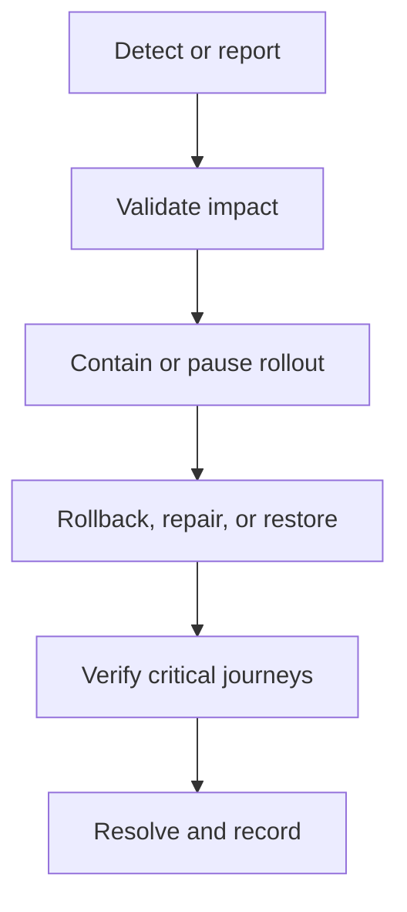

# Hyped! MVP Observability and Incident Runbook

**Status:** Draft for review  
**Last updated:** 2026-09-14  
**Related documents:** [`09-security-design.md`](./09-security-design.md), [`10-test-plan.md`](./10-test-plan.md), [`11-deployment.md`](./11-deployment.md)

## 1. Purpose

This document defines how the solo developer observes Hyped! in production, detects operational failures, investigates incidents, communicates user impact, and restores service. It covers the Spring Boot API, Flutter releases, PostgreSQL, scheduled work, notifications, backups, media, authentication, invite routing, and cost.

This runbook is an operational starting point for an MVP. It does not promise 24/7 support or a contractual SLA. Thresholds must be reviewed after real traffic produces stable baselines.

## 2. Confirmed observability decisions

| Area | Decision |
|---|---|
| Backend monitoring | Google Cloud Logging, Error Reporting, Monitoring, and Cloud Run metrics |
| Mobile monitoring | Firebase Crashlytics |
| Dashboard | One production overview with links to provider-specific consoles |
| Alert destination | Developer email |
| API critical threshold | More than 5 server errors and more than 5% 5xx responses in 5 minutes |
| Uptime | Public health check every 5 minutes; critical after 3 consecutive failures |
| Application log retention | 14 days |
| Security/audit record retention | 30 days |
| Incident-record retention | 30 days, sanitized |
| Migration/backup failure | Immediate critical email |
| Reminder/lifecycle jobs | Email after 2 consecutive failed executions |
| Outbox backlog | Alert when oldest ready item exceeds 15 minutes or ready count exceeds 100 |
| Database pool | Warning at 80% for 10 minutes; critical after 3 acquisition timeouts in 5 minutes |
| Crashlytics | Manual review before each phased-rollout increase; no automatic Crashlytics alert gate initially |
| Security events | Manual dashboard review once per week and before rollout increases |
| Budget | ₹500 monthly Google Cloud budget; email at 50%, 80%, and 100% |
| Release watch | Active monitoring for 2 hours after deployment; best-effort email response afterward |
| Status communication | Simple Cloudflare Pages status page updated manually for major incidents |

## 3. Goals and boundaries

The observability system shall:

- Detect sustained API failure without emailing on every isolated error.
- Show whether a problem is in the app, Cloud Run, PostgreSQL, a scheduled job, or an external provider.
- Preserve enough evidence to diagnose failures without collecting unnecessary personal data.
- Confirm reminders, lifecycle deletion, account deletion, moderation, and backups continue progressing.
- Support the four-hour recovery objective and 24-hour recovery-point objective.
- Make release and rollback decisions traceable to an exact commit, image digest, backend revision, and mobile version.
- Remain affordable and understandable for one developer.

The initial system does not include a paid observability vendor, distributed tracing platform, 24/7 on-call rotation, automated security paging, automated mobile rollout halt, or numeric latency release gate.

## 4. Service inventory

| Component | Primary telemetry | Detailed console |
|---|---|---|
| Flutter Android/iOS | Crash/non-fatal events, app version, platform | Firebase Crashlytics |
| Spring Boot API | Structured logs, request count, latency, status, revision | Google Cloud Logging/Monitoring/Error Reporting |
| Cloud Run | Instances, concurrency, CPU, memory, startup, request errors | Cloud Run console |
| Neon PostgreSQL | Connections, compute activity, storage, query health | Neon console plus application metrics |
| Notification outbox | Ready/processing/failed counts, oldest age, attempts | Application dashboard and PostgreSQL operational views |
| Cloud Run Jobs | Execution state, duration, exit code | Cloud Run Jobs |
| Cloud Scheduler | Invocation result and target response | Cloud Scheduler |
| Firebase Auth/FCM | Provider availability and delivery outcomes | Firebase console |
| Cloudflare R2 | Request errors, object operations, storage | Cloudflare dashboard |
| Invite Worker/Pages | Request errors and route status | Cloudflare dashboard |
| Image moderation | Latency, approved/manual/rejected counts, failures | Application/provider console |
| Backup pipeline | Last success, age, size, checksum, restore result | Application dashboard, Jobs, and private R2 metadata |
| Google Cloud billing | Actual/forecast spend and budget percentage | Billing console |

## 5. Telemetry data rules

### 5.1 Never collect or log

- Access or refresh tokens
- Firebase, Google, or Apple identity tokens/codes
- Full invitation links, room codes, or preview references
- Database, R2, signing, KMS, GIPHY, or service credentials
- Email addresses, provider subjects, FCM tokens, IP addresses beyond an approved coarse abuse representation
- Room descriptions, locations, uploaded images, report text, or request bodies on sensitive routes
- Signed media URLs or internal object keys
- Per-user encryption keys or decrypted personal fields

### 5.2 Safe structured fields

| Field | Example | Rule |
|---|---|---|
| `timestamp` | RFC 3339 UTC | Server-generated |
| `severity` | `INFO`, `WARNING`, `ERROR` | Stable mapping |
| `service` | `hyped-api` | No secrets |
| `environment` | `production` | Explicit |
| `revision` | Cloud Run revision | Release correlation |
| `commit_sha` | Full Git SHA | Release correlation |
| `request_id` | Random UUID | Returned to client safely |
| `correlation_id` | Random UUID | Cross-operation correlation |
| `route_template` | `/api/v1/rooms/{roomId}` | Never raw URL |
| `method` | `POST` | Allowlisted |
| `status_code` | `201` | Numeric |
| `duration_ms` | `84` | Bounded numeric |
| `error_code` | `ROOM_FULL` | Controlled application code |
| `provider` | `R2`, `FCM` | Controlled enum |
| `job_type` | `BACKUP` | Controlled enum |
| `outcome` | `SUCCESS`, `FAILURE` | Controlled enum |

Resource/user correlation uses short-lived or rotatable pseudonymous fingerprints only when necessary for abuse or incident diagnosis. Product analytics and operational telemetry remain separate.

### 5.3 Retention

| Data | Retention |
|---|---:|
| Cloud/application request logs in the project `_Default` or dedicated application bucket | 14 days |
| Google Cloud `_Required` audit logs | Provider-mandated 400 days; not configurable |
| Error Reporting source logs | 14 days |
| Security/audit database records | 30 days |
| Raw privacy-safe analytics | 30 days |
| Pseudonymized abuse reports | 90 days |
| Sanitized incident records | 30 days |
| Deployment evidence | Per release policy, sanitized |
| Daily database backup | 7 days |

The project-level `_Default` or dedicated application log bucket is configured for 14 days. Google Cloud's `_Required` bucket retains mandatory Admin Activity, System Event, and Access Transparency audit logs for 400 days and cannot be shortened; application payloads and personal content must never be written there. This provider-controlled exception is documented in the privacy/data inventory. Log sinks and buckets enforce all configurable retention automatically. Before lowering or extending retention, review incident needs, privacy disclosure, storage cost, and deletion commitments.

## 6. Production overview dashboard

The single dashboard answers five questions in order:

1. Are users reaching the service?
2. Are requests succeeding?
3. Are the database and runtime saturated?
4. Are background workflows progressing?
5. Did a release or provider change correlate with the problem?

### 6.1 API and runtime panels

- Request count by status class and route group
- 5xx count and percentage over 5 minutes
- p50, p95, and p99 latency as observations, not release gates
- Public health-check result and consecutive failures
- Cloud Run active instance count, startup latency, cold starts, CPU, memory, and concurrency
- Current/previous revision traffic and image digest
- Error Reporting groups by revision and first/last seen time

### 6.2 Database panels

- Hikari active, idle, pending, maximum, and acquisition timeouts
- Pool utilization percentage by revision
- Neon active connections and compute state
- Slowest/query-count observations for critical route groups
- Transaction/lock failure count
- Database connectivity errors

### 6.3 Background-work panels

- Scheduler success/failure by target
- Job success/failure and consecutive-failure count
- Outbox ready/processing/terminal-failed count
- Oldest ready outbox item age
- Reminder dispatch attempts and safe outcome codes
- Rooms awaiting archive/deletion and oldest overdue age
- Account deletions pending and oldest pending age
- Media in validating/moderating/manual-review states and oldest state age

### 6.4 Provider and release panels

- Firebase authentication exchange and FCM result categories
- R2 authorization/upload/delivery/delete error categories
- Image-moderation outcome/failure counts
- Invite Worker 4xx/5xx and association-file checks
- Current mobile versions observed by safe aggregate
- Links to Crashlytics, Neon, Firebase, Cloudflare, Cloud Run Jobs, Scheduler, billing, and the current release record

The dashboard does not embed secret-bearing provider URLs or broad database access.

## 7. Alert policy summary

| Signal | Condition | Severity | Notification |
|---|---|---|---|
| API 5xx | Count > 5 **and** rate > 5% in 5 min | Critical | Immediate email |
| Public uptime | 3 consecutive failed 5-minute checks | Critical | Immediate email |
| Migration Job | Any failed execution | Critical | Immediate email |
| Backup Job | Any failed execution or last success older than 26 hours | Critical | Immediate email |
| Reminder/lifecycle job | 2 consecutive failed executions | High | Email |
| Outbox age | Oldest ready item > 15 minutes | High | Email |
| Outbox size | Ready item count > 100 | High | Email |
| DB pool usage | >= 80% for 10 minutes | Warning | Email |
| DB acquisition | >= 3 timeouts in 5 minutes | Critical | Immediate email |
| Google Cloud spend | 50%, 80%, or 100% of ₹500 monthly budget | Info/Warning/High | Email |
| Crashlytics | Manual review before rollout increase | Manual gate | No automatic alert initially |
| Security events | Weekly manual review | Manual control | No automatic alert initially |

An API alert clears only after the evaluation window no longer meets both error conditions. The outbox alert clears only after both age and count are below threshold. One successful reminder/lifecycle execution resets its consecutive-failure counter.

## 8. Health checks

### 8.1 Endpoints

- `/actuator/health/liveness` proves the process can run. It does not call every provider.
- Internal readiness proves the revision can accept application work and reach mandatory dependencies with bounded checks.
- A public minimal health endpoint returns only a generic status and request ID.

No health response exposes build dependencies, database names, regions, configuration, exception text, credentials, provider account IDs, or queue contents.

### 8.2 External uptime check

Google Cloud Monitoring calls the public endpoint every five minutes. Three consecutive failures create the critical email. A single failure remains visible on the dashboard but does not page the developer.

Health-check traffic is excluded from product analytics and ordinary user-request volume where practical, but remains visible as synthetic monitoring.

## 9. Logging conventions

### 9.1 Request lifecycle

Emit one completion record per request with the route template, outcome, status, duration, revision, request ID, and safe error code. Avoid separate noisy start/end records unless diagnosis requires them.

Expected user outcomes such as invalid input, room full, stale revision, or access denied are not logged as server exceptions. Unexpected failures include a stable exception group and stack trace in protected logs without request bodies.

### 9.2 Jobs and outbox

Each job execution records:

- Job type and execution ID
- Scheduled/start/end times
- Revision/image digest
- Claimed, succeeded, retried, terminal-failed, and skipped counts
- Oldest eligible work age before and after
- Final safe outcome code

Individual outbox payloads are not logged. A pseudonymous work fingerprint may be recorded for retry correlation.

### 9.3 Mobile

Crashlytics custom keys are restricted to app version, build number, platform, OS version, environment, feature area, and a random correlation/request ID copied from a failed response. User IDs, invite data, room values, media links, and tokens are excluded.

## 10. Incident severity

| Severity | Definition | Examples | Initial action |
|---|---|---|---|
| Critical | Active data exposure/loss, account takeover, broad outage, irreversible corruption | Compromised signing key, database corruption, API unavailable | Stop release/change, contain, restore or rollback |
| High | Critical journey broadly unavailable or durable work seriously delayed | Auth outage, repeated DB timeouts, backup failure, large outbox delay | Diagnose promptly, pause rollout, recover |
| Medium | Important function degraded with workaround | GIF search, image upload, or notification subset unavailable | Record, communicate if material, schedule fix |
| Low | Minor/cosmetic or isolated issue | One recoverable error or display defect | Track with normal work |

There is no guaranteed response time outside the two-hour release watch. The engineering objective remains recovery within four hours for declared disaster recovery. Severity can be raised when scope or risk becomes clearer.

## 11. Incident workflow

1. Record detection time, signal, current revision/mobile version, and request IDs.
2. Confirm the alert is not an expected maintenance/test event.
3. Assign severity based on user/data impact, not the loudness of logs.
4. Freeze deployment, migration, or rollout changes that could worsen impact.
5. Contain access or traffic when security/data integrity is uncertain.
6. Choose the smallest safe recovery: retry job, disable feature, rollback backend, pause mobile rollout, or restore data.
7. Verify health plus the affected critical journey.
8. Update the public status page for major user-visible incidents.
9. Record resolution, remaining risk, follow-up, and evidence without personal data.

## 12. Release monitoring

### 12.1 Before deployment

- Dashboard and provider consoles are reachable.
- Alert policies are enabled and the developer email is current.
- Last backup is successful and recent.
- Scheduler/jobs/outbox have no unexplained backlog.
- Current revision and baseline error/latency values are recorded.
- Status-page editing access is available.

### 12.2 Two-hour active watch

After backend traffic moves to the new revision, watch actively for two hours:

- First 15 minutes: continuous dashboard and log observation.
- Remaining period: check at least every 15 minutes and after each smoke action.
- Keep current and previous revision/digest visible.
- Do not advance a mobile rollout during an unresolved backend signal.

A required post-traffic smoke failure automatically returns 100% traffic to the previous healthy revision under `11-deployment.md`. An alert without a failed gate is investigated before manual rollback.

### 12.3 Mobile rollout review

Before each Google Play or App Store phased-rollout increase, manually review Crashlytics and record:

- New fatal and non-fatal signatures
- First/last seen time and release version
- Number of affected installations
- Android/iOS and OS versions
- Critical journey affected, if any
- Continue, pause, or hotfix decision

There is no automated Crashlytics halt initially. A verified critical/high mobile defect pauses rollout even if only one installation has reported it.

## 13. API outage runbook

Trigger: hybrid 5xx alert or three failed uptime checks.

1. Check current revision traffic, Error Reporting groups, Cloud Run instances, startup failures, and recent deployment/config changes.
2. Separate liveness failure from database/provider dependency failure.
3. If correlated with the new revision and the previous revision is compatible, route 100% traffic back.
4. If no release occurred, inspect database connectivity, quotas, secrets/KMS access, and provider status.
5. Avoid raising minimum instances or caps until the failure cause is known.
6. Verify sign-in, room list, room detail, create, preview, and join after recovery.
7. Update status page when impact is broad or lasts more than a short transient window.

## 14. Database saturation/unavailability runbook

Trigger: pool warning, acquisition-timeout critical, or database-connectivity error.

1. Compare Hikari usage across revisions with Cloud Run instance count.
2. Confirm configured maximum is five connections per instance and no job creates an unbounded pool.
3. Inspect Neon status/compute, active connections, long transactions, locks, and slow query observations.
4. Stop a runaway batch or pause nonessential scheduled work before increasing connection limits.
5. Roll back a newly introduced query/revision when compatible.
6. Increase pool, instance, or database capacity only with a documented total-connection budget.
7. Confirm mutation integrity and outbox progress after recovery.

## 15. Outbox and notification runbook

Trigger: oldest ready item over 15 minutes, more than 100 ready items, or two failed worker executions.

1. Check Scheduler delivery, worker job result, lease expiry, database health, and FCM result categories.
2. Determine whether work is unclaimed, retrying, terminally failed, or blocked by provider limits.
3. Safely rerun the idempotent worker after fixing the cause.
4. Do not manually mark work delivered without provider/application evidence.
5. Process bounded batches to avoid exhausting database connections or FCM quotas.
6. Verify reminder timeliness, event archive, 24-hour room deletion, and access invalidation.

## 16. Migration failure runbook

Trigger: any failed production migration Job.

1. Keep existing application traffic unchanged.
2. Capture Job execution ID, Flyway output, schema history, and image digest with secrets redacted.
3. Determine whether the migration made no change, partially committed, or completed despite reporting failure.
4. Never run a down migration or edit an applied Flyway file.
5. Prepare a forward repair migration or correct operational configuration.
6. Revalidate against a local representative schema before rerunning production.
7. Deploy application code only after schema history and old-revision compatibility pass.

## 17. Backup and restore runbook

### 17.1 Backup failure

Trigger: any failed backup or no successful backup within 26 hours.

1. Check Scheduler, Job execution, database export, encryption, R2 upload, checksum, and lifecycle results.
2. Confirm no plaintext dump remains in logs or temporary storage.
3. Correct the failing boundary and rerun once with the singleton lease.
4. Verify the new object's encrypted metadata, checksum, and retention.
5. If RPO is at risk, pause schema/data-risking releases and record the exposure window.

### 17.2 Restore declaration

1. Stop writes or isolate the affected service when integrity is uncertain.
2. Select the newest verified backup satisfying the incident boundary.
3. Restore into an isolated environment with no public traffic.
4. Verify checksum and Flyway history.
5. Replay the deletion journal and prove destroyed per-user keys remain unavailable.
6. Reconcile sessions, media references, room ownership/membership counts, invitations, lifecycle, and retention.
7. Run critical smoke journeys.
8. Record achieved RPO/RTO and enable traffic only after explicit approval.

The full exercise runs before public launch and once every three months.

## 18. Authentication and account-state runbook

1. Separate Firebase/provider errors from Hyped token issuance and PostgreSQL session failures.
2. Confirm issuer, audience, key ID, clock, Secret Manager version, KMS availability, and account-state checks.
3. Never log or ask a user to send a token.
4. If a signing key may be exposed, stop issuance, rotate the key, retain safe verification overlap only when confidence permits, and assess all active sessions.
5. Suspended/compromised accounts remain denied automatically even when an issued JWT has time remaining.
6. Verify Google and Apple flows, refresh rotation, device list, and logout after recovery.

Dedicated security email alerts are not enabled initially. Security events are reviewed once weekly and before rollout increases. This accepted choice can delay detection by up to seven days; automatic enforcement does not replace timely investigation.

## 19. Media and moderation runbook

1. Identify whether failure is in upload authorization, R2 transfer, validation/re-encode, automated moderation, manual review, or signed delivery.
2. Keep all non-ready images private.
3. Never bypass moderation by directly changing media to `READY` without recorded evidence.
4. On provider outage, keep uncertain images hidden and allow preset themes.
5. Verify orphan cleanup and private bucket policy after recovery.
6. Escalate any public exposure of unapproved content as a security/privacy incident.

## 20. Invite edge and public-pages runbook

1. Check Cloudflare Worker/Pages deployment, DNS, TLS, route errors, and provider status.
2. Verify `assetlinks.json` and `apple-app-site-association` against the currently signed app identifiers.
3. Use room-code entry as the documented fallback for invite-routing failure.
4. Do not log or paste full production invite credentials into incident records.
5. Keep privacy, Terms, community rules, support, deletion, and status pages reachable during backend incidents where possible.

## 21. Account deletion and safety-workflow runbook

Dashboard checks include oldest pending account deletion, key-destruction outcome, media cleanup, policy acceptance errors, report queue age, block transaction failures, and moderation backlog.

- Account deletion older than 24 hours without completion is critical even if no infrastructure alert fired.
- A failed block transaction must not show success to the user; retry uses the same idempotency key.
- Suspended/compromised-account request attempts remain denied.
- Restore cannot reopen traffic until deletion-journal replay succeeds.
- Support investigation uses pseudonymous references and never reveals who blocked whom.

## 22. Cost incident runbook

Trigger: ₹250, ₹400, or ₹500 Google Cloud budget notification, or an unexplained provider-cost increase.

1. Compare spend by service/SKU with request volume, job executions, instances, logs, storage, and egress.
2. Look for loops, abusive uploads/invites, excessive logs, stuck jobs, unintended minimum instances, or infrastructure drift.
3. Preserve availability and data safety while containing nonessential cost.
4. Do not delete backups, disable moderation, expose private media, or shorten required retention as an emergency shortcut.
5. Adjust limits/capacity only through documented configuration and Terraform where applicable.

The ₹500 budget sends notifications but does not cap billing automatically.

## 23. Public status communication

The Cloudflare Pages status page supports:

| State | Meaning |
|---|---|
| Operational | No known material user impact |
| Degraded | Important feature impaired; core service partly usable |
| Outage | Core journeys broadly unavailable |
| Resolved | Service restored and monitoring |

Updates include detection time, affected feature category, safe workaround when available, and next update/resolution. They exclude provider credentials, exploit details, personal data, exact defensive thresholds, and unsupported promises.

Post a status update for broad or sustained user-visible incidents. Minor isolated errors remain internal. Close with a short sanitized resolution and support contact.

## 24. Routine operating schedule

| Frequency | Action |
|---|---|
| Before each deployment | Review dashboard, backups, jobs, outbox, active incidents, and baseline |
| First 2 hours after deployment | Active release watch |
| Before each mobile rollout increase | Manual Crashlytics and security dashboard review |
| Daily | Check backup success/age and unresolved operational alerts |
| Weekly | Manual security-event review and provider-quota overview |
| Monthly | Review spend, log volume, error groups, capacity, SDK/provider notices, and alert usefulness |
| Every 3 months | Full isolated restore exercise and runbook review |
| After any incident | Verify follow-up, thresholds, and documentation while evidence remains |

## 25. Weekly security review

The weekly review records only safe aggregate counts and investigation references for:

- Refresh-token reuse and device-family revocations
- Account locks, suspensions, and compromise transitions
- Repeated invite/code/upload/report rate-limit events
- Attestation failures and gradual-enforcement impact
- Secret Manager/KMS/signing-key access failures
- Unusual admin or deletion-journal operations
- Authorization-denial changes and moderation/report backlog

Any credible active compromise becomes a critical incident immediately when discovered. The reviewer does not wait for the next weekly cycle.

## 26. Alert testing and maintenance

Before public launch and after a material alert-policy change:

1. Send a test email through the configured notification channel.
2. Trigger non-production/synthetic conditions for uptime, API error, job failure, outbox, and pool policies where safe.
3. Confirm alerts include environment, policy, time, dashboard link, and runbook link without sensitive payloads.
4. Confirm resolution notifications and consecutive-failure resets.
5. Verify Terraform and deployed policies agree.

Alert fatigue is reviewed monthly. A noisy alert is tuned with evidence, not silently disabled. A missed incident adds or adjusts a signal through a reviewed change.

## 27. Incident record

Each sanitized incident record contains:

- Incident ID, severity, and status
- Detection/start/resolve times in UTC
- Affected service, feature, platform, and release identifiers
- User impact described in aggregate
- Detection signal and relevant safe dashboard/log links
- Timeline of containment, rollback, repair, and verification
- Root cause or current best-supported hypothesis
- Data/security/privacy assessment
- Achieved recovery time and recovery point when applicable
- Follow-up items with owner and target

Incident records expire after 30 days. Longer retention requires an explicit need and privacy review. Raw logs remain subject to their shorter 14-day lifecycle.

## 28. Operational readiness checklist

- [ ] Production overview dashboard exists and links to every provider console.
- [ ] Public uptime check runs every five minutes and three-failure email is tested.
- [ ] Hybrid 5xx alert requires both count and percentage thresholds.
- [ ] Migration and backup failures email immediately.
- [ ] Reminder/lifecycle two-failure and outbox age/count alerts work.
- [ ] Database pool warning and acquisition-timeout critical alerts work.
- [ ] Application log retention is 14 days, mandatory `_Required` audit-log retention is documented, and redaction is verified.
- [ ] Crashlytics is reviewed manually before each rollout increase.
- [ ] Weekly manual security review is scheduled and recorded.
- [ ] ₹500 budget notifications are configured at 50%, 80%, and 100%.
- [ ] Two-hour post-deployment watch is included in the release checklist.
- [ ] Public Cloudflare status page and editing access are ready.
- [ ] Backup/restore, API, database, jobs, auth, media, invite, deletion, cost, and mobile runbooks are usable.
- [ ] Incident templates contain no personal data or secrets and expire after 30 days.
- [ ] Current dashboards and thresholds are represented in Terraform where supported.

## 29. Deferred improvements

- Automated Crashlytics-to-rollout gating
- Automated high-confidence security alerts and a shorter security review interval
- Formal 24/7 on-call rotation and escalation service
- Distributed tracing and managed observability vendor
- Product-specific latency/error SLOs and burn-rate alerts
- Provider-live synthetic journeys from multiple regions
- Automated public status updates
- Long-term anonymized reliability trend warehouse

These controls should be reconsidered when traffic, revenue, team size, incident frequency, or compliance obligations increase.

## 30. References

- [Google Cloud Monitoring documentation](https://cloud.google.com/monitoring/docs)
- [Google Cloud uptime checks](https://cloud.google.com/monitoring/uptime-checks)
- [Google Cloud Logging retention](https://cloud.google.com/logging/quotas#logs_retention_periods)
- [Cloud Run monitoring](https://cloud.google.com/run/docs/monitoring)
- [Cloud Run logging](https://cloud.google.com/run/docs/logging)
- [Google Cloud budgets and alerts](https://cloud.google.com/billing/docs/how-to/budgets)
- [Firebase Crashlytics](https://firebase.google.com/docs/crashlytics)
- [Cloudflare Pages](https://developers.cloudflare.com/pages/)
